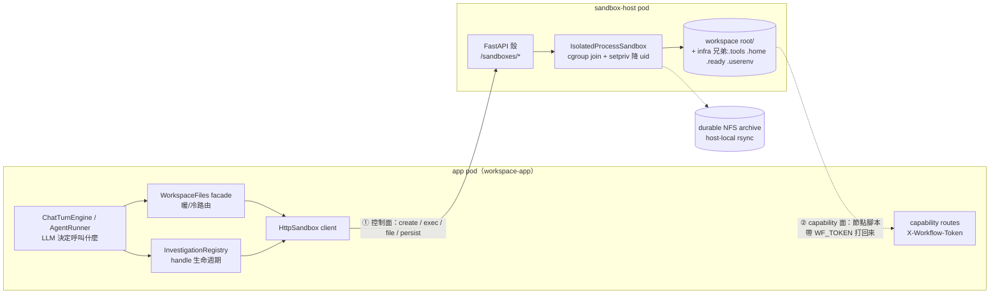
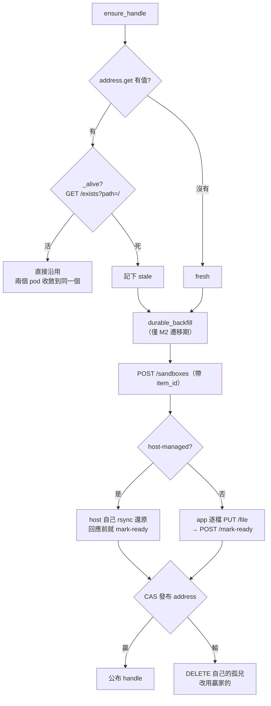
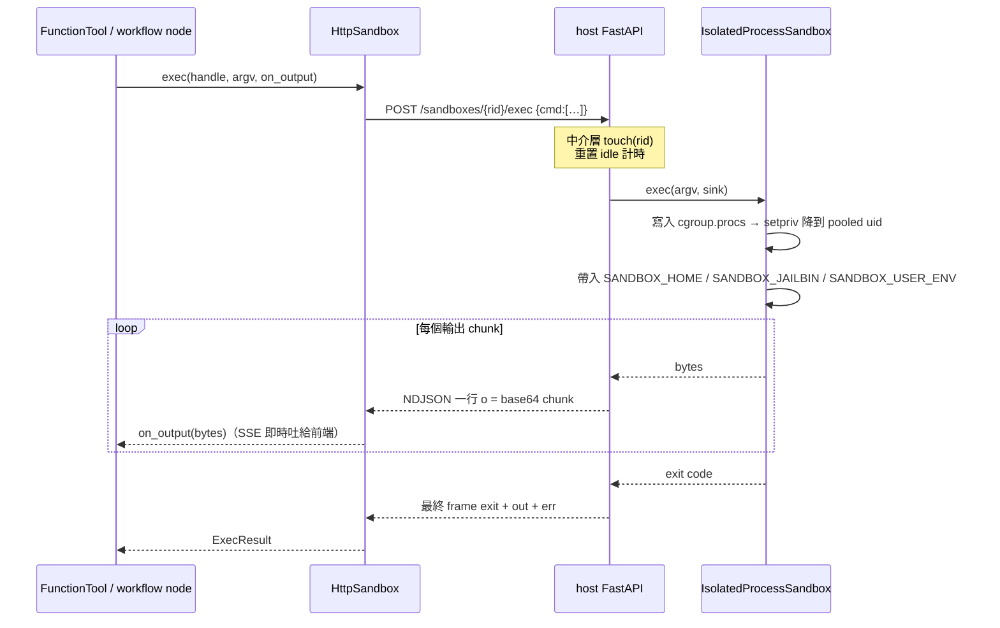
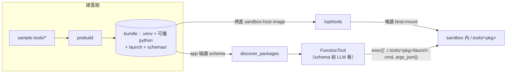

# Hosted sandbox — 執行時架構

`sandbox.kind: http` 的**執行時**視角:agent 的指令實際上在另一個 pod 裡跑,
app 與那個 pod 之間在什麼時機、為了什麼事交換哪一次 HTTP,以及 **tool / skill /
workflow** 這三種「能力」各自怎麼落到 sandbox 裡。

這頁刻意只講**時間軸與觸發點**。元件內部與契約細節分散在既有三頁,不在此複述:

| 想知道的事 | 看哪一頁 |
|---|---|
| host pod 內部怎麼隔離(uid pool / cgroup / jail)、怎麼部署 | [Sandbox Host](sandbox-host.md) |
| 每個 endpoint 的 body、狀態碼、錯誤映射 | [Sandbox Host 線上契約](sandbox-host-wire.md) |
| 工具 bundle 怎麼被 build 出來、怎麼變成 `FunctionTool` | [工具套件與 Sandbox Host](subsystems/tooling-and-sandbox-host.md) |
| sandbox ↔ durable 的同步語意(restore / mirror / 真實來源) | [Sandbox、FileStore 與同步](subsystems/sandbox-and-filestore.md) |
| **誰在何時打 host、tool/skill/workflow 的落地路徑** | **本頁** |

---

## 1. 三個行程,兩條方向相反的邊界



兩條邊界方向相反,是理解整套架構的關鍵:

- **① 控制面(app → host)**——app 是唯一的驅動者。host **完全不知道** LLM、
  specstar、KB、權限、conversation 的存在(它連 `workspace_app` 都不 import),
  它收到的只有 argv 與 bytes。
- **② capability 面(sandbox → app)**——workflow 的確定性節點在 sandbox 裡跑腳本,
  腳本可以帶著 run-scoped 憑證打回 app 的 HTTP API(§7)。這是**唯一**由 sandbox 主動
  發起的方向。

!!! note "host 從不主動找 app"
    host 沒有任何回撥。它自主做的事只有兩件:**idle reaper**(回收 app pod crash 遺留的
    孤兒 handle)與 **`/drain`**(PreStop 停收新 sandbox)。其餘一切都是 app 打過來的。

---

## 2. handle 的一生:誰記得這個 sandbox 在哪

`POST /sandboxes` 打的是 host 的 **ClusterIP Service**(會負載平衡);回應帶著**被選中那個
pod 自己的 URL** + 它本機的 handle id,client 把兩者 base64 成不透明的
`SandboxHandle.id`。**之後每一次呼叫都直連那個 pod**,繞過 LB。

於是「這個 item 的 sandbox 在哪」有兩層記憶:

| 層 | 位置 | 作用範圍 | 消失時機 |
|---|---|---|---|
| session 快取 | `InvestigationSession.handle`(pod 記憶體) | **單一 app pod** | pod 重啟 |
| address store | `_SandboxAddress`(specstar 一列,CAS) | **跨所有 app pod** | 被 swap / 明確 kill |

address store 是 #366 的解方。`kind: http` 的 `create` **每次都鑄新 handle**(不像
`kind: local` 用 item id 定址同一個目錄),所以沒有它,兩個 app pod 會各自開一個 sandbox
給同一個 item——症狀就是「檔案樹一下有一下沒有」。

`_acquire` 的收斂邏輯:



!!! warning "`SandboxBusy` 不等於死"
    `_alive` 只把 `SandboxNotFound` 當死。**逾時**(reachable but slow)映成
    `SandboxBusy`,視為**活著**——把只是忙的 sandbox 判死會再開一個,變成 split-brain
    (#492 / #493 g1)。

### 三條拆除路各清什麼(close / idle reap / delete)

同一個 item 有三條「結束」路,各自的清理範圍**刻意不同**——把 close 當 delete 用
(或反過來)是常見誤會:

| | sandbox(先回寫再 kill) | address 列 | heartbeat | durable 檔案 | 對話 / workflow runs | disk ledger | item 列 |
|---|---|---|---|---|---|---|---|
| **close**(`POST /a/{slug}/items/{id}/close`) | ✅ | **留**(stale 無害;刪掉有 split-brain 風險,見上) | 清 | 留 | 留 | 留 | 留 |
| **idle reaper**(`kill_idle`) | ✅ | 留 | 清 | 留 | 留 | 留 | 留 |
| **delete**(`DELETE /a/{slug}/items/{id}`,cascade) | ✅ | **清**(item 都沒了,誰也不該重建) | 清 | **永久刪**(blob 才能被 GC 回收) | **永久刪** | **退帳**(`forget`) | **最後**永久刪——它是交易記號,中途失敗可重打續掃 |

specstar 原生的 `DELETE /{model}/{id}/permanently` 對 WorkItem **已封鎖**(403 並指向
cascade 路):它只刪 item 列,上表其他欄全部變孤兒——尤其 disk ledger 會永遠凍著繼續
記在 owner 頭上。

---

## 3. 何時與 host 溝通:完整觸發表

這是本頁的核心。左欄是**觸發者**,不是模組名——問「使用者做了什麼」才找得到對應的呼叫。

| 觸發 | 時機 | 打到 host 的呼叫 | 沒有 sandbox 時 |
|---|---|---|---|
| 使用者/agent 讀寫檔 | 每一次檔案操作 | `GET /exists?path=/`(liveness probe)+ 該操作本身(`GET`/`PUT /file`、`walk`、`mkdir`…) | **不喚醒**。globally cold ⇒ 直接讀寫 durable |
| agent 第一次需要行程 | `exec` 工具 / 工具呼叫 / workflow 節點 | `POST /sandboxes` → (restore) → `POST /mark-ready` → address CAS | 這就是喚醒點 |
| 每個 turn 開場 | `ensure_sandbox()` 拿到 handle 後 | `POST /user-env`(**無條件重寫**) | 隨喚醒一起 |
| LLM 呼叫工具 | 每次工具呼叫 | `POST /exec`(NDJSON 串流) | 先喚醒 |
| 寫入前的配額把關 | 每次寫入 | `GET /size?path=`(覆寫的抵扣額);總量優先用 mirror sweep 發布的量測,快取視窗過期或冷啟才 `GET /disk-usage` | 走 durable 數字 |
| turn 結束 | `flush` | host-managed:`POST /persist {delete:true}`;否則 app-side mirror(`walk` + 逐檔 `GET /file`,前後各驗一次 `GET /ready`) | no-op |
| 背景 mirror sweep | 每 `mirror_interval` | 同上但 **`delete:false`**(純追加的 checkpoint) | 略過 |
| idle killer | 每 `idle_check_interval` | writeback(`delete:true`)+ `DELETE /sandboxes/{rid}` | 略過 |
| workflow run 結束 | terminal(**pause 不會**,#652) | 沒有其他 run 在跑才 `close_session` → writeback + `DELETE` | — |
| app 關機 | lifespan 收尾 | 每個 session:writeback + `DELETE` | — |
| k8s 探針 | 持續 | `GET /healthz`(帶 version + capabilities)、`GET /readyz`(cgroup 就緒) | — |
| host pod 下線 | PreStop | `POST /drain` | — |

### 三個容易誤解的時機

**「純檔案操作不喚醒 sandbox」是硬規則。** 讀檔、列目錄、上傳、建資料夾——全都路由到
durable。只有需要**活行程**的操作(`exec`)才 create。這條規則讓「開一個 item 看看檔案」
不會平白開一個 sandbox。

**每個檔案操作都多打一次 probe,而且是刻意的。** `_warm` 對每個操作先
`exists(handle, "/")`。快取這個答案看似免費(一次存檔會發好幾個操作),但**這個 probe 同時是
復原觸發器**:host 把 sandbox 回收掉、或 pod 重啟之後,就是靠它的 `SandboxNotFound` 觸發
rebuild;記住「還活著」會把復原路徑變成一個持續 500 的錯誤。

**`persist` 的 `delete` 旗標分兩種語意。** turn 結束/回收是 `delete=true`(在靜止點做
**對帳**,`rsync --delete`);背景 sweep 是 `delete=false`(**純追加**的耐久 checkpoint)。
把 sweep 也設成對帳,會在 agent 正在寫的中途刪掉它剛建又還沒同步的檔。

---

## 4. 一次 `exec` 走完的路徑



幾個必須記住的性質:

- **HTTP 讀取沒有期限。** client 的 `read_timeout: 0` 是刻意的——一個跑十分鐘的指令不該被
  wire 的讀取逾時砍掉。真正的期限在 host 上:`SANDBOX_HOST_EXEC_TIMEOUT`(總時長)與
  `SANDBOX_HOST_LOG_TIMEOUT`(閒置無輸出)。
- **非零 exit 不是錯誤**,它跟著 `exit` frame 一起回來(逾時 124、找不到 127、不可執行 126)。
- **後端錯誤是帶內的。** stream 一開 HTTP 就已經 200,所以 host 端的例外用一個
  `{"error":…}` frame 傳。stream 在 `exit`/`error` frame 之前斷掉 ⇒ 當成 pod 死了
  (`SandboxNotFound`),但**已收到的輸出保留**。
- **`exec` 永遠不重試。** 它不是冪等的。

---

## 5. Tool 怎麼跑

工具是**定義在 app、執行在 host**,兩邊唯一的交接物是一個不透明的 bundle 目錄。



執行時 LLM 呼叫一個工具 ⇒ `on_invoke` 先 `ensure_sandbox()`(必要時喚醒),再
`exec(["../.tools/<pkg>/launch", <cmd>, <args_json>])`。路徑是 workspace root 的**相對
路徑**,指向 workspace 旁邊的 infra 區——所以工具**永遠不會出現在檔案樹、不會被同步、不佔
配額**。工具進程用自己的 3-stage `Dispatcher` 驗參數、跑、把結果寫 stdout。

!!! warning "hosted 模式不做 `provision_tools`"
    app 啟動時傳 `prebuilt_dir=None`。bundle 已經以**唯讀** bind-mount 掛在 `/.tools`,
    再去 `tar xzf` 進那個唯讀掛載只會 exit 2。**bind-mount 本身就是安裝**。
    `provision_tools` 只保留給沒有 tools mount 的假想後端。

!!! warning "兩個 image 的工具集靠慣例同步,沒有跨程序檢查"
    host image 烤的是 bundle 的**執行檔**;app 端仍要 `discover_packages` 讀到**同一份**
    bundle 才生得出 schema。app image 本身不帶 bundle,所以 hosted 部署要嘛掛
    `WORKSPACE_TOOLS_DIR`、要嘛把 `PACKAGES` 清空(留著卻沒 bundle ⇒ **開機 fail-loud**,
    這是刻意的:靜默跳過曾讓 agent 零工具跑了好幾小時)。

!!! note "有些 toolchain 只能烤進 image"
    host 忽略 `SandboxSpec.image`(沒有 container)。make_deck 需要的
    node/pptxgenjs/libreoffice/poppler/CJK 字型因此**必須**在 `sandbox-host/Dockerfile`
    裡,不能靠請求某個 image 拿到。

---

## 6. Skill 怎麼跑——它**不在 sandbox 執行**

這是最常被誤解的一塊。skill 是**給 LLM 讀的 markdown 方法論**,不是可執行檔:host 從頭到尾
不知道 skill 這個概念存在。

每回合系統提示只列 `(name, description)`;agent 判斷用得上時才呼叫 `read_skill(name)` 把
本文載入 context(progressive disclosure)。body 依序從三個來源解析:

| 順位 | 來源 | 存在哪 | 會打 host 嗎 |
|---|---|---|---|
| 1 | workspace `.skill/<name>/SKILL.md` | item 的 workspace | **暖機時會**(一次檔案讀) |
| 2 | 共用 skill 登錄表 | app image 的 `sample-skills/` | 不會 |
| 3 | profile 內建 skill | Python package 資源 | 不會 |

所以 skill 對 host 的足跡只有一種:**workspace skill 的檔案讀寫**,而它跟其他檔案操作走完全
一樣的暖/冷路由——冷的時候讀 durable、**不會**因為 `read_skill` 就喚醒一個 sandbox。
把內建 skill 複製進 workspace 供人編輯(`materialize_skill`)是一次普通的寫入,一樣受配額
把關。

授權細節見[共創 Skills](skills-authoring.md)。

---

## 7. Workflow 怎麼跑

workflow 有兩種節點,落到 sandbox 的方式完全不同:

**agent 節點** —— 交給 turn engine 跑一個真正的 agent 回合,於是回到 §5 的工具路徑,
只是工具上限被收斂成該節點的子集。

**確定性節點** —— 直接跑指令:

```python
exec(handle, ["sh", "-lc", f"export WF_TOKEN={token}; {run}"])
```

三個推論:

- **`sh -lc` 是 login shell**,會 source `/etc/profile`。Debian 的 profile 會**硬重設
  PATH**,把 per-sandbox 的 `.jailbin`(`python`/`pip` shim 所在)整個丟掉。線上沒有 chroot
  可以蓋掉那個檔,所以 image 裝了 `docker/profile.d/sandbox-jailbin.sh`,從 per-exec 匯出的
  `SANDBOX_JAILBIN` 把目錄補回 PATH 最前面。**動到 workflow 節點的執行方式,就要一起想這個
  guard。**
- **每個節點跑完立刻 `flush`**(`delete=true` 的對帳),所以一個中途失敗的 run,已完成節點
  的產物是留得住的。
- **`WF_TOKEN` 是 §1 的第二條邊界。** 節點腳本可以帶 `X-Workflow-Token` 打回 app 的
  capability API(把產物 ingest 進 KB、upsert 一張 context card)。憑證是 **run-scoped 且綁
  這個 item**,以捕捉到的使用者身分行事——這是 sandbox 內的程式碼唯一能影響 app 狀態的途徑,
  它**不能**繞過 item 的權限。

!!! warning "pause 不回收 sandbox(#652)"
    run 暫停正是為了請人動手——而人要動的往往就是那個 workspace。在此時 `close_session`
    不只語意上矛盾,還是實際的資料危害:#345 把目錄綁在 item 上,一個與人類寫入競態的
    `close_session` 會把 API 已經回過 204 的檔案 rmtree 掉,下一次讀就 404。等 `kill_idle`
    去收就好——它會先確認**全域**閒置。

---

## 8. 失敗語意:兩種壞法要分清楚

| 現象 | 映成 | 意思 | 該怎麼辦 |
|---|---|---|---|
| 讀取逾時 | `SandboxBusy` | pod 活著但**慢**(過載 / 大檔傳輸中) | 冪等操作用**遞增期限**重試;**絕不** rebuild |
| 連線被拒/重設 | `SandboxNotFound` | pod **沒了** | 從 durable 重建 |
| 404 + `{"error":…}` | 同上 | host 活著但沒這個 sandbox(已回收) | 同上 |

重試策略只套在**冪等的檔案/探測操作**上:第 n 次嘗試的讀取期限是
`min(base × factor^(n-1), cap)`,退避同構(預設 4 次、10s 起跳、上限 40s)。一個真的卡死的
host 會在**有界時間**內失敗,而不是無限期掛著(那正是 #492 的原始症狀)。

!!! warning "`create` / `persist` / `exec` 永不重試"
    `create` 不冪等——重試會多鑄一個 sandbox。`persist` 是長時間 rsync。`exec` 有自己的期限。
    這三個只能失敗上報。

---

## 9. 設定總表

**app 端**(config yaml):

```yaml
sandbox:
  kind: http
  http:
    base_url: http://sandbox-host:8000   # ClusterIP；只有 create 打這裡
    read_timeout: 0                      # 0 = 不設讀取期限（由 host 的 exec/log timeout 管）
    host_managed_durable: false          # true ⇒ 還原/寫回都交給 host 自己 rsync（#492）
    io_attempts: 4                       # 以下是「忙碌 host」的重試曲線
    io_timeout_base_s: 10.0
    io_timeout_cap_s: 40.0
    io_backoff_base_s: 1.0
    io_backoff_cap_s: 8.0
  durable:
    kind: nfs_tree                       # 與 host_managed_durable 配對使用
    nfs_root: /mnt/workspaces            # 必須與 host 的 SANDBOX_HOST_NFS_ROOT 指向同一棵樹
```

**host 端**(`SANDBOX_HOST_*` 環境變數,**不讀 app 的 config 檔**)——完整表在
[Sandbox Host](sandbox-host.md#設定);與本頁時間軸直接相關的是:

| 變數 | 決定什麼時機的行為 |
|---|---|
| `SANDBOX_HOST_EXEC_TIMEOUT` / `_LOG_TIMEOUT` | 一次 `exec` 的總時長 / 閒置上限——**wire 沒有期限,期限在這裡** |
| `SANDBOX_HOST_IDLE_TTL` | 回收 app pod crash 遺留的孤兒 handle(0 = 關) |
| `SANDBOX_HOST_NFS_ROOT` | 設了才有 host-managed 還原/`persist`;必須與 app 的 `sandbox.durable.nfs_root` 同一棵樹 |
| `SANDBOX_HOST_TOOLS_DIR` | bind-mount 到 `/.tools` 的 bundle 目錄(未設 = 沒有工具) |

!!! note "`GET /healthz` 會自報 capabilities"
    回應帶 `version` 與一組能力名(例如 `per-exec-home`、`host-managed-archive`)。
    它們與行為在同一個 commit 裡,不會像手維護的相容性表那樣漂移——排查
    「這台 host 到底支不支援 X」先打這支。

---

## 10. 眉角速查

!!! warning "readiness marker 是刪除傳播的守門員"
    `.ready` 是 workspace **外**的空檔(不出現在 `walk`/檔案樹,使用者偽造不了)。app 的
    mirror 只有在 walk **前後**都 `ready` 為真時才傳播刪除(三明治);回收時**先**移除 marker
    再 rmtree。少了它,「暫時是空的」與「真的被刪光」無法區分,一次半途的還原就會把 durable
    快照清空。

!!! warning "任一瞬間只有一個真實來源"
    活著 ⇒ sandbox;死了 ⇒ durable。刻意不存在兩邊都可寫的視窗。所以讀與寫**必須走同一個
    `_warm` 判斷**——一個落在冷 durable 的寫入,會被 host 之後的 `--delete` 對帳抹掉。

!!! warning "`/user-env` 每回合無條件重寫"
    暖機的 sandbox 可能還留著上一回合的檔案。使用者刪掉最後一個變數時,若因為「沒有變數就
    不寫」而略過,工具就會繼續讀到已刪除的值。它寫在 workspace 外的 infra 區:不進檔案樹、
    不同步、不算配額、隨 sandbox 一起消失(**傳遞**用,不是保存;真實來源是 item 記錄)。

!!! note "沒有 namespace,所以 HOME 必須是 per-sandbox"
    hosted 只有 uid + cgroup 隔離,`/tmp` 是整個 pod 共用的。carrier launcher 的 `HOME` 因此
    由 `SANDBOX_HOME` 指到 per-sandbox 的 `.home`——否則某個使用者 `pip install --user` 會落
    在全 pod 共用的 `/tmp/.local`,被同 pod 每個 sandbox import 到。

!!! note "v1 沒有 app 層認證,也沒有 `expose_port`"
    host 只在 namespace 內可達(NetworkPolicy + ClusterIP),namespace 內任何 caller 都能驅動
    它。也沒有把 sandbox 內服務對外開埠的路徑——client 的 `expose_port` 直接丟
    `NotImplementedError`。

---

## 11. 原始碼錨點

想追這條時間軸,建議依序讀:

- `src/workspace_app/api/registry.py` — `ensure_handle` / `_acquire` / `_alive` /
  `_writeback` / `flush` / `mirror_warm` / `kill_idle` / `close_session`:**所有喚醒與寫回
  的時機都在這一個檔**。
- `src/workspace_app/files/facade.py` — `_warm`(每個檔案操作的 liveness probe + rebuild
  決策)、`_ensure_headroom`(配額把關打 `disk_usage`/`size_of` 的地方)。
- `src/workspace_app/sandbox/http_client.py` — `_request`(Busy vs NotFound 的分流)、
  `_io_request`(遞增重試)、`exec`(NDJSON)、`_encode_handle`。
- `src/workspace_app/agent/context.py` — `ensure_sandbox()`:喚醒 + 工具 provisioning +
  `write_user_env` 的**唯一**匯流點。
- `src/workspace_app/tooling/registry.py` — `_to_function_tool.on_invoke`:LLM 工具怎麼變成
  一次 `exec`。
- `src/workspace_app/apps/skills.py` — `resolve_skill_body`:skill 三來源的優先序。
- `src/workspace_app/api/workflow_exec.py` — `run_sandbox`(`sh -lc` + `WF_TOKEN` + 節點後
  `flush`)、`release`(#652 pause 不回收)。
- `src/workspace_app/api/capability_routes.py` — 反向邊界:`X-Workflow-Token` 的驗證。
- `sandbox-host/src/sandbox_host/app.py` — `_HostController`(idle clock / archive 對映)、
  `_track_activity` 中介層、`_exec_ndjson`、`/healthz` 的 capabilities。
- `sandbox-host/src/sandbox_host/nfs_archive.py` — host-local rsync:為什麼 bulk copy 不再
  跨 app↔host 網路。

設計出處:[plan-http-sandbox.md](plan-http-sandbox.md)(#60 路由/隔離)、
[plan-issue-366.md](plan-issue-366.md)(跨 pod 位址收斂)、
[plan-issue-492.md](plan-issue-492.md)(host 擁有 durable)、
[plan-sandbox-sot.md](plan-sandbox-sot.md)(sandbox 即真實來源)。
