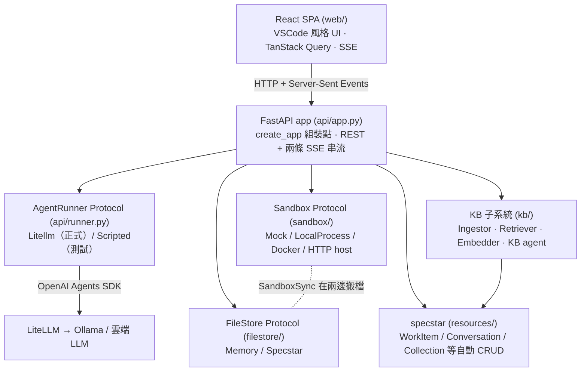
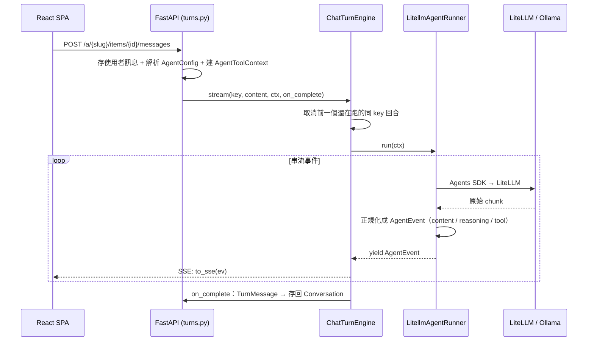
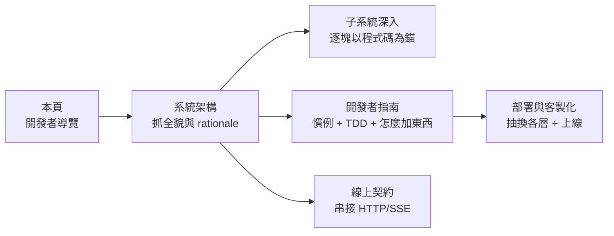

# 開發者導覽（Developer Overview）

> 這頁是**站在開發者角度**的整體架構入口：先給你一個 30 秒能記住的心智模型，再把
> 「東西放在哪、一次請求怎麼跑、我想改 X 要動哪裡」攤平給你。要看更深的細節，每節都
> 連到對應的權威文件（[系統架構](architecture.md)、[線上契約](contract.md)、
> [開發者指南](development.md)、[部署](deployment.md)）。

---

## 這是什麼

`workspace-app` 是一個**團隊內部的 AI workspace**。它做兩件事：

1. **App 工作區**——在每個 workspace 各自的 sandbox 裡跑 OpenAI Agents（透過 LiteLLM
   接 Ollama / 雲端 LLM）。每個 workspace 有自己的永久 FileStore；agent 要跑 shell
   指令時才**延遲**開一個 sandbox，閒置就回收。RCA（根因分析）是內建的第一個 App，
   Topic Hub、Playground 是另外兩個。
2. **知識庫（KB）聊天機器人**——把內部文件上傳成具名 **collection**，切塊、嵌入、做
   混合檢索（dense 向量 + BM25 → RRF → MMR → parent-doc merge，可選 multi-query /
   HyDE / rerank）。KB **agent** 對這些 collection 回答問題，附上可點回原文的 `[n]`
   引註；App 的 workspace agent 也能用 `ask_knowledge_base` 工具轉問它。

---

## 30 秒心智模型

整個系統就是**幾條 Protocol 接縫 + 一個 `create_app` 組裝點 + 兩個子系統**。

- **每一層都是可抽換的 Protocol**（Sandbox / FileStore / AgentRunner / Embedder /
  Chunker…）。測試注入 Mock / Scripted 實作，正式環境注入真的實作。
- **`create_app(...)`（`api/app.py`）是唯一的組裝點**。換掉任一塊只要寫一個新實作丟進
  去，其他層不用動。`__main__.py` 從 `config.yaml` 解析設定 → factories 建出每個實作 →
  餵給 `create_app`。
- **兩個子系統共用同一套回合引擎**：App 的 RCA chat 與 KB chat 都跑同一個
  `ChatTurnEngine`（`api/turns.py`），只差在各自建的 `AgentToolContext` 與「怎麼把結果
  存回去」。不要為每個介面各刻一套 turn / cancel / SSE。



每一層的職責與**為什麼這樣切**，見 [系統架構 §1–§2](architecture.md)。

---

## 四個主要抽換點

| Protocol | 定義 | 正式實作 | 測試實作 |
|---|---|---|---|
| **Sandbox** | `sandbox/protocol.py` | `LocalProcessSandbox`（subprocess + userns 隔離）、`HttpClient`（外部 sandbox-host pod）、`DockerSandbox`（已棄用） | `MockSandbox`（記憶體） |
| **FileStore** | `filestore/protocol.py` | `SpecstarFileStore`（per-workspace blob） | `MemoryFileStore` |
| **AgentRunner** | `api/runner.py` | `LitellmAgentRunner`（OpenAI Agents SDK + LiteLLM，`api/litellm_runner.py`） | `ScriptedAgentRunner`（腳本事件） |
| **Embedder / Chunker / Retriever** | `kb/embedder.py` · `kb/chunker.py` · `kb/retriever.py` | `LitellmEmbedder` + LlamaIndex 攝取管線 + 混合 `Retriever` | `HashEmbedder`（離線確定性） |

抽換的實際步驟（寫一個實作 → 在 factory / `create_app` 注入），見
[部署與客製化](deployment.md)。

---

## 倉庫地圖（東西放在哪）

後端套件都在 `src/workspace_app/` 底下：

| 套件 | 職責 | 最該先看的檔 |
|---|---|---|
| `api/` | HTTP app、SSE 事件、回合編排 | `app.py`（`create_app`）、`turns.py`（`ChatTurnEngine`）、`events.py`（事件 schema）、`litellm_runner.py`（agent loop） |
| `sandbox/` | 可插拔的指令執行環境 | `protocol.py`、`local_process.py`、`http_client.py` |
| `filestore/` | 每個 workspace 的永久檔案儲存 | `protocol.py`、`specstar_impl.py`、`blob_gc.py`（配額 + GC） |
| `kb/` | 知識庫:攝取/切塊/嵌入/檢索 | `ingest.py`、`retriever.py`、`embedder.py`、`chunker.py`、`index_coordinator.py`、`llm.py` |
| `agent/` | agent 工具、context、prompt 組裝、設定解析 | `context.py`（`AgentToolContext`）、`tools.py`、`config_catalog.py` |
| `apps/` | 多 App 平台（RCA / topic-hub / playground） | `catalog.py`（`AppCatalog`）、`manifest.py`、各 `apps/<slug>/` |
| `resources/` | specstar 資料層（typed Struct + 自動 CRUD） | `__init__.py`（`make_spec`）、`kb.py`、`conversation.py` |
| `workflow/` | API 觸發的 headless workflow（#100） | `engine.py`、`run.py`、`orchestrator.py`（steer + resume） |
| `worker/` | 獨立 job consumer pod（#312） | `__init__.py`、`__main__.py`（`python -m workspace_app.worker <jobtype>`） |
| `coordinators.py` | FastAPI-free 的背景 job 統一組裝（#312） | `build_coordinators()`、`build_ingestor()` |
| `tooling/` | tool 套件探索與佈署 | `registry.py`、`packages.py`、`dispatcher.py` |
| `config/` | Settings schema 與 loader | `schema.py`、`loader.py`（`load_with_provenance`）、`catalog_build.py` |
| `health/` · `observability/` · `perm/` · `sync/` · `users/` | 健康檢查 / 設定與 LLM log / 權限 / 程式碼鏡像同步 / 使用者目錄 | — |

前端在 `web/src/`（React + Vite + TS）：

| 路徑 | 職責 |
|---|---|
| `components/` | UI 元件;`AgentEntryView.tsx` 是 RCA 與 KB 共用的對話渲染（reasoning / 工具卡 / metrics） |
| `pages/` | 路由頁:Launcher、AppWorkspace、AppDashboard、Diagnostics |
| `hooks/` | `useAgent`（回合 SSE pump）、`useKbChat`、`useItemChat`、`useWorkflow` |
| `api/` | TanStack Query client + key（`queryKeys.ts`、`real.ts`、`kb.ts`、`types.ts`） |
| `events.ts` | **SSE 事件 schema,鏡像後端 `api/events.py`——新增事件型別兩邊必須同步** |
| `renderers/` · `lib/` | markdown / `[n]` 引註渲染、i18n 等工具 |

倉庫其他重要目錄:`kubernetes/`（k8s manifest:API + 各 JobType worker）、
`sandbox-host/`（獨立的 sandbox 服務 pod）、`sample-tools/`（預建 tool 套件）、
`scripts/`（prebuild / workflow check）。

---

## 兩個子系統

### App 工作區（RCA 是第一個 App）

平台是**多 App** 的:每個 App 是 `apps/<slug>/` 一個目錄 = `app.json`（身份 + 功能開關 +
agent + layout）+ `model.py`（它的 `WorkItem` Struct）+ `prompts/` + `profiles/`。

- 路由:`/` = launcher（列 App 卡 + KB 連結）、`/a/:slug` = App 首頁、
  `/a/:slug/:itemId` = 工作區。
- 功能開關（app.json）:`workspace`（檔案 IDE + 檔案工具）、`sandbox`（agent `exec` +
  套件工具）、`terminal`（人類 shell pane,需 `sandbox`）。`tools[]` 與開關不一致是
  **開機硬錯誤**。
- 新增一個 App **不必改前端 shell**——畫面是一個泛用 `WorkspaceShell`,per-App 變化純粹
  是資料（app.json + model.py）。實作步驟見 [新增一個 App](adding-an-app.md);名詞定義見
  專案根目錄的 `CONTEXT.md`。

### 知識庫（KB）

與 App 平行的第二個子系統。攝取（`kb/ingest.py`）切成快的 `store`（同步,文件即時以
`indexing` 出現）+ 慢的 `index`（背景切塊 + 嵌入,翻成 `ready`）,兩者都用
`asyncio.to_thread` 明確 offload 不擋 event loop。檢索（`kb/retriever.py`）是 dense +
BM25 → RRF → MMR → parent-doc merge 的混合管線。KB agent **重用同一個 `AgentRunner`**,
只是 `AgentToolContext` 換成帶 `retriever` + `collection_ids`、工具只有 `kb_search`。

> **`kb_search` vs `ask_knowledge_base`**:前者是 KB agent 自己的檢索**葉節點**（只給
> 真的是 KB agent 的呼叫者）;其他 App agent 一律拿後者——它把整個問題委派給一個 KB
> 子代理,把吵雜的檢索留在子代理的拋棄式 context 裡。細節見 [系統架構 §8](architecture.md)
> 與專案根目錄的 `CLAUDE.md`。

---

## 一次 Agent 回合怎麼跑



關鍵眉角（fan-in queue 讓工具 stdout 邊跑邊顯示、LiteLLM↔OpenAI 五種 `.delta` 事件的
分流、Ollama usage=0 的 token 估算)，見 [系統架構 §3–§4](architecture.md);完整 SSE 事件
欄位見 [線上契約 §3](contract.md)。

---

## 背景工作:Job runner ⊥ API（#312）

背景 job 協調器（index / wiki / card-gen / sanity）由**一個 FastAPI-free 的組裝點**
`coordinators.build_coordinators` 建出,被 `create_app` 與獨立 worker 共用。

- API 用 `server.run_consumers` 旗標決定要不要在進程內消費:預設 `true`（all-in-one,
  本機/測試/單 pod）;設 `false` 時 API 變**純 producer**（只 enqueue,不 consume）。
- 一個 worker pod 用 `python -m workspace_app.worker <jobtype>` block-consume **單一**
  JobType,各自掛 k8s HPA。
- 非佇列的 sweeper（idle-killer / mirror / blob-gc / code-sync）**永遠**留在 API,不受
  旗標影響。

部署拓樸見 [部署 §11](deployment.md)。

---

## 「我想做 X」快速導引

| 我想… | 動哪裡 | 讀哪份 |
|---|---|---|
| 新增一個 App | 新增 `apps/<slug>/`（app.json + model.py + prompts + profiles） | [新增一個 App](adding-an-app.md) |
| 加一個 agent 工具 | `agent/tools.py` + `AgentToolContext` + app.json 的 `tools[]` | [開發者指南](development.md) |
| 新增一個 SSE 事件型別 | `api/events.py` **且** `web/src/events.ts`（兩邊鏡像） | [開發者指南](development.md) |
| 抽換 sandbox / FileStore / runner | 寫新實作 → factory / `create_app` 注入 | [部署與客製化](deployment.md) |
| 換 LLM / embedder / 檢索模型 | `config.yaml` 的 preset / 環境變數（`KB_*`） | [部署](deployment.md)、`README.md` |
| 寫一個 workflow | `apps/<slug>/.../run.py`,先 `workflow new` 鷹架、`workflow check` 靜態檢查 | [撰寫 Workflow](workflows-authoring.md)、[Workflows 規格](workflows.md) |
| 加一個 KB chunker / embedder | `kb/chunker.py` / `kb/embedder.py` 實作對應 Protocol | [開發者指南](development.md) |
| 串接 HTTP / SSE API | — | [線上契約](contract.md) |

---

## 開發守則（最常踩到的幾條）

- **新功能 / bug** 先跑 `/grill-me` 把計畫壓力測試過,再用 `/tdd` red-green-refactor 寫。
- **Phase 編號**用平坦整數（Phase 1、2…),**不要**子階段 `1a` / `1b`。
- **權威 100% 覆蓋 gate**(完整本機套件):
  `uv run coverage run -m pytest && uv run coverage combine && uv run coverage report --fail-under=100`。
  CI 只跑單元子集(`-m "not integration" -n auto`),不卡 100%。
- Lint / 格式 / 型別:`uv run ruff check`、`uv run ruff format --check`、`uv run ty check`。

完整慣例（TDD 流程、coverage parallel+combine、specstar 索引查詢、ABC over Protocol…）
見 [開發者指南](development.md) 與專案根目錄的 `CLAUDE.md`。

---

## 接下來讀什麼



1. [系統架構](architecture.md) — 分層、Protocol、回合資料流、事件正規化、設計決策（**整體心智模型**）。
2. [子系統深入](subsystems/index.md) — 13 篇以真實程式碼為錨的逐子系統深入文件（職責、模組、Protocol、不變式、原始碼錨點）。
3. [開發者指南](development.md) — 在這個 codebase 開發的慣例與步驟。
4. [部署與客製化](deployment.md) — 抽換實作、模型字串與環境變數、生產注意事項。
5. [線上契約](contract.md) — 權威 HTTP 路由 + SSE 事件型別。
6. [詞彙表](glossary.md) · [設計決策](decisions.md) — 名詞查定義、決策查「為什麼這樣設計、否決了什麼」。
7. [使用者手冊](user-guide.md) — 從使用者角度看 RCA 工作流程與 UI。
8. [設計計畫與歷史](design-history.md) — 各功能動工前的計畫與被否決的替代方案。

---

## 在本機建這份文件站

```bash
# 安裝文件工具（一次性）
uv sync --group docs

# 本機即時預覽（http://127.0.0.1:8000）
uv run --group docs mkdocs serve

# 產出靜態站到 site/
uv run --group docs mkdocs build
```

設定在倉庫根目錄的 `mkdocs.yml`（Material 主題、zh-TW、mermaid 圖、深淺色切換）。
nav 只列目前有效的精選文件;`plan-*` / `handoff-*` 等設計演進紀錄收在
[設計計畫與歷史](design-history.md),仍可被全文搜尋。
