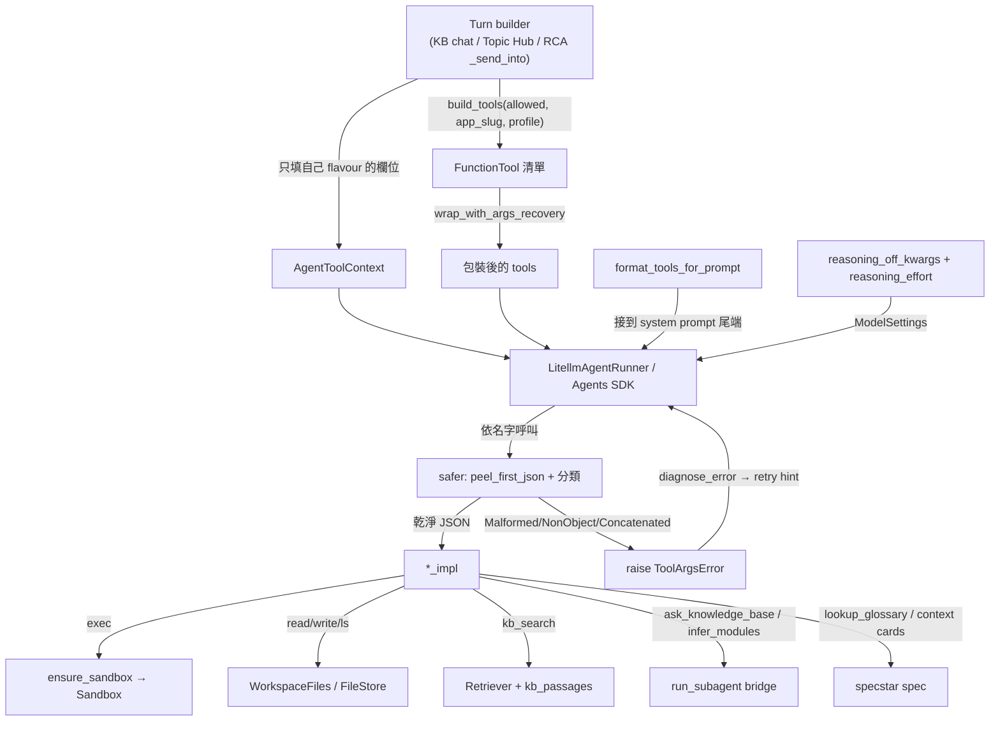

# Agent 執行時（agent-runtime）

`agent/` 是「每一回合（per-turn）」的基底層：app 裡每一個 LLM agent 都跑在這層上。它定義了一個 `AgentToolContext` dataclass（把工具所需的一切：sandbox、filestore、retriever、sub-agent bridge、VLM、specstar handle、budgets 全裝進去）、模型可呼叫的 function tool 目錄，以及一組「讓小型本地 LLM 乖乖聽話」的輔助函式（reasoning on/off、壞掉的 tool-call args 復原、把工具清單注入 prompt）。

> **看這篇之前**：先讀 [架構總覽](../architecture.md) 抓全貌。這層的上游是 [API 與回合引擎](api-and-turns.md)，下游接 [Sandbox、FileStore 與同步](sandbox-and-filestore.md) 與 [知識庫:檢索與 Agent](kb-retrieval-agent.md)。

## 職責與邊界

這個子系統存在的理由：讓**同一個** `LitellmAgentRunner` 同時服務兩種 flavour——RCA workspace 與 KB chat——靠的是共用「一個 context 形狀」，而「不屬於這個 flavour」的欄位就只是留 `None` 的 optional field。

負責：

- 定義 `AgentToolContext`：每回合傳進每個 tool 的 dataclass。
- function tool 目錄（每個 `*_impl` coroutine、`_IMPLS` 註冊表、`_WORKSPACE_TOOLS` 預設集、`build_tools()`）。
- 把 tool 清單算成 system-prompt 區塊（`format_tools_for_prompt`）。
- provider-aware 的 reasoning-OFF kwargs（`reasoning.py`）。
- 防禦模型吐出壞掉的 tool-call args（`args_recovery.py` + `arg_repair.py`）。
- KB-facing 的 `AgentConfigCatalog`（`kb_chat` / `infer_modules` 兩種 purpose）+ preset 註冊表。

**不**負責：

- 真正驅動 Agents SDK / LiteLLM、組 `Agent[AgentToolContext]`、把 `ToolArgsError` 對映成 retry hint——那是 `api/litellm_runner.py`（見 [API 與回合引擎](api-and-turns.md)）。
- 每回合的鎖 / SSE / 取消（`ChatTurnEngine`，同上）。
- sandbox 的真正建立與 idle reap（`sandbox/` 與 `InvestigationRegistry`，見 [Sandbox、FileStore 與同步](sandbox-and-filestore.md)）。
- 檢索本身的 dense+BM25→RRF→MMR 管線（`kb/retriever.py`，見 [知識庫:檢索與 Agent](kb-retrieval-agent.md)）。
- 每個 App 的 agent 解析（app◇profile◇preset 在 `apps.catalog.AppCatalog`，見 [App 平台](apps-platform.md)）。

## 核心模組

| 路徑 | 角色 |
| --- | --- |
| `src/workspace_app/agent/context.py` | 定義 `AgentToolContext`——傳進每個 tool 的 per-run dataclass。40 多個欄位橫跨兩 flavour（RCA: `investigation_id`/`sandbox`/`filestore`/`files`/`sync`；KB: `retriever`/`collection_ids`/`kb_passages`）外加 Topic-Hub 的 `spec`/`acting_user`、wiki 欄位、`describer`/`deck_vlm` VLM、`run_subagent` bridge、各種 budget、`history`。擁有 `ensure_sandbox()` 的 lazy-create + 套件 eager provisioning。 |
| `src/workspace_app/agent/tools.py` | 整個 function-tool 目錄：每個 `*_impl` coroutine、`_IMPLS` 名稱→impl 註冊表、`_WORKSPACE_TOOLS`（RCA 預設集）、`_LEGACY_TOOL_RENAMES`、把 allowed-list 變成 `agents.FunctionTool` 的 `build_tools()`（含條件式 `read_skill` 注入）。也含 exec/read 格式化輔助（`_format_exec`/`_truncate_middle`）與 `infer_modules` 的 fan-out 機制。 |
| `src/workspace_app/agent/tool_prompt.py` | `format_tools_for_prompt()`——把 live `FunctionTool` 清單（name、description、JSON args schema）渲染成 Markdown「Tools available」system-prompt 區塊，讓小模型不會把已 provision 的 tool 誤當成 shell binary。由 `_agent_for` 在 template-time prompt 之後於 runtime 接上。 |
| `src/workspace_app/agent/config_catalog.py` | `AgentConfigCatalog`——（現只剩 KB）依 purpose（`kb_chat`、`infer_modules`）索引的 `AgentConfig` 目錄，外加被 `AppCatalog` 消費的具名 preset 註冊表。`configs_for`/`default_for`/`purposes` + 各 purpose 的薄包裝。 |
| `src/workspace_app/agent/reasoning.py` | provider-aware 的 reasoning-OFF kwargs。`is_ollama(model)` + `reasoning_off_kwargs(model)`：Ollama → `{"think": False}`；其他（vLLM/openai-compatible）→ `{"extra_body": {"chat_template_kwargs": {"enable_thinking": False}}}`。 |
| `src/workspace_app/agent/args_recovery.py` | 防衛回合不被壞掉的 tool-call args 打死。`peel_first_json()` 抽出第一個完整 JSON 值 + 剩餘字串；`wrap_with_args_recovery()` 回傳一個會分類 args、並 RAISE 三種 `ToolArgsError` 子類之一（Malformed / NonObject / Concatenated）的 `FunctionTool`，好讓 runner 的 `diagnose_error` 把它對映成 retry hint 並從乾淨 history 重啟。 |
| `src/workspace_app/agent/arg_repair.py` | in-band backstop sentinel：`make_backstop_sentinel(raw)` / `malformed_raw(parsed)`。在模型輸出邊界把無法解析/修復的 args 換成一個**合法** JSON sentinel；tool wrap 認得它，於是**回傳**乾淨的 in-band 錯誤（而非 raise），不污染下一個 request 也不中止回合。 |

## 介面與接縫

`AgentToolContext` 本身就是中心接縫——**單一 dataclass、兩 flavour 靠欄位存在與否區分、不做 subclassing**。其餘接縫多由 context 欄位引用、impl 在別的子系統：

| 接縫 | 定義位置 | 種類 | 實作 |
| --- | --- | --- | --- |
| `AgentToolContext` | `src/workspace_app/agent/context.py` | per-run dataclass（中心接縫） | 單一 dataclass，RCA / KB 兩 flavour 由欄位存在決定 |
| `Sandbox` | `src/workspace_app/sandbox/protocol.py` | Protocol（`ctx.sandbox`） | `MockSandbox`（測試）、`LocalProcessSandbox`（VM 部署預設） |
| `FileStore` | `src/workspace_app/filestore/protocol.py` | Protocol（`ctx.filestore`，外層包 `WorkspaceFiles` facade） | `SpecstarFileStore`、`WikiFileStore`（wiki flavour） |
| `Retriever` | `src/workspace_app/kb/retriever.py` | class（`ctx.retriever`；KB flavour） | `kb.retriever.Retriever` |
| `IVlm` / `VlmDescriber` | `src/workspace_app/kb/vlm/protocol.py` / `src/workspace_app/kb/vlm/describer.py` | `read_image`（`ctx.describer`）與 `make_deck`（`ctx.deck_vlm`）用的 describer | `VlmDescriber`（`get_kb_vlm`）、deck VLM（`get_designed_pptx_vlm`） |
| `UserDirectory` | `src/workspace_app/users/protocol.py` | Protocol（`ctx.users`；`lookup_user`） | 見 [平台服務](platform-services.md)（impl 細節見原始碼） |
| `IWikiSources` | `src/workspace_app/kb/wiki/sources.py` | interface（`ctx.wiki_sources`；wiki tools） | 見 [知識庫:攝取與索引](kb-ingest-index.md)（impl 細節見原始碼） |
| `wrap_with_args_recovery` | `src/workspace_app/agent/args_recovery.py` | SDK 與 `*_impl` 之間的 interposition 接縫 | `safer()` closure，透過 `dataclasses.replace` 重建 `FunctionTool` |
| `run_subagent` bridge | `src/workspace_app/agent/context.py` | API 層注入的 `Callable`（RCA → sub-agent） | 在 api 的 turn builder / workflow 接線；由 `ask_knowledge_base_impl` + `infer_modules_impl` 消費 |

## 運作方式 / 資料流

主要 runtime 路徑（散文版）：

1. **每回合組裝**：某個 surface 的 turn builder（KB chat、Topic Hub、RCA 的 `_send_into`）建一個 `AgentToolContext`，只填它那個 flavour 的欄位（RCA 填 `sandbox`/`files`；KB 填 `retriever`/`collection_ids`），其餘留 `None`。同時用 `build_tools(allowed, app_slug, profile)` 把該 agent 的 allowed-list 變成 `FunctionTool` 清單。
2. **runner 接手**：`LitellmAgentRunner` 把每個 tool 用 `wrap_with_args_recovery` 包起來、用 `format_tools_for_prompt` 把工具清單接到 system prompt 尾端、把 `reasoning_off_kwargs` 與 `reasoning_effort` 折進 `ModelSettings`，然後組出 `Agent[AgentToolContext]` 交給 Agents SDK。
3. **tool 呼叫**：模型決定呼叫某 tool 時，SDK 先進到包裝層 `safer()`，由 `peel_first_json` 把 args 分類：乾淨單一物件 → 透傳給原 `*_impl`；三種壞法 → raise 對應 `ToolArgsError`，runner 的 `diagnose_error` 把它對映成 retry hint，從乾淨的 persisted history 重啟回合（被污染的 in-flight call 被丟掉）。
4. **impl 落地**：`exec_impl`（與 `make_deck` 的 exec_run）是唯一會喚醒 sandbox 的路徑——透過 `ctx.ensure_sandbox()`。純檔案操作走 `ctx.files`/`filestore`，**絕不**喚醒 sandbox。`kb_search_impl` 打 `ctx.retriever` 並把命中段落 append 進 `ctx.kb_passages`。`ask_knowledge_base_impl` / `infer_modules_impl` 走 `ctx.run_subagent` bridge 開 sub-agent。`lookup_glossary` / `resolve_collection` / context-card 工具直接查 `ctx.spec`（specstar）。

`ensure_sandbox()` 還負責：sandbox 一旦建好（`handle` 從 `None` 變有值），把 `agent_config.allowed_tools` 裡（用 `pkg` 或 `pkg:cmd` colon 語法命中的）套件 eager 裝進去，每個 sandbox 只裝一次。

## 關鍵不變式與眉角

!!! warning "flavour 契約靠 allowed_tools，不靠 context"
    讀 RCA-only 欄位（`sandbox`/`filestore`/`files`/`investigation_id`）的 tool 會 `assert` 它非 `None`——在 KB-flavour context 裡呼叫它是 programming error，不是可復原錯誤。flavour 契約由「你把哪些 tool 放進 `allowed_tools`」強制，**不是**由 context 本身。

!!! warning "kb_search 是 leaf，不是 consumer 介面（#270）"
    `kb_search` 在 `_IMPLS` 裡但**刻意不在** `_WORKSPACE_TOOLS`：它需要 RCA 從不設定的 `retriever`。每個非 KB app 改拿 `ask_knowledge_base`。用 `kb_search`/`search_wiki` 接一個新 app 會在 call time `assert`/失敗。詳見 CLAUDE.md 的 leaf-vs-consumer 規則。

!!! warning "args-recovery 必須 raise，不能回字串"
    對 Malformed/NonObject/Concatenated，`wrap_with_args_recovery` **必須 raise**（不能回 error string）。回字串會（a）設定 `progress_made`（擋住 retry）並（b）把被污染的對話送回 LiteLLM，那邊 `json.loads(arguments)` 會以 `Extra data` 炸掉（APIConnectionError）。只有 `malformed_raw` sentinel backstop 例外——它回 in-band 錯誤（對話裡已經是合法 sentinel，所以不會污染）。

!!! warning "safer() 的 context 型別標註不能改窄"
    `safer()` 標註成 `ToolContext[AgentToolContext]`，**不是** `RunContextWrapper`——SDK 會 introspect 這個標註；較窄的型別會觸發 `_fork_with_tool_input` 把 `run_config` 剝掉，弄壞被包的 invoker。

!!! warning "FunctionTool 必須用 dataclasses.replace 重建"
    `wrap_with_args_recovery` 透過 `dataclasses.replace`（不是新建 ctor）重建 `FunctionTool`，好讓約 20 個私有 SDK 欄位（`_failure_error_function`、`_tool_origin`…）原樣存活；只用 5 個公開欄位重建會弄壞 tool emission。

!!! warning "ensure_sandbox 是唯一建 sandbox 的地方"
    `ensure_sandbox()` 是**唯一**會建 sandbox 的地方；只有 `exec_impl`（與 make_deck 的 exec_run）會喚醒它。純檔案操作必須走 `ctx.files`/`filestore`，絕不能喚醒 sandbox。

!!! note "subagent_citations 以工具名分桶、位置配對"
    `subagent_citations`（`dict[str, list[list[Citation]]]`）以**工具名**（`ask_knowledge_base` / `infer_modules`，**不是** sub-agent 的 purpose）分桶，並依位置配對（第 N 個桶 entry ↔ 第 N 個 tool message）。因此每一條 `ask_knowledge_base`/`infer_modules` 呼叫路徑——**含 early return**——都必須剛好 append 一個桶 entry，否則 citation 配對會錯位。（`tool_displays` 的 key 不同——見下方 `_format_exec` 一條：它是 `dict[str, str]`，以**清乾淨的 exec 輸出字串**為 key、不是工具名、也不靠位置。）

!!! note "kb_search 在搜尋前先記一單位 budget（#195）"
    `kb_search` 在實際搜尋**之前**就先計一單位 budget（空/錯誤的搜尋也照算一次），避免小模型無限 loop；上限 clamp 落在 retriever，所以模型給的 `expand=99` 是安全的。

!!! note "enhancement 解析優先序（#68）"
    enhancement 解析是 caller(context) > LLM tool args > retriever default——使用者挑的 depth（`kb_enhancements`）是權威，模型無法悄悄覆蓋。

!!! note "_format_exec 對成功命令丟 stderr 給模型、保留給顯示（#62）"
    成功命令的 stderr 在 LLM-facing 結果裡被丟掉、但在顯示版本（`keep_stderr`）裡保留；兩者透過 `ctx.tool_displays`（以清乾淨的輸出字串為 key）對齊。

!!! note "build_tools 會默默略過不在 _IMPLS 的名字（#21/#25）"
    `build_tools` 默默略過不在 `_IMPLS` 的名字——它們可能是 provisioned tool-package 命令（`pkg` / `pkg:cmd` colon 語法），由 runner 另外加上。所以打錯一個 tool 名會**無聲消失**（不報錯）。

!!! note "read_skill 永不在 _WORKSPACE_TOOLS"
    `read_skill` 從不在 `_WORKSPACE_TOOLS`；只有當 App+profile 真的有 ship skill（`merged_profile_skills`）時，`build_tools` 才注入它。

!!! note "reasoning-off 是 provider 分支的"
    reasoning-off 只在 `'none'` 這個 OFF 訊號才觸發；Ollama 用 `think=False`、vLLM 需要 `chat_template_kwargs` 路線——送錯邊是無聲 no-op。

## 設計決策與出處

| 決策 | 理由 | 出處 |
| --- | --- | --- |
| 一個 `AgentToolContext` dataclass 服務 RCA 與 KB 兩 flavour，optional 欄位 = 錯 flavour | 讓同一個 `LitellmAgentRunner` 服務兩 surface；KB agent 重用 runner 而非另寫一套 | `context.py` docstring + CLAUDE.md AgentRunner 慣例 |
| args-recovery 對 malformed/concatenated 是 **raise** 而非回 error string | 回字串會設 `progress_made`（擋 retry）且把污染對話送回 LiteLLM，`json.loads(arguments)` 以 `Extra data` 炸掉；raise 會跳出 `run_streamed`，讓 `diagnose_error` 從乾淨 history retry | `args_recovery.py` docstring，#76 / #69 |
| 拿掉 `parallel_tool_calls=False`，args-recovery 為唯一防線 | 那 flag 是與可靠的 Replay 路徑唯一的 wire 差異，使部分模型把 tool call 當純文字吐出，且 litellm 在 `ollama_chat` 上拒收 | `args_recovery.py` docstring，#69 |
| `kb_search` 有 per-turn budget（`kb_search_max_calls`）且**搜尋前**就計數 | 否則小模型會把昂貴的 multi-query/HyDE/rerank 重跑到 `max_turns`；搜尋前計數可擋住空結果 loop | `tools.py` `kb_search_impl`，#195 |
| 把 tool 清單（name+desc+JSON-schema）注入 system prompt | 小型本地 LLM（Qwen3:14b）不可靠地把 provisioned tool 綁到其呼叫慣例，會退化成 `exec(['<tool-name>'])`；顯式清單讓它躲不掉 | `tool_prompt.py` docstring |
| reasoning-off 採 provider 分支（Ollama `think=False` vs vLLM `chat_template_kwargs`） | OpenAI 風的 `reasoning_effort='none'` 只在 Ollama 經 litellm 關掉 thinking；vLLM 上是 no-op，所以 disable 參數必須不同 | `reasoning.py` docstring，qwen3 本機驗證 |
| `AgentConfigCatalog` 縮成只剩 KB purpose（`kb_chat` / `infer_modules`） | 每個 App 的 workspace agent 改經 `apps.catalog.AppCatalog`（app◇profile◇preset）解析；舊的 `workspace_chat` picker / `resolve()` / `/agent-configs` route 已移除 | `config_catalog.py` docstring，#89 P8 |
| `build_tools` 默默略過不在 `_IMPLS` 的名字 | 那些是 provisioned tool-package 命令（`pkg` / `pkg:cmd`），由 `tooling.registry.build_function_tools` 另外加 | `tools.py` `build_tools`，#21/#25 |

## 與其他子系統的關係

- **[API 與回合引擎](api-and-turns.md)**：`LitellmAgentRunner` 組 `Agent[AgentToolContext]`、接上 `format_tools_for_prompt`、把 `reasoning_off_kwargs`/`reasoning_effort` 折進 `ModelSettings`、用 args-recovery 包 tool、並擁有把 `ToolArgsError` 種類對映成 retry hint 的 `diagnose_error`。`ChatTurnEngine` 是共用的 per-conversation turn pump；每個 surface 建自己的 `AgentToolContext` + `on_complete` 後丟進引擎跑。
- **[Sandbox、FileStore 與同步](sandbox-and-filestore.md)**：透過 `ctx.sandbox` + `ensure_sandbox()`；`InvestigationRegistry` 經 `ensure_sandbox_via` 擁有 handle 建立。檔案 tool 與 liveness routing 走 `ctx.files`/`filestore`（`WorkspaceFiles` facade）。
- **[知識庫:檢索與 Agent](kb-retrieval-agent.md)**：`Retriever`、`Enhancements`/`LocationFilter`、`doc_resolve`、provenance、context_cards、collections、`VlmDescriber`；`kb_search`/`lookup_glossary`/`resolve_collection` 伸手進去。
- **[App 平台](apps-platform.md)**：`read_skill`/`save_skill` 的解析與 `build_tools` 的條件式 `read_skill` 注入（`apps/skills` + `apps/shared_skills` + `apps/manifest`）；`config.catalog_build.build_catalog` + `apps.catalog.AppCatalog` 構造 `AgentConfigCatalog` 並把 preset 解析成 `AgentConfig`。
- **[工具套件與 Sandbox Host](tooling-and-sandbox-host.md)**：`tooling.registry` 的 provisioned tool-package `FunctionTool` 與內建 tool 並列加上；`provision.py` 把套件裝進 sandbox。
- **[Workflow 引擎](workflow-engine.md)**：`workflow.capabilities` 的 create/update context card CAS 操作藏在 Topic-Hub 的卡片 tool 後面。
- make_deck 委派給 `agent/deck/` 的多模態 sub-agent loop（`run_make_deck`）。

## 原始碼錨點

接手者建議照此順序讀：

- `src/workspace_app/agent/context.py` — `AgentToolContext`（中心接縫）與 `ensure_sandbox()`。
- `src/workspace_app/agent/tools.py` — `_IMPLS` 註冊表、`_WORKSPACE_TOOLS`、`_LEGACY_TOOL_RENAMES`、`build_tools`，以及 `kb_search_impl` / `ask_knowledge_base_impl` / `infer_modules_impl` / `_format_exec` / `_truncate_middle`。
- `src/workspace_app/agent/args_recovery.py` — `peel_first_json`、`wrap_with_args_recovery` / `safer`、`ToolArgsError` 與 Malformed/NonObject/Concatenated 子類。
- `src/workspace_app/agent/arg_repair.py` — `make_backstop_sentinel` / `malformed_raw`（in-band backstop sentinel）。
- `src/workspace_app/agent/tool_prompt.py` — `format_tools_for_prompt`。
- `src/workspace_app/agent/reasoning.py` — `is_ollama` / `reasoning_off_kwargs`。
- `src/workspace_app/agent/config_catalog.py` — `AgentConfigCatalog.configs_for` / `default_for`。
- `CONTEXT.md` — Preset / Usage entry / AgentConfig / AgentToolContext / args_recovery 的詞彙定義。
