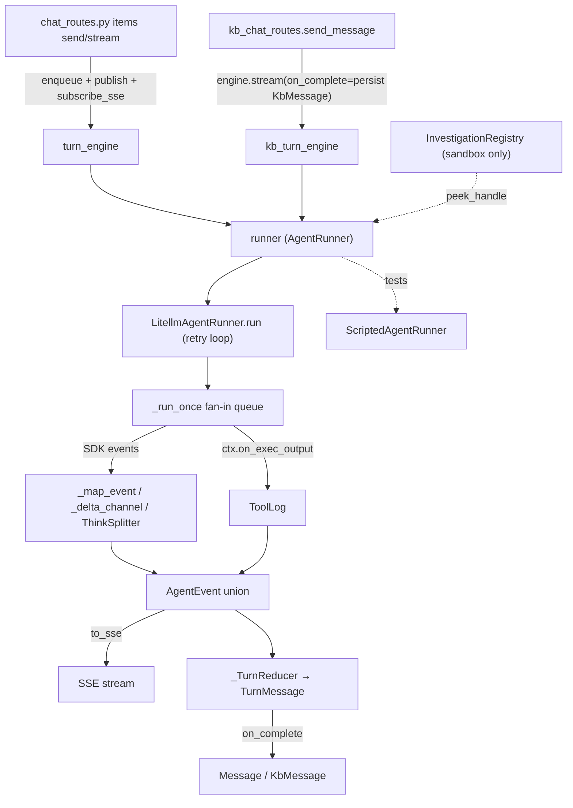

# API 與回合引擎（api-and-turns）

HTTP / SSE 邊界：對外暴露 FastAPI 的 REST 表面（Apps/items、KB collections+documents、KB chat），對內把**每一場 agent 對話**都導進同一個共用的回合生命週期引擎 `ChatTurnEngine`。RCA 工作區聊天與 KB 聊天跑的是**同一個** runner、**同一個** engine，差別只在於各自建構的 `AgentToolContext` 與持久化用的 `on_complete`。

> **看這篇之前**：先讀 [架構總覽](../architecture.md) 抓全貌。

## 職責與邊界

這個子系統負責：

- **REST 表面**：App items 的訊息端點、KB collections/documents 的 CRUD 與上傳、KB chat 的多執行緒對話。
- **回合生命週期**：每個對話一次一場可取消的 in-flight turn；把 runner 吐出的 `AgentEvent` 串流成 SSE，並把同一串事件 reduce 成可持久化的 `TurnMessage`。
- **LiteLLM / Ollama 的眉角集中地**：delta channel 分流、`<think>` 切分、token 用量補值、小模型工具呼叫的重試與診斷，全都收斂在 `LitellmAgentRunner` 一處。
- **兩種廣播模型**：KB chat 的 per-requester `stream()`（新訊息取消前一場），RCA 的 #43 broadcast `enqueue()`（新訊息不取消，序列化於共用 sandbox/檔案）。

**不負責**：

- **Sandbox 生命週期** — 由 `InvestigationRegistry` 持有（KB agent 沒有 sandbox，正因如此 KB 才能重用同一個 engine）。詳見 [Sandbox、FileStore 與同步](sandbox-and-filestore.md)。
- **Agent 內部的 Model 包裝、工具實作、失敗修復** — 屬於 [Agent 執行時](agent-runtime.md)。
- **KB 攝取/索引、檢索與引用解析** — 屬於 [知識庫:攝取與索引](kb-ingest-index.md) 與 [知識庫:檢索與 Agent](kb-retrieval-agent.md)；本層只在 turn 結束時呼叫它們。
- **組裝與 wiring** — 由 [啟動與組裝根](boot-and-config.md) 的 `create_app` 完成。

## 核心模組

| 路徑 | 角色 |
| --- | --- |
| `src/workspace_app/api/turns.py` | `ChatTurnEngine`：per-requester `stream()`（KB）+ #43 `enqueue`/`_worker`/`_run_turn`/`subscribe_sse`/`publish`/`cancel_current`（RCA broadcast）。`_TurnReducer` 把 `AgentEvent` 折成 `TurnMessage`；`history_items` 由持久訊息重建 SDK input items（#199 折疊、#45 token 預算）。 |
| `src/workspace_app/api/runner.py` | `AgentRunner` Protocol（swap 接縫）+ `ScriptedAgentRunner`（測試用）。 |
| `src/workspace_app/api/litellm_runner.py` | `LitellmAgentRunner`：`run()` 重試迴圈（`diagnose_error`/`classify_retry_event`，#26 progress-gated）、`_run_once` fan-in queue（producer 正規化 SDK 事件 + `ctx.on_exec_output` stdout）、`_delta_channel`、`ThinkSplitter`、`_final_tokens`、`_agent_for`。 |
| `src/workspace_app/api/events.py` | `AgentEvent` dataclass union + `to_sse()`；在 `web/src/events.ts` 鏡像。 |
| `src/workspace_app/api/registry.py` | `InvestigationRegistry`：只管 per-investigation 的 **SANDBOX** 生命週期（`ensure_handle`、`peek_handle`、`mirror_warm`/`kill_idle`/`close_all`）。 |
| `src/workspace_app/api/app.py` | `create_app` 組裝根（#54 後精簡為純 composition root，~767 行）：建構 `KernelService`、安裝 monitor、`build_coordinators`、接出兩個 `ChatTurnEngine`（`turn_engine` 與 `kb_turn_engine` 都套在 `runner`；#537 後不再有 wiki 路由層），再呼叫每個 `register_*_routes`。**不再**定義路由 handler 或 lifespan body——lifespan→`lifecycle.py:build_lifespan`、`_run_subagent` bridge→`subagent_bridge.py`、RCA send/stream/cancel→`chat_routes.py`（見下方路由模組表）。 |
| `src/workspace_app/api/kb_chat_routes.py` | KB chat：`KbChat` CRUD + `send_message`（建 KB `AgentToolContext`、持久化帶 `[n]` 引用的 `KbMessage`）+ `answer_question`（給 `ask_knowledge_base` 用的非串流 KB run）+ `kb_progress`。 |
| `src/workspace_app/api/kb_routes.py` | KB REST（無 turns/SSE）：collections、文件上傳+enqueue、分頁列表、render/reindex/move/delete、wiki、export/import。 |
| `src/workspace_app/kernels/service.py` | `KernelService`：per-(item, notebook) 的 IPython kernel 管理（`get_or_start`/`execute_cell`→`CellEvent`/`interrupt`/`restart`/`reap_idle`）。是 `AgentEvent` 之外的**第二條 SSE 串流**，由 notebook cell 端點驅動。 |

### 路由模組（#54 後拆分）

`create_app` 不再內含路由 handler；每組路由各自落在一個 `register_*_routes(app, deps...)` 模組裡，由 `create_app` 呼叫。承接 turn-send / item 定位 / sub-agent 邏輯的**深模組**（小介面、行為在後）也一併從舊 monolith 抽出。

| 路徑 | 角色 |
| --- | --- |
| `src/workspace_app/api/chat_routes.py` | `register_chat_routes`：RCA `send_message` / `stream_investigation` / `cancel_message` + 多 chat CRUD（`list/create/rename/delete_chat`）+ `promote_to_kb` / `export_chat`；以 `send_into=` 注入 `ChatSendService.send`。 |
| `src/workspace_app/api/chat_send.py` | `ChatSendService.send`：舊 `_send_into` closure（append 使用者 `Message`、建 turn ctx、`enqueue` 到 `engine_key`、`on_complete` 持久化）；巢狀 `_run_subagent_with_depth`（#280 tier scope + composer depth/effort，包住 `SubagentBridge.run`）。 |
| `src/workspace_app/api/turn_context.py` | `TurnContextBuilder`：建一場 turn 的 `AgentToolContext`，統一原本在 send 路徑與 workflow node driver 間漂移的建構（`build_chat_turn` / `build_workflow_turn`）。 |
| `src/workspace_app/api/locator.py` | `ItemLocator`：item 身分解析、`resolve_agent_config`（#54 後 `_resolve_agent_config` 的家，仍委派 `resolve_item_agent_config`）、`engine_key`、`context_files`、`require_item` / `conversation_for` / `require_chat`。 |
| `src/workspace_app/api/subagent_bridge.py` | `SubagentBridge.run`：通用 purpose→AgentConfig 的 `_run_subagent` bridge（wiki routing + 引用 relay + logging）；`app.py` 僅建構並留別名 `_run_subagent = subagent_bridge.run`。 |
| `src/workspace_app/api/item_routes.py` | `register_item_routes`：App work-item 生命週期，含 `create_app_item`（`POST /a/{slug}/items`）。 |
| `src/workspace_app/api/meta_routes.py` | `register_meta_routes`：`/me`、user directory、App launcher catalog（`get_app_manifest` = `GET /apps/{slug}`）、`/activity` feed、telemetry monitor（`GET /monitor`、`GET /monitor/stream`）。 |
| `src/workspace_app/api/file_routes.py` | `register_file_routes`：workspace 檔案 / exec / search / replace / download + **notebook cell 端點**（`execute_cell` / interrupt / restart，第二條 SSE 的驅動點）。`KernelService` 本身仍在 `app.py` 建構。 |
| `src/workspace_app/api/workflow_routes.py` | `register_workflow_routes`（run / runs / preview / stream 路由），由 `workflow_exec.py:WorkflowExecutor` 背書（`drive_turn` / run_sandbox / ingest / convert / upsert_card / release / notify_failure）。 |
| `src/workspace_app/api/capability_routes.py` | `register_capability_routes`：item capability + export。 |
| `src/workspace_app/api/lifecycle.py` | `build_lifespan(...)`：FastAPI lifespan；`run_consumers` gate 下的四個 `start_consuming()`（wiki/index/sanity/card_gen）＋五個非佇列 sweeper（`idle_killer` / `mirror_sweeper` / `index_sweeper` #227 / `blob_gc_sweeper` #245 / `code_sync_sweeper`，皆為巢狀函式、無前綴底線）。 |

## 介面與接縫

| 接縫 | 定義位置 | 種類 | 實作 |
| --- | --- | --- | --- |
| `AgentRunner` | `src/workspace_app/api/runner.py` | Protocol | `LitellmAgentRunner`（正式）、`ScriptedAgentRunner`（測試） |
| `AgentToolContext` | `src/workspace_app/agent/context.py` | dual-flavour context | RCA：sandbox/filestore/sync（`chat_send.py:ChatSendService.send` + `turn_context.py:build_chat_turn`）；KB：retriever + collection_ids、無 sandbox（`kb_chat_routes` + `answer_question`） |
| `_SyncHook` | `src/workspace_app/api/registry.py` | Protocol | `src/workspace_app/sync/sandbox_sync.py:SandboxSync` |
| `AgentEvent` | `src/workspace_app/api/events.py` | tagged dataclass union | `web/src/events.ts`（FE 鏡像） |
| inner SDK Model wrap | `src/workspace_app/api/litellm_runner.py:_agent_for._build_model` | swap | `LitellmModel`、`agent/repairing_model.py:RepairingModel`、`agent/decide_then_act.py:DecideThenActModel`、`failover/model.py:FallbackModel` |

`AgentRunner` 只有一個方法 `run(prompt, ctx) -> AsyncIterator[AgentEvent]`：驅動一場 turn、邊發事件邊 yield，最後以 terminal 事件收尾（`RunDone`/`RunError`/…）。實作這個就能換掉整個 agent 引擎——只要 yield 出 FE 看得懂的 `AgentEvent` union，其他都不用動。一般失敗應該被「surface 成 `RunError`」而不是 raise，這樣 SSE 才能乾淨關閉。

## 運作方式 / 資料流

### KB chat（per-requester `stream()`）

`POST /kb/chats/{id}/messages` →（在 `send_message`）先把使用者的 `KbMessage` append 進 `KbChat` → 解析 picker（`agent_name`，未知名稱回 422 不靜默 fallback）→ 建 KB `AgentToolContext`（retriever + `collection_ids` + `history_items(...)` + #106 context-card pre-scan，只增 agent 看到的內容、持久訊息保持乾淨）→ `engine.stream(chat_id, content, ctx, on_complete=persist)`。

`stream()` 拿 `session.lock`，先 `_cancel_prior_turn`（新訊息取消前一場），再 spawn `_drive`。`_drive` 把 `_events(...)`（即 `guard_repetition(runner.run(...))`，#113 重複偵測包在這一處）泵進 per-turn queue：`CancelledError` → 推 `RunCancelled`、其他 `Exception` → 推 `RunError`、最後推 `None` sentinel。回傳 `StreamingResponse(gen())`。`gen()` 把每個事件同時 `reducer.add()`（建可持久化形狀）並 `to_sse()` yield 給這個 requester；收到 sentinel 時呼叫 `on_complete(reducer.produced)`——`persist` 重抓 chat、把每個 `TurnMessage` 轉成 `KbMessage`，assistant 訊息以 `parse_citations(content, ctx.kb_passages)` 解析 `[n]` 並 `record_citations`。

### RCA（#43 broadcast `enqueue()`）

`POST /a/{slug}/items/{item_id}/messages` →（在 `chat_send.py:ChatSendService.send`，即抽出的舊 `_send_into`）append 使用者 `Message` → `turn_engine.publish(engine_key, UserMessage(...))`（先廣播給所有 live viewer）→ `turn_engine.enqueue(engine_key, turn_content, ctx, on_complete=persist)`。**新訊息不取消** in-flight turn——協作者共用一個 sandbox/檔案系統，turn 序列化排隊，只有 `cancel_current`（Stop）能打斷。`_worker` 以 FIFO 拉取，`_run_turn` 把每個 raw event 同時 `reducer.add()` 與 `publish()` 給訂閱者；turn 結束時 future `set_result(None)` 喚醒在等的那個 POST。`GET .../stream` → `subscribe_sse(key)`（eager 註冊，turn 在 connect 與首次 body-pull 之間開始也不漏）。`locator.py:ItemLocator.engine_key`（#54 後 `_engine_key` 的家）讓**預設 chat** 沿用 `item_id` 當 key（item-level 端點、workflow drive、檔案變更廣播共享同一條 stream），其他 chat 各自以 `chat_id` 為 key。

### Runner（`LitellmAgentRunner.run`）

`run()` 先守 `ctx.agent_config`（`None` → yield `RunError`，#94 不靜默跑某個 default agent），再進迴圈跑 `_run_once`。小模型失敗時 `diagnose_error` 給回饋 hint、`classify_retry_event` 選最貼切的事件（三種 tool-arg 失敗 → `ToolCallParseError`，其餘 → `RunError`），**只有在沒有使用者可見進度時**才重試（#26：SDK 無法 mid-turn resume，restart 會清掉已串流的可見輸出；reasoning-only 仍可重試）。

`_run_once` 先建 fan-in `queue`（**先建 queue 再建 agent**，這樣 #196 的 `FallbackModel` 切換能往裡推 `FailoverSwitch`），設 `ctx.on_exec_output = lambda b: queue.put_nowait(ToolLog(...))`（讓還在跑的長 exec 的 stdout 能 live 插進來），跑 `Runner.run_streamed`。一個 `produce()` task 把 `raw_response_event` 的 delta 經 `_delta_channel` + `ThinkSplitter` 路由成 `MessageDelta(content|reasoning)`，把 `run_item_stream_event` 經 `_map_event` 路由成 `ToolStart`/`ToolEnd`，並發 `AgentMetrics`（`up`/`down`/`final`）。drain 迴圈 yield 先到的；遇 `done` sentinel 結束。

### Notebook cell 執行（kernels / 第二條 SSE）

agent 回合不是這層唯一的串流。`POST /a/{slug}/items/{item_id}/notebooks/{notebook_path:path}/cells/{idx}/execute`（#54 後註冊在 `file_routes.py:register_file_routes`）走的是一條**獨立**的 SSE 串流：`KernelService.get_or_start(item_id, notebook_path)` 取得（或起一個）per-(item, notebook) 的 IPython kernel，`execute_cell(handle, code)` 把該 cell 跑出的 IOPub 訊息 drain 成 `CellEvent`（`CellStream` / `CellDisplayData` / `CellError` / `CellDone`，見 [線上契約](../contract.md)）直到 kernel 回到 `idle`。kernel 在 `create_app` 建一個 `KernelService` 持有、lifespan 收尾時 `shutdown_all`；`reap_idle(threshold)` 回收閒置 kernel。它與 `ChatTurnEngine` **完全分開**——notebook 不經 runner、不發 `AgentEvent`，但同樣跑在 sandbox host 上（kernel 起在 `LocalProcessSandbox` 的執行環境裡，見 [Sandbox、FileStore 與同步](sandbox-and-filestore.md)）。

## 關鍵不變式與眉角

!!! warning "`_delta_channel` 按事件型別分流，不是按 `.delta` 是否存在"
    LiteLLM/Qwen 路徑上有 **五種** Responses `*.delta` 事件都帶 `.delta` 字串。`output_text.delta` + `refusal.delta` → content；型別含 `"reasoning"` → reasoning；`function_call_arguments.delta` → **忽略**（否則工具呼叫的 JSON 會洩漏進答案文字）。只靠「有沒有 `.delta`」判斷是錯的。

!!! warning "Ollama 常回報 usage=0"
    `_final_tokens` 優先用 provider 的精確 usage，但當 usage 為 `None` **或 0** 時退回 chars/4 近似（`usage[0] or prompt_tok`、`usage[1] or approx_completion`）。否則最後一行 token 數會翻成 ↑0 ↓0。

!!! warning "`_map_event` 用 `_raw_field` 讀 `call_id`，不是 `getattr`"
    工具輸出的 `raw_item` 在 LiteLLM 路徑上是 `FunctionCallOutput` TypedDict（dict），其餘情況才是物件。純 `getattr` 會默默丟失 `call_id`，FE 的工具卡就會永遠卡在「running」。

!!! note "兩種廣播模型的取消語意不同"
    `stream()`（KB，per-requester）：新訊息**取消**前一場（由 `session.lock` 序列化）。`enqueue()`（RCA #43，broadcast）：新訊息**不取消**——協作者共用 sandbox/檔案，turn 序列化排隊，只有 `cancel_current`（Stop）打斷。`ChatTurnEngine` 擁有 **turn** 生命週期；`InvestigationRegistry` 擁有 **sandbox** 生命週期。不要在每個表面各自重做 turn/cancel/SSE。

!!! warning "history 不可在對話中段含 system item"
    `_build_input` 會 `assert` 沒有 `role == "system"` 的項目（SDK 自己 prepend system prompt，中段再插一個會被 provider 以「system message must be at the beginning」拒絕）。使用者取消是以 `_INTERRUPTED_MARKER` **折疊進前一個 assistant turn** 重播（#199），絕不發成獨立 system 訊息。`history_items` 也把 `role == "error"` 的 marker（除 `cancelled` 外）排除在模型 context 之外（#37）。

!!! note "`on_complete` 每場 turn 必定觸發一次"
    正常 / 取消 / 錯誤都會觸發；已串流的部分輸出**保留**，terminal marker 是 append 而非清除。`_drive`/`_run_turn` 把 `CancelledError` → `RunCancelled`、其他 `Exception` → `RunError`，讓 SSE 乾淨關閉；runner 把一般失敗 surface 成 `RunError` 而不是 raise。

!!! note "引用不走 SSE 串流"
    KB `[n]` 引用在 turn 結束時（`on_complete` / `parse_citations`）才解析；FE 在收到 `done` 後重抓 thread 取得持久化的 `[n] → Citation`。`events.py` 的 union 必須與 `web/src/events.ts` 同步。

!!! note "工具呼叫的容錯集中在一處"
    小模型常把多個 tool_call 的 arguments 串接成無法解析的 JSON。`_agent_for` 用 `wrap_with_args_recovery` 包每個工具（剝出第一個合法 JSON 物件，並在結果字串警告模型自我修正），底層再以 `RepairingModel`（#76 backstop，恆開）淨化輸出邊界的壞 JSON。刻意**不**強制 `parallel_tool_calls=False`（#69，會被某些 provider 拒絕且是 replay/live 行為差異的唯一來源）。

## 設計決策與出處

| 決策 | 理由 | 出處 |
| --- | --- | --- |
| 一個 `ChatTurnEngine` + 一個 `AgentRunner` 同時服務 RCA 與 KB chat | per-conversation lock、單一可取消 turn、`_drive` 泵與 SSE reduction 全收在一處；dual-flavour context 區分表面 | `CLAUDE.md` + `turns.py` docstring |
| `InvestigationRegistry` 只保留 sandbox 生命週期 | KB agent 沒有 sandbox；分離才能讓 KB 重用 engine | `registry.py` + `turns.py` docstring |
| `_delta_channel` 按事件型別分類而非按 `.delta` 是否存在 | `function_call_arguments.delta` 必須忽略，否則 tool-call JSON 洩漏進答案 | `litellm_runner.py:_delta_channel` |
| usage 缺席或為 0 時保留 chars/4 近似 | Ollama 常串流 usage=0，否則最後 token 行會翻成 0/0 | `litellm_runner.py:_final_tokens` |
| RCA enqueue/broadcast：新訊息不取消執行中的 turn | 協作者共用一個 sandbox/檔案；turn 序列化，Stop 才是明確中斷 | `turns.py:enqueue`（#43）+ `chat_send.py:ChatSendService.send` |
| 只在沒有使用者可見進度時重試 | SDK 無法 mid-turn resume，restart 會清掉可見輸出；reasoning-only 仍可重試 | `litellm_runner.py:_should_retry`（#26） |
| 每個 turn 把 runner 包進 `guard_repetition` | 偵測退化重複迴圈並截斷持久訊息，活的串流保留重複以示模型出錯 | `ChatTurnEngine._events`（#113） |
| `_agent_for` 不強制 `parallel_tool_calls=False` | 是 replay/live 唯一線級差異且部分 provider 直接拒絕；`args_recovery` wrap 才是真正防線 | `litellm_runner.py`（#69） |

## 與其他子系統的關係

- **上游組裝**：[啟動與組裝根](boot-and-config.md) 的 `create_app` 接出兩個 engine、`runner`、`InvestigationRegistry`，並注冊 KB / KB-chat / RCA 路由。
- **下游 agent 執行**：[Agent 執行時](agent-runtime.md) 提供 `AgentToolContext`、`build_tools`/`tooling.registry`、以及 `_agent_for._build_model` 換進的 Model 包裝（`RepairingModel`/`DecideThenActModel`/`FallbackModel`），底層走 OpenAI Agents SDK + LiteLLM/Ollama。
- **Sandbox/檔案**：[Sandbox、FileStore 與同步](sandbox-and-filestore.md) — `InvestigationRegistry.peek_handle` 決定檔案操作走 warm sandbox 或 FileStore 快照；`_SyncHook` 即 `SandboxSync`。
- **KB 攝取/檢索**：`kb_routes` 的上傳把文件 enqueue 給 [知識庫:攝取與索引](kb-ingest-index.md)（#312 `build_coordinators`）；`kb_chat_routes` + `answer_question` 走 [知識庫:檢索與 Agent](kb-retrieval-agent.md) 的 retriever 與 `[n]` 解析。
- **App / Workflow**：[App 平台](apps-platform.md) 的 items 經 `chat_send.py:ChatSendService.send`（舊 `_send_into`）進 RCA broadcast；[Workflow 引擎](workflow-engine.md) 的 step 事件折進 `AgentEvent` union 並搭 #43 stream 廣播。
- **失敗轉移 / 擴展**：`failover/`（`FallbackModel` + `CooldownRegistry`）的 #196 切換 → `FailoverSwitch`；[背景工作與擴展](jobs-and-scaling.md) 的 worker pod / producer gating 影響 `kb_routes` 的 enqueue 行為。
- **資料層 / 前端**：`on_complete` 持久化進 [資料層（specstar）](data-layer.md) 的 `Conversation` / `KbChat` 模型；[前端（web/）](frontend.md) 以 `web/src/events.ts` 鏡像事件、用共用的 `AgentEntryView.tsx` 渲染兩種聊天。

## 原始碼錨點

接手者建議照這個順序讀：

- `src/workspace_app/api/turns.py` — `ChatTurnEngine.stream` / `_drive`（KB per-requester）、`enqueue` / `_worker` / `_run_turn` / `cancel_current` / `subscribe_sse`（RCA #43 broadcast）、`_TurnReducer`、`history_items`。
- `src/workspace_app/api/runner.py` — `AgentRunner` Protocol 的 swap 契約 + `ScriptedAgentRunner`。
- `src/workspace_app/api/litellm_runner.py` — `LitellmAgentRunner.run`（重試迴圈）/ `_run_once`（fan-in queue）/ `_delta_channel` / `ThinkSplitter` / `_final_tokens` / `diagnose_error` / `_map_event` / `_agent_for`。
- `src/workspace_app/api/events.py` — `AgentEvent` union + `to_sse`（與 `web/src/events.ts` 對照）。
- `src/workspace_app/api/registry.py` — `InvestigationRegistry`（只看 sandbox，對照 turn 生命週期的分界）。
- `src/workspace_app/api/kb_chat_routes.py` — `register_kb_chat_routes` / `send_message` / `answer_question` / `kb_progress`。
- `src/workspace_app/api/app.py` — 只剩 `create_app`（搜 `turn_engine` / `kb_turn_engine` wiring）；#54 後 `_send_into`→`chat_send.py:ChatSendService.send`、`_engine_key` / `_resolve_agent_config`→`locator.py:ItemLocator`、turn-context 建構→`turn_context.py:TurnContextBuilder`、`_run_subagent`→`subagent_bridge.py:SubagentBridge.run`、lifespan→`lifecycle.py:build_lifespan`、RCA send/stream/cancel→`chat_routes.py`。
- `src/workspace_app/api/chat_routes.py` / `chat_send.py` / `locator.py` / `turn_context.py` / `subagent_bridge.py` — #54 後 RCA send 路徑的家：`register_chat_routes`（send/stream/cancel + 多 chat）、`ChatSendService.send`（含巢狀 `_run_subagent_with_depth`）、`ItemLocator`、`TurnContextBuilder`、`SubagentBridge.run`。
- `src/workspace_app/api/kb_routes.py` — `register_kb_routes`（純 REST，無 turns/SSE）。
- `src/workspace_app/kernels/service.py` — `KernelService`（notebook cell 的第二條 SSE；`execute_cell` → `CellEvent`、`reap_idle`）；`KernelService` 仍在 `api/app.py` 建構（~line 293），但驅動它的 cell 端點（execute/interrupt/restart）#54 後在 `api/file_routes.py:register_file_routes`。

> 部分細節（`agent/context.py` 的 `AgentToolContext` 欄位全集、`repetition_guard.py` 的 `RepetitionStopped` 內部邏輯）以原始碼為準；`_run_once` / `_run_once_nonstream` 標了 `# pragma: no cover`，只有 live-Ollama 整合測試會走到。
