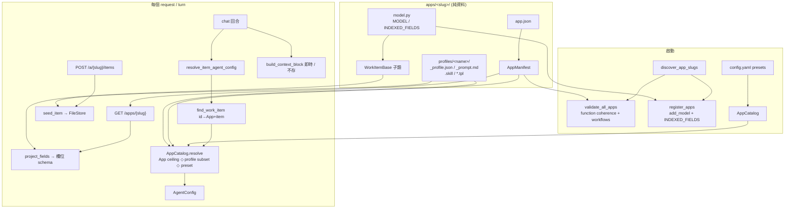

# App 平台（apps-platform）

把 RCA、Topic Hub、Playground 從「被特例化的畫面」變成「純資料定義的 App」的子系統（#89）。每個 App 就是一個資料目錄 `apps/<slug>/`（`app.json` 身分/功能/agent/版面 + `model.py` 的 WorkItem Struct + `prompts/` + `profiles/`），靠掃描自動註冊——丟一個新目錄進去就上線,**不需要改任何平台程式碼**。共用後端把這些資料檔轉成一個註冊到 specstar 的 resource、一份給前端用的欄位 schema,以及每回合一個 `AgentConfig`(透過 App ◇ profile ◇ preset 三層 resolve)。

> **看這篇之前**:先讀 [架構總覽](../architecture.md) 抓全貌。

## 職責與邊界

這個子系統負責:

- **App 發現與註冊**:掃描 `apps/` 找出帶 `app.json` 的目錄,匯入各 App 的 `model.py`,把 `MODEL`(`WorkItemBase` 子類)`add_model` 到 specstar(`registry.py`)。
- **資料契約解碼**:把 `app.json` → `AppManifest`、`_profile.json` → `ProfileManifest`(`manifest.py` / `profiles.py`)。
- **三層 agent resolve**:每回合把 App 上限 ◇ profile 子集 ◇ preset(model/creds)合成一個 `AgentConfig`(`catalog.py`)。
- **欄位 schema 投影**:從 model 的 msgspec/OpenAPI schema 推導出前端可渲染/可編輯的欄位清單(`schema.py`)。
- **建立 item 時的 starter 內容 seeding**(`seeding.py`)、每回合的 context-file 注入(`context_files.py`)、漸進揭露 skills(`skills.py` / `shared_skills.py`)。

**不負責**(留給鄰居):

- 回合執行、SSE、取消——那是 [API 與回合引擎](api-and-turns.md) 與 [Agent 執行時](agent-runtime.md)。
- 工具的實際實作(`exec` / `ask_knowledge_base` / `make_deck` …)——`app.json` 只列**名字**,實作在 [工具套件與 Sandbox Host](tooling-and-sandbox-host.md) + `AgentToolContext`。
- WorkItem 的儲存後端——交給 [資料層(specstar)](data-layer.md);本層只 `add_model` 註冊。
- 前端的 `WorkspaceShell` / 欄位渲染——本層只**產出** manifest + 欄位 schema,消費端見 [前端(web/)](frontend.md)。
- profile 帶的 workflow `run.py` 的實際編排——那是 [Workflow 引擎](workflow-engine.md);本層只在啟動時跑 `validate_workflow_profiles`。

## 核心模組

| 路徑 | 角色 |
| --- | --- |
| `src/workspace_app/apps/manifest.py` | `app.json` 的型別形狀:`AppManifest` + `FunctionToggles` / `AgentManifest` / `PickerEntry` / `Layout` / `Lifecycle` / `ItemNouns` / `Onboarding`。`load_app_manifest(slug)` 解碼。欄位**型別/選項**不在這裡——從 model 的 schema 讀(decision 19)。 |
| `src/workspace_app/apps/base.py` | `WorkItemBase`——每個 App 的 item Struct 都繼承它。Tier1 `title`/`owner`(+ `profile`/`attached_preset`),Tier2 `members`/`topics`(`T \| UnsetType`,redeclaring 才 opt-in),Tier3 = App 自己的 domain 欄位。也定義 `IndexedFields` 型別別名。 |
| `src/workspace_app/apps/registry.py` | 發現 + specstar 註冊。`_app_models` 掃 `discover_app_slugs()`、匯入各 `model.py`(slug 是合法識別字→`import_module`;含連字號如 `topic-hub`→`_load_model_module` 用 file-path exec),斷言 `MODEL` 是 `WorkItemBase` 子類。`register_apps` 對每個 App `add_model`。`resource_route` 把 model 名 kebab-case 成 FE CRUD 路由。`@cache`。 |
| `src/workspace_app/apps/catalog.py` | `AppCatalog`——每回合三層 resolve。`resolve()` → `AgentConfig`:tools/presets 是 App ceiling 的 profile 子集(否則整個 ceiling),preset 給 model/creds/sandbox_image/idle/env,prompt = base ◇ #241 preamble ◇ profile appendix ◇ skill index。`validate_function_coherence` + `validate_all_apps` 在啟動時 enforce decision 11。 |
| `src/workspace_app/apps/profiles.py` | `ProfileManifest`(`_profile.json`)——narrows `tools` ⊆ app.tools / `presets` ⊆ app.picker,加 `suggestions` / `default_preset` / `collections`(#280)/ `upload_dir`(#198)/ `workflows`(#100)。`load_profile` / `load_profile_appendix` / `list_profiles` + workflow 正規化 helper。 |
| `src/workspace_app/apps/resolve.py` | `find_work_item(spec, item_id)`——「id → 哪個 App 擁有它 + 那個 item」的唯一接縫(掃 `registered_apps`,`item_id == resource_id`),per-turn 與 mention 路徑共用。`resolve_item_agent_config` 把它橋接到 `AppCatalog.resolve`。 |
| `src/workspace_app/apps/schema.py` | `project_fields(model)` → `list[FieldSpec{name,label,kind,options?}]`(走 `msgspec.inspect`)。Enum→`select`(+options),list/Unset-wrapped-list→`tags`,其餘→`text`。折進 `GET /apps/{slug}` 當 `data['fields']`。 |
| `src/workspace_app/apps/seeding.py` | `seed_item(...)`——把 `apps/<slug>/profiles/<profile>/` 複製進新 item 的 FileStore;`.tpl` 檔用 `string.Template` 以 `case_from_item(item)` 代換並去掉 `.tpl`;`_profile.json`/`_prompt.md`/`.skill`/`run.py`/`__init__` 跳過。鍵在 opaque `item_id`。 |
| `src/workspace_app/apps/context_files.py` | 每回合 deterministic 注入(Topic Hub §6)。`build_context_block` 每回合**即時**從 FileStore 讀 `agent.context_files`(如 `MEMORY.md`、`collections.json`),render 成標籤區塊 prepend 到 agent content;**永不存進 history**(idempotent / replay-safe)。 |
| `src/workspace_app/apps/skills.py` | 漸進揭露 skills。Package skill 在 `profiles/
/.skill/<name>/SKILL.md`(frontmatter `name`/`description` + body,`read_skill` 按需載入)。`list_skills`/`load_skill`(`@cache`)、workspace skills(#298,即時讀不快取)、`merged_profile_skills`,加上 `save_skill` 工具(在 `agent/tools.py`)用的 helper `slugify_skill_name`/`render_skill_md`。 |
| `src/workspace_app/apps/shared_skills.py` | `SHARED_SKILLS` registry(name→`sample-skills/` 下的源目錄,mirror tooling `PACKAGES`)。App 透過 `app.json` `agent.skills` opt-in。v1 ships `author-skill`(co-authoring meta-skill)。 |
| `src/workspace_app/apps/rca/`（`app.json` + `model.py`） | RCA App:完整 workspace+sandbox+terminal、最大工具 ceiling、`primary_surface=ide`、lifecycle status→resolved/abandoned。`RcaInvestigation` Tier3 `severity`/`status`(enums)/`product`(`str`),`INDEXED_FIELDS=[severity,status,product]`。 |
| `src/workspace_app/apps/topic-hub/`（`app.json` + `model.py`） | 連字號 slug → `model.py` 由 file path 載入(絕對 import、不 `from __future__ import annotations`)。`terminal:false`、`chat_switcher=always`、`context_files=[MEMORY.md,collections.json]`,collection set 是 workspace **檔案**不是 model 欄位。`TopicHub` Tier3 只有 `status`。 |
| `src/workspace_app/apps/playground/`（`app.json` + `model.py`） | 最小 baseline App(#102 診斷)。`PlaygroundItem`:`topics`(Tier2) + `status`(Tier3)。single-preset picker。 |
| `src/workspace_app/apps/_template/` | Copy-me 樣板(`app.json`/`__init__.py`/`model.py`)。`_`-prefixed → 被 `discover_app_slugs` 跳過,永不註冊成真 App。對應 [adding-an-app](../adding-an-app.md)。 |

## 介面與接縫

本層的多型靠**資料契約 + base Struct + resolver**,而非 Protocol/ABC。主要接縫:

| 接縫 | 種類 | 定義位置 | 實作 |
| --- | --- | --- | --- |
| `WorkItemBase` | base Struct(per-App 子類) | `src/workspace_app/apps/base.py` | `apps/rca/model.py:RcaInvestigation`、`apps/topic-hub/model.py:TopicHub`、`apps/playground/model.py:PlaygroundItem`、`apps/_template/model.py` |
| `app.json → AppManifest` | 資料契約(msgspec decode) | `src/workspace_app/apps/manifest.py` | `apps/rca/app.json`、`apps/topic-hub/app.json`、`apps/playground/app.json` |
| `_profile.json → ProfileManifest` | 資料契約(msgspec decode) | `src/workspace_app/apps/profiles.py` | `apps/<slug>/profiles/*/_profile.json` |
| `AppCatalog.resolve`(三層) | resolver | `src/workspace_app/apps/catalog.py` | `apps/resolve.py:resolve_item_agent_config`、`factories.py:get_app_catalog` |
| `find_work_item`(id → App+item) | lookup 接縫 | `src/workspace_app/apps/resolve.py` | per-turn resolution + mention 路徑 |
| `SHARED_SKILLS` registry | registry(mirror tooling `PACKAGES`) | `src/workspace_app/apps/shared_skills.py` | `sample-skills/author-skill` |

## 運作方式 / 資料流

### 啟動(組裝根)

`factories.get_app_catalog(settings)`(由 [啟動與組裝根](boot-and-config.md) 在啟動時呼叫)先跑 `validate_all_apps()`:對每個 `discover_app_slugs()` 跑 `validate_function_coherence(load_app_manifest(slug))`(decision 11 硬錯)+ `validate_workflow_profiles(slug)`,然後用 `settings.agents.presets` 建 `AppCatalog`。同一啟動路徑下,`resources/__init__.py`(`make_spec`)呼叫 `register_apps(spec)`,對每個 App `add_model(MODEL, indexed_fields=INDEXED_FIELDS)`。`_app_models()` 被 `@cache` 起來——一個 process 的 App 集合固定。

### Manifest 抓取

`GET /apps/{slug}`(`api/app.py:get_app_manifest`):`load_app_manifest` 轉 builtins 後,補上 `resource_route`、`project_fields(app_model(slug))` 當 `data['fields']`、各 profile 的 picker(`list_profiles`/`load_profile`,含 `upload_dir`),若 `icon` 以 `.svg` 結尾就 inline 進 `data['icon']`。前端拿這份 manifest × 欄位 schema 驅動整個 `WorkspaceShell`。

### 建立 item

`POST /a/{slug}/items`(`api/app.py:create_app_item`):`msgspec.convert(body + owner + 預設 profile → model)` → `spec.create` → `seed_item` 把 profile 的 starter 檔(`.tpl` 用 `case_from_item` 代換)複製進 item 的 FileStore(`item_id == resource_id`)→ #280 `resolve_profile_collections` 把 profile 預設 collection set 解析成 live id 寫進 `collections.json`。

### 每回合 resolve

`api/app.py` 的 `_resolve_agent_config(item_id)` 呼叫 `resolve_item_agent_config(spec, app_catalog, item_id)`:`find_work_item` 掃 `registered_apps()` 得到 `(slug, item)`,再 `app_catalog.resolve(app_slug=slug, profile=item.profile, attached_preset=item.attached_preset or None)`(keyword-only 簽名)合成 tools(profile ⊆ app ceiling)、allowed presets(profile ⊆ app.picker)、chosen preset(attached → profile default → 第一個),以及 system prompt(base `prompt_file` ◇ #241 workspace preamble(僅 workspace App)◇ profile `_prompt.md` appendix ◇ merged skill index)。同一回合,API 也呼叫 `build_context_block` 把 App `agent.context_files` 的即時內容 prepend 到 agent content(永不存進 history),另外 `build_workspace_skills_block` 把使用者在此 workspace 共創的 skill 索引一併 prepend。

## 關鍵不變式與眉角

!!! warning "function toggles ↔ tools[] 一致性是啟動硬錯"
    `validate_function_coherence` 在啟動時 raise(不是回合時靜默失敗):`terminal` 需 `sandbox`;tools 含 `exec` 需 `sandbox:true`;檔案工具(`read_file`/`write_file`/`edit_file`/`list_files`/`exists`/`delete_file`)需 `workspace:true`;`primary_surface=ide` 需 `workspace:true`;每個 `agent.skills` 名字都必須存在於 `SHARED_SKILLS`。一個 typo 就 fail boot loud,而不是回合時神祕誤動作。

!!! warning "profile 只能 narrow,不能 widen"
    profile 的 `tools` 必須 ⊆ `app.tools`、`presets` ⊆ `app.picker`(`_subset_or_raise`)——profile **收窄** App ceiling,永不放大。省略(`UNSET`)→ 繼承整個 ceiling。

!!! warning "連字號 slug 的 model.py 規矩"
    含連字號的 slug(`topic-hub`)不是可 import 的 package,其 `model.py` 由 file path exec(`_load_model_module`),所以它**必須用絕對 import**、**且不可** `from __future__ import annotations`(msgspec 會 eager 解析欄位型別,而 path-exec 的合成模組名不保證在 `sys.modules` 裡供 stringised forward-ref 解析)。同理見 workflow `run.py`。

!!! note "item_id 就是 WorkItem 的 specstar resource_id"
    它全域唯一(不是 uid),是 FileStore / Conversation / sandbox 共用的 opaque cross-cutting key。**永不 parse 它。**

!!! note "Tier-2 opt-in 靠 redeclaring,不要 extra:dict"
    把 base 的 `members`/`topics`(`T | UnsetType`)在子類 redeclare 成具體 `list[str]` 才啟用該功能;留 `UNSET` 代表 App 沒這功能,msgspec 在 wire 上省略它。不要加 `extra: dict`。

!!! note "欄位型別/選項來自 model schema,app.json 只做顯示"
    `project_fields` 從 model 的 OpenAPI/msgspec schema 推導 `kind`/`options`;model 是 enum 選項的唯一真相。`app.json` 只 overlay 顯示(`layout`/`labels`/`field_styles`)。**注意**:`schema.py` 實際會吐第三種 `kind`——`tags`(給 list 欄位),不只 `select`/`text`(以程式碼為準)。

!!! note "context_files 每回合即時注入、永不存"
    區塊每回合從 FileStore 重新讀取,只有最新回合帶它,絕不寫進 conversation history(idempotent + replay-safe)。

!!! note "profile metadata 永不被 seed 進 workspace"
    `seeding._SKIP` = `{__init__.py, __pycache__, _profile.json, _prompt.md, .skill, run.py}`——只有 starter 內容會進 item workspace。

!!! note "package skill 的 frontmatter name 必須等於目錄名"
    否則 `list_skills` 會靜默跳過(`save_skill` 工具用 `slugify_skill_name` 讓 frontmatter `name` 與目錄名同步,因此不會寫出會被跳過的 skill);`SKILL.md` body 上限 `50_000` 字元(超過 raise,絕不截斷)。

!!! note "_-prefixed 目錄永遠不是 App"
    `discover_app_slugs` 跳過 `_`-prefixed 目錄(`_template`、`_base.md`、`__pycache__`)。一個 App 目錄 = 帶 `app.json`(marker)+ `model.py`(暴露 `MODEL` 為 `WorkItemBase` 子類 + `INDEXED_FIELDS`)的子目錄。

## 設計決策與出處

| 決策 | 理由 | 出處 |
| --- | --- | --- |
| 三層 resolve:App ceiling ◇ profile subset ◇ preset model/creds | 把能力創作(App)、starter 內容/收窄(profile)、部署 LLM 配方(config.yaml preset)分開獨立變化;App 不會被 profile 放大。 | #89 decision 25;`catalog.py` docstring |
| tools[] ↔ function toggle 不一致是啟動硬錯,不靜默丟棄 | `exec` 配 `sandbox:false`(或拼錯的 shared skill)應該 fail boot loud,而非回合時神祕誤動作。 | #89 decision 11;#298 Q7;`validate_function_coherence` |
| 欄位型別來自 model schema,app.json 只做顯示 | enum 選項單一真相;呼應 specstar autocrud 的 ResourceField,但 runtime 端瘦身,前端免 codegen。 | #89 decision 19/P7b;`schema.py` |
| `WorkItemBase` Tier 模型(1 具體 / 2 opt-in / 3 App domain) | 平台結構欄位保證存在,選用平台功能 redeclare 才 opt-in(msgspec 在 wire 省略 UNSET),App 專屬欄位 typed 且 per-resource 原生索引(無跨 App 混料、無 `extra:dict`)。 | #89;`base.py` |
| App 靠掃描 `apps/` 的 `app.json`+`model.py` 發現;連字號 slug 由 file path 載入 | 丟一個目錄就註冊一個 App,零平台程式碼改動;連字號 slug 不是 importable package,model 像 workflow `run.py` 那樣 exec。 | #89 P3;`registry.py`;[adding-an-app](../adding-an-app.md) |
| context_files 每回合即時注入、永不存 | agent 永遠看到當下的 `MEMORY.md`/`collections.json`,而 history 保持乾淨;idempotent + replay-safe;泛化 #106 的 context-card prepend。 | Topic Hub §6;`context_files.py` |
| `primary_surface`(chat vs ide)+ `chat_switcher`(auto vs always)是 manifest 資料 | chat-first App(Topic Hub)vs IDE-first(RCA evidence/brief)純由 `app.json` 資料驅動前端 chrome,不是 shell 程式碼。 | #159 / #200;`manifest.Layout` |

## 與其他子系統的關係

- [啟動與組裝根](boot-and-config.md)——`factories.get_app_catalog` 從 `settings.agents.presets` 建 `AppCatalog` 並跑 `validate_all_apps`;`resources/__init__.py` 的 `register_apps(spec)`。
- [API 與回合引擎](api-and-turns.md)——`GET /apps/{slug}`(manifest+fields+profiles)、`POST /a/{slug}/items`(create+seed+collections)、per-turn `resolve_item_agent_config`、`build_context_block` prepend。
- [Agent 執行時](agent-runtime.md)——`resolve` 吐出的 `AgentConfig` 餵給 runner;`allowed_tools` 由它消費。
- [資料層(specstar)](data-layer.md)——`register_apps` 把每個 App 的 WorkItem `add_model`;`find_work_item` 走 resource manager 查 id。`config/schema.py:Preset` 是 catalog 折進 `AgentConfig` 的 model/creds 層。
- [Sandbox、FileStore 與同步](sandbox-and-filestore.md)——`seed_item` 寫 / `context_files` 讀,皆鍵於 `item_id`。
- [Workflow 引擎](workflow-engine.md)——`validate_workflow_profiles` 在啟動驗證;`ProfileManifest.workflows`(`WorkflowManifest`)+ profile 的 `workflows/<id>/run.py`。
- [知識庫:攝取與索引](kb-ingest-index.md)——#280 `kb/collections.py:resolve_profile_collections` 從 profile 預設 set seed `collections.json`。
- [工具套件與 Sandbox Host](tooling-and-sandbox-host.md)——`app.json` `agent.tools` 列的工具名;`SHARED_SKILLS` mirror tooling `PACKAGES`。
- [前端(web/)](frontend.md)——通用 `WorkspaceShell` / `DomainFields` 由 manifest layout × 欄位 schema 驅動。
- 新增一個 App 的步驟手冊:[adding-an-app](../adding-an-app.md);Topic Hub 細節:[topic-hub](../topic-hub.md)。

## 原始碼錨點

接手者建議先讀的真實檔案:

- `src/workspace_app/apps/catalog.py`——`AppCatalog.resolve`、`validate_function_coherence`、`discover_app_slugs`、`validate_all_apps`(三層 resolve + 啟動 gate)。
- `src/workspace_app/apps/manifest.py`——`AppManifest` / `FunctionToggles` / `Layout` / `Lifecycle` / `load_app_manifest`(`app.json` 的型別形狀)。
- `src/workspace_app/apps/base.py`——`WorkItemBase` 三層欄位模型 + `IndexedFields`。
- `src/workspace_app/apps/registry.py`——`_load_model_module` / `_app_models` / `register_apps` / `resource_route`(發現 + specstar 註冊)。
- `src/workspace_app/apps/resolve.py`——`find_work_item` / `resolve_item_agent_config`(id → App+item 接縫)。
- `src/workspace_app/apps/profiles.py`——`ProfileManifest` / `load_profile` / `normalize_workflows`。
- `src/workspace_app/apps/schema.py`——`project_fields` / `FieldSpec`。
- `src/workspace_app/apps/seeding.py`——`seed_item` / `case_from_item`。
- `src/workspace_app/apps/context_files.py`——`build_context_block`。
- `src/workspace_app/apps/skills.py` + `shared_skills.py`——`merged_profile_skills` / `list_skills` / `SHARED_SKILLS`。
- `src/workspace_app/apps/rca/model.py`、`apps/topic-hub/model.py`、`apps/playground/model.py`——三個對照範例(含連字號 slug 的 file-path 載入特例)。
- `src/workspace_app/api/app.py`——`get_app_manifest` / `create_app_item` / `_resolve_agent_config` / `build_context_block` prepend 的呼叫點。
- `src/workspace_app/factories.py`——`get_app_catalog`。
