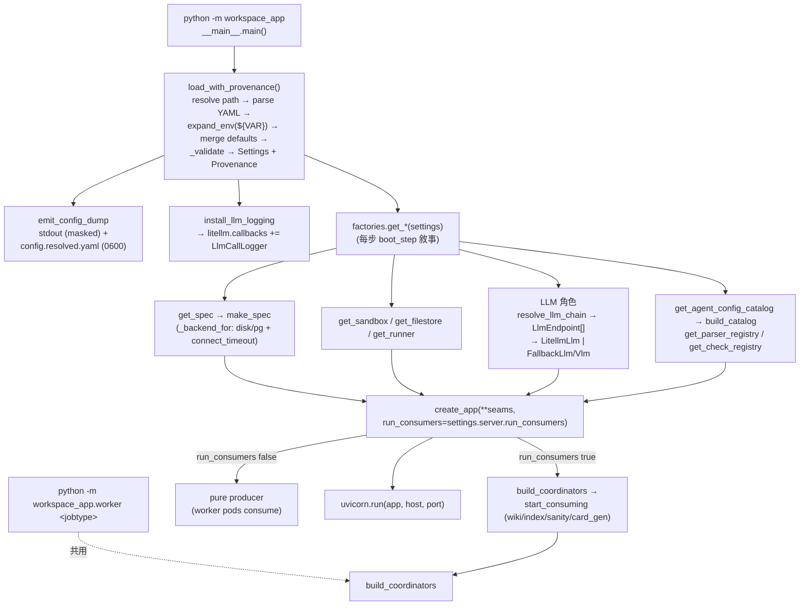

# 啟動與組裝根（Boot and Config）

把 `python -m workspace_app`（外加一份 operator 的 `config.yaml`）變成一個活著的 FastAPI app 的「組裝根」（composition root）：載入型別化的 `Settings`、記錄每個 leaf 的來源（provenance）、透過 `factories.get_*` 建出每個可插拔的 Protocol/ABC 實作、敘事化每個 blocking 啟動步驟、裝上觀測（config dump + 可重播的 litellm 呼叫紀錄），最後把全部東西注入 `create_app`。

> **看這篇之前**：先讀 [架構總覽](../architecture.md) 抓全貌。

## 職責與邊界

這個子系統是**唯一決定「哪個實作墊在每個接縫底下」的地方** —— 換一個 backend 是改 config，不是改 code。它負責：

- **設定載入**：bundled defaults ◇ operator YAML 的層疊合併、`${VAR}` 環境變數插值、嚴格驗證、per-leaf provenance。
- **接縫選擇**：`factories.get_*(settings) -> Protocol impl`，把 sandbox / filestore / runner / embedder / chunker / ILlm / IVlm 等每個 seam 對應到一個具體實作。
- **啟動敘事與觀測**：`boot_step` 包住每個 blocking 步驟；`emit_config_dump` 印出已解析設定；`install_llm_logging` 裝上忠實可重播的 LLM 呼叫紀錄。
- **注入 `create_app`**：把 ~40 個 keyword seam 餵進 FastAPI 組裝。

它**不**負責的事：

- 不負責 FastAPI 內部的 route 註冊、回合引擎、sweeper 排程等 —— 那些在 [API 與回合引擎](api-and-turns.md) 與 `src/workspace_app/api/app.py` 內。
- 不負責背景工作的實際消費邏輯 —— 它只建出 coordinator 物件並（在 `run_consumers` 為真時）啟動消費，細節見 [背景工作與擴展](jobs-and-scaling.md)。
- 不負責 specstar 的資料模型本身 —— 那是 [資料層（specstar）](data-layer.md)；這裡只組出 `BackendConfig` 並呼叫 `make_spec`。
- 測試**不**走 `factories.get_*`：測試直接 `Settings(...)` + 注入 mock。factory 只服務 production 組裝。

## 核心模組

| 路徑 | 角色 |
| --- | --- |
| `src/workspace_app/__main__.py` | Production entrypoint / thin composition root。`main()`：解析 `--config`、`load_with_provenance`、印出套用的 config 檔、`emit_config_dump`、定義 `get_user_id` 接縫、`install_llm_logging`,然後一連串 `boot_step(...)` 包住的 factory 呼叫,最後 `create_app(...)` + `uvicorn.run`。 |
| `src/workspace_app/config/schema.py` | 型別化的巢狀 `Settings` frozen-dataclass 樹 + bundled defaults。各 section:server/sandbox/sandbox_host/tools/filestore/runner/llm/read_file/exec/history/kb/agents/health/message_queue/observability/failover。`ServerSettings` 帶 `default_user`/`superusers`/`run_consumers`。 |
| `src/workspace_app/config/loader.py` | 載入 pipeline orchestrator。`load_with_provenance` 把路徑解析→YAML 解析→插值→層疊合併→嚴格 `_validate`→`_settings_from_dict`→`_build_provenance` 串起來。定義 `Source`/`Provenance` 與 `SOURCE_CONFIG/ENV/DEFAULT`。 |
| `src/workspace_app/config/interpolate.py` | `${NAME}`/`$NAME` 環境變數插值。`expand_env` 對未設定的引用丟 `EnvVarUnset`(fail-loud);`$$`→`$`。`has_env_reference` 驅動 provenance 的 env-vs-literal 標記。 |
| `src/workspace_app/config/merge.py` | `merge_layered(base, override)` —— loader（defaults ◇ YAML）與 catalog（preset ◇ usage）共用的 deep merge。dict 遞迴、list 整段取代、其餘 override 勝出。 |
| `src/workspace_app/config/catalog_build.py` | `build_catalog(settings, config_dir) -> AgentConfigCatalog`。逐一走 `agents.sub_agents` 的每個 purpose,`resolve_usage` 把 usage ◇ preset、解析 `prompt_file`→body、建出 `AgentConfig`。KB-required purpose 為空或沒給 `kb_search` 就 fail-loud。 |
| `src/workspace_app/config/prompt_file.py` | `resolve_prompt_file(value, config_dir)` —— 把 preset 的 `prompt_file`（`pkg:`/絕對/相對）解析成 markdown body;相對路徑以 config_dir 為錨。 |
| `src/workspace_app/config/dump.py` | 觀測功能 A。`emit_config_dump` 把已解析的樹印成註解 YAML `key: value  # ← <source>`（stdout 上遮罩 secret）並寫一份真值 `config.resolved.yaml`（0600）。best-effort,絕不擋 boot。 |
| `src/workspace_app/factories.py` | 接縫選擇層:`get_*(settings) -> Protocol impl`。包含 `get_spec`/`_backend_for`、`get_sandbox`、`get_filestore`、`get_runner`，以及所有 LLM 角色 factory（透過 `resolve_llm_chain` + `LlmEndpoint` + `_llm_from_chain`/`_vlm_from_chain`）、parser/check registry、`build_message_queue_factory`。 |
| `src/workspace_app/api/app.py` | `create_app(*, spec, sandbox, filestore, runner, ...~40 seams, run_consumers=True)` —— FastAPI 組裝。掛 route、用 `coordinators.build_coordinators` 建 coordinator,只在 `run_consumers` 為真時對 wiki/index/sanity/card_gen 呼叫 `start_consuming()`。 |
| `src/workspace_app/coordinators.py` | FastAPI-free 組裝根 `build_coordinators`（+ `build_ingestor`/`resolve_wiki_config`),被 `create_app` 與 worker entrypoint 共用,讓 API 能當 pure producer 而 worker pod 各消費一個 JobType。 |
| `src/workspace_app/worker/__main__.py` | 獨立 worker entrypoint `python -m workspace_app.worker <jobtype>` —— 用同一個 `build_coordinators` block-consume 一個 JobType,是 `run_consumers` 拆分的另一半。 |
| `src/workspace_app/observability/boot.py` | `boot_step(label)` context manager —— `→ enter / ✓ done (1.2s) / ✗ failed` 敘事,每行 flush,讓卡住的步驟自己報名（#208）。 |
| `src/workspace_app/observability/setup.py` | `install_llm_logging(settings)` —— gate（`WORKSPACE_LLM_LOG` env 覆蓋 config `observability.llm_log.enabled`,預設 on）後構造 `LlmCallLogger(LlmLogWriter(dir))` 並 append 到 `litellm.callbacks`。 |
| `src/workspace_app/observability/logger.py` | `LlmCallLogger(CustomLogger)` —— 對每個 litellm 呼叫觸發;async success/failure hook 建 record 並用 `asyncio.to_thread` 寫出(不卡),全部 best-effort(不錯)。 |
| `src/workspace_app/observability/record.py` | 純函式,從 litellm kwargs+response 建出忠實、可貼上重播的 record:`request` block 等同 `litellm.completion(**request)` kwargs。`classify_call` 分桶 generative/embedding/rerank/other。 |
| `src/workspace_app/observability/writer.py` | `LlmLogWriter` —— 日期分區的磁碟 layout(`<root>/<day>/NNNN-<call_type>-<id>.json` + `index.jsonl`),並丟一支 `replay.py` 助手重播任一 record。同步,經 to_thread 離開 event loop 呼叫。 |

## 介面與接縫

`factories.get_*` 是這些 seam 的**唯一選擇點**;下游只依賴 Protocol/ABC,不依賴具體實作或 `Settings`。

| Seam | 種類 | 定義位置 | 實作（正式 / 測試） |
| --- | --- | --- | --- |
| `Sandbox` | Protocol | `src/workspace_app/sandbox/protocol.py` | `LocalProcessSandbox`、`HttpSandbox`、`DockerSandbox`（已棄用）/ `MockSandbox` |
| `FileStore` | Protocol | `src/workspace_app/filestore/protocol.py` | `SpecstarFileStore` / `MemoryFileStore` |
| `AgentRunner` | Protocol | `src/workspace_app/api/runner.py` | `LitellmAgentRunner` / `ScriptedAgentRunner` |
| `Embedder` | Protocol | `src/workspace_app/kb/embedder.py` | `LitellmEmbedder` / `HashEmbedder` |
| `ILlm` | interface | `src/workspace_app/kb/llm.py` | `LitellmLlm`、`FallbackLlm`（`src/workspace_app/failover/llm.py`） |
| `IVlm` | interface | `src/workspace_app/kb/vlm/protocol.py` | `LitellmVlm`、`FallbackVlm` |
| `Chunker` | Protocol | `src/workspace_app/kb/chunker.py` | `FixedTokenChunker` |
| `MessageQueueFactory` | interface | `specstar.message_queue` | `SimpleMessageQueueFactory` / `RabbitMQMessageQueueFactory` |
| `IParser` / `ISanityCheck` | ABC/Protocol | `src/workspace_app/kb/parsers`、`src/workspace_app/health` | bundled + dotted-path 自訂 |

LLM 角色（`get_kb_llm`/`get_card_drafter_llm`/`get_kb_quality_judge_llm`/`get_sanity_judge_llm`/`get_kb_vlm`/`get_designed_pptx_vlm` 等）都走同一條 cascade:`resolve_llm_chain(settings, ref)` 解出一串 `LlmEndpoint`,再由 `_llm_from_chain`/`_vlm_from_chain` 收斂:`0` 個 → `None`（角色關閉）、`1` 個 → 純 `LitellmLlm`/`LitellmVlm`、`≥2` 個 → busy-aware `FallbackLlm`/`FallbackVlm`。

## 運作方式 / 資料流

主要 runtime 路徑（`main()`）：

1. **`_parse_args`** 讀 `--config / -c`。
2. **`load_with_provenance(config_path)`** 跑載入 pipeline：解析 config 路徑（顯式 > `$WORKSPACE_APP_CONFIG` > `./config.yaml`）；解析 YAML 並保留原始樹供 provenance；`_walk_strings` 對每個字串 leaf 套 `expand_env`（`${VAR}` 變活值,未設定 → `EnvVarUnset`）；層疊合併到 `asdict(Settings())`（把 `agents.sub_agents` flatten 讓 operator 的扁平 key 能覆蓋,合併後再 pack 回去）;嚴格 `_validate` 對照 `_TOP_SCHEMA` + preset/fallback/ref/`max_searches` 檢查;`_settings_from_dict` 構造型別化 `Settings`;`_build_provenance` 從原始 operator YAML 標每個 leaf 為 config.yaml/env/default。
3. 印出套用了哪個 config 檔,然後 **`emit_config_dump`** 把遮罩過的註解 YAML 印到 stdout,並寫真值 `config.resolved.yaml`(0600)。
4. **`get_user_id = lambda: settings.server.default_user`** —— 同一個接縫穿進 `get_spec`(讓 specstar 蓋 `created_by`)與 `create_app`(access 層 + KB doc-id),兩者不可分歧。
5. **`install_llm_logging(settings)`** 依 `WORKSPACE_LLM_LOG`/config gate,把 `LlmCallLogger` append 到 `litellm.callbacks`。
6. 一連串 **`boot_step(...)`** 包住的 factory 呼叫:`get_spec`(從 filestore 設定經 `_backend_for` 組 specstar backend,Postgres DSN 注入 `connect_timeout`;`make_spec` 註冊所有 model)、可選的 `migrate_inline_to_binary`(#219,僅 specstar filestore)、`discover_packages` 工具套件、`get_embedder` 與各 LLM 角色、`get_sandbox`。每個 LLM 角色走 `resolve_llm_chain` + `_llm_from_chain` 收斂。
7. **`create_app(spec=, sandbox=, filestore=get_filestore(settings, spec), runner=get_runner(settings), ...~40 seams, run_consumers=settings.server.run_consumers)`** 組出 FastAPI,用 `build_coordinators` 建 coordinator,只在 `run_consumers` 為真時啟動 in-process 消費。
8. **`uvicorn.run(app, host, port)`**。

Worker 路徑(`python -m workspace_app.worker <jobtype>`)重用 `load_with_provenance` + `build_coordinators`,當 API 當 pure producer 時 block-consume 單一 JobType。

## 關鍵不變式與眉角

!!! warning "Secret 紀律與遮罩"
    **永遠不要讀 `configs/config.yaml`(活的 secret)** —— 只讀 `config.example.yaml` 與 `config/schema.py`。dump 在 stdout 上遮罩 `api_key`/`pg_dsn`/`*_token`/`rabbitmq.url`;`base_url` 刻意**不**遮罩(operator 想看打去哪)。真值只寫進 `config.resolved.yaml`(0600)。

!!! warning "`${VAR}` 是唯一的環境覆蓋機制"
    沒有 per-field 1:1 的 env 查找。未設定的引用在 load 時丟 `EnvVarUnset`(fail-loud),絕不靜默變空字串(一個 typo 例如 `${OPENAPI_KEY}` 不會悄悄關掉認證)。`$$`→字面 `$`;`FOO=""`(設了但空)會代入空字串且**不**報錯。

!!! note "Provenance 答的是『我設了什麼』"
    Provenance 由**插值前的原始 YAML** 推導(operator 實際寫了哪些 leaf),與寫的值是否剛好等於 default 無關。

!!! warning "驗證在啟動時 fail-loud,不是首次使用時"
    未知 key、壞掉的 preset 引用、自我參照/未知的 fallback、缺 `model`、壞的 retrieval-llm ref、以及 `kb.max_searches_per_turn`(null 或正整數)全都在啟動時 raise,訊息帶上出錯的 dotted path + 來源檔。Registry resolver(`kb.parsers`、`health.checks`)也是零參數構造 dotted-path 類別,未知 id / 壞路徑 / 錯 base class 在啟動 raise,不是首次上傳/執行時。

!!! warning "`get_user_id` 是單一接縫,穿進兩處"
    同一個 callable 必須同時餵 `get_spec` 與 `create_app`;分歧會悄悄破壞非預設使用者的 KB 交叉引用連結(#41)。`superusers`(frozenset)亦同 —— 必須與 `make_spec` 和 route 的 `authorize` 一致(#262)。

!!! warning "每個 blocking 步驟都要包 boot_step"
    config dump 到活著的 server 之間的每個 blocking 步驟都必須包在 `boot_step`,卡住時最後一行未配對的 `→` 就是元兇(#208)。Postgres-down 的卡住會落在 `create_app` 的 `spec.apply`,所以 `_backend_for` 對 Postgres DSN 注入 `connect_timeout` 讓它 fail-fast。

!!! note "LLM 角色 chain 的收斂語意"
    無 chain → `None`(角色關閉,優雅降級);單一 endpoint → 純 `LitellmLlm`(無 failover 機制);`≥2` endpoint → busy-aware `FallbackLlm`/`FallbackVlm`。內層 per-call `num_retries=0`,因為 failover loop 自己用「換模型」來重試(#196)。

!!! warning "KB-required purpose 必須給 kb_search"
    `kb_chat`、`infer_modules` 必須非空且授予 `kb_search`,否則 `build_catalog` raise —— 沒有它的 sub-agent 會悄悄退化成「我無法存取 KB」式的拒答。

!!! note "觀測絕不擋回合也絕不卡 loop"
    LLM 紀錄全 best-effort(失敗只記 debug),檔案 I/O 經 `asyncio.to_thread` 離開 event loop。`request` block 必須維持逐字可重播(等同 `litellm.completion(**request)` kwargs)。

!!! note "run_consumers 只 gate in-process 消費"
    `run_consumers`(預設 true = all-in-one)只控制 in-process 的 queue 消費;pod-split 在 API 上設 false(pure producer)並跑 worker pod。`build_coordinators` 是 `create_app` 與 worker 共用的唯一 FastAPI-free 根 —— 新 coordinator 加在那裡,不要 inline 進 `create_app`(#312)。`_backend_for` 在 `disk_root` 與 `pg_dsn` 皆空時回 `None`(in-memory specstar 預設,讓 `Settings()` 對測試可用)。

## 設計決策與出處

| 決策 | 理由 | 出處 |
| --- | --- | --- |
| 設定 = bundled defaults ◇ operator YAML,`${VAR}` 插值為唯一 env 機制 | operator 改 config.yaml 就能換任一接縫,單一可稽核的覆蓋路徑;靜默空字串會把 typo 變成悄悄關認證,只在首次 LLM 呼叫才浮現 | config-refactor grill Q1/Q2/Q7;`interpolate.py` / `loader.py` docstring |
| 嚴格驗證 + provenance dump + 啟動時 fail-loud registry | 設定錯誤要立刻可見並帶上出錯路徑,不要變成數小時後才發現的靜默降級執行 | `loader._validate`、`factories.get_parser_registry`/`get_check_registry`、`dump.py` |
| `boot_step` 敘事每個 blocking 啟動步驟 | pod 以前在 config dump 後靜默卡住,任一步卡住看起來都一樣;敘事讓卡住的步驟自己報名 | #208;`observability/boot.py` docstring |
| 用單一 litellm `CustomLogger` 做忠實可重播的 LLM 呼叫紀錄 | 一個 callback 覆蓋每個呼叫點(runner/KB/retrieval/VLM/wiki/embeddings),無需 per-site 接線;record 可貼上重播,讓 operator 重發並調 prompt;必須不卡、不錯 | always-stream-LLM / LLM-features-need-live-checks 記憶;`observability/logger.py` docstring |
| LLM 角色走單一 preset cascade,`≥2` endpoint 變 busy-aware `FallbackLlm` | 部署有多個各自可能「太忙」的模型;優先序清單讓系統在 busy/hang 時換下一個;單一 cascade 避免平行的扁平 config block 走樣 | #196/#131;`docs/plan-llm-failover.md`;`factories.LlmEndpoint`/`resolve_llm_chain` |
| Job runner ⊥ API,以 `run_consumers` gate + 共用 `build_coordinators` | 讓 API 當 pure producer 而專屬 worker pod 各自在自己的 HPA 下消費每個 JobType;coordinator 構造 FastAPI-free 讓 worker 沒有 HTTP app | #312;`coordinators.py` docstring;`ServerSettings.run_consumers` |
| Postgres DSN 在 DSN 接縫注入 `connect_timeout` | specstar 的 SQLAlchemy engine 沒有 timeout,DB 掛掉時首次連線(`spec.apply` 的 create_all)會卡數分鐘;DSN 是我們唯一擁有、會流到每個 store 的接縫 | #208;`factories._with_connect_timeout` |

## 與其他子系統的關係

- **[資料層（specstar）](data-layer.md)**：`get_spec` 從 filestore 設定組 `BackendConfig` 並呼叫 `make_spec`,把 `default_user` + `superusers` 穿進去讓 storage access_scope 與 API guard 一致。
- **[API 與回合引擎](api-and-turns.md)**：`create_app` 是所有 factory 的匯流點 —— ~40 個 keyword seam 在此注入,`run_consumers` 的消費端與 route 接線也在這裡。
- **[Sandbox、FileStore 與同步](sandbox-and-filestore.md)**：`get_sandbox` / `get_filestore` 是 Sandbox / FileStore Protocol 的唯一選擇點。
- **[Agent 執行時](agent-runtime.md)**：`get_runner` 建 `LitellmAgentRunner`(含 failover chain);`get_agent_config_catalog` → `build_catalog` 把 `Settings.agents` 變成 runtime `AgentConfigCatalog`。
- **[App 平台](apps-platform.md)**：`get_app_catalog` 在啟動時 `validate_all_apps` 驗證每個 App(#89)。
- **[知識庫:攝取與索引](kb-ingest-index.md)** 與 **[知識庫:檢索與 Agent](kb-retrieval-agent.md)**:embedder、doc/chat pipeline、parser registry、retrieval/VLM/wiki/quality/card-drafter LLM 全在這裡建好並注入。
- **[背景工作與擴展](jobs-and-scaling.md)**：`coordinators.build_coordinators` 與 worker entrypoint 共用 FastAPI-free 根,由 `run_consumers` gate(#312)。
- **[平台服務（健康 / 觀測 / 權限 / 使用者）](platform-services.md)**：`get_check_registry`、`get_replay_service`、`get_sanity_llm_factory`/`get_sanity_models` 由 settings 建好注入;`install_llm_logging` 把 `CustomLogger` append 到 litellm.callbacks。
- 部署面（pod-split / HPA / worker 入口）見 [部署](../deployment.md)。

## 原始碼錨點

接手者建議優先讀的真實檔案：

- `src/workspace_app/__main__.py` —— `main()`:`load_with_provenance` → `emit_config_dump` → `install_llm_logging` → `boot_step` 鏈 → `create_app` → `uvicorn.run`;`get_user_id` 接縫;`run_consumers=settings.server.run_consumers`。
- `src/workspace_app/config/loader.py` —— `load_with_provenance`、`_validate`、`_TOP_SCHEMA`、`_build_provenance`、`_settings_from_dict`。
- `src/workspace_app/config/interpolate.py` —— `expand_env`、`has_env_reference`、`EnvVarUnset`。
- `src/workspace_app/config/schema.py` —— `Settings`、`ServerSettings`(`default_user`/`superusers`/`run_consumers`)。
- `src/workspace_app/config/catalog_build.py` —— `build_catalog`、`resolve_usage`、`_validate_kb_search_granted`、`_KB_REQUIRED_PURPOSES`。
- `src/workspace_app/factories.py` —— `get_spec`、`_backend_for`、`_with_connect_timeout`、`get_sandbox`、`get_filestore`、`get_runner`、`resolve_llm_chain`、`LlmEndpoint`、`_llm_from_chain`/`_vlm_from_chain`。
- `src/workspace_app/config/dump.py` —— `emit_config_dump`、`render`、`_is_secret`、`_mask`。
- `src/workspace_app/observability/boot.py`、`setup.py`、`logger.py`、`record.py`、`writer.py`。
- `src/workspace_app/api/app.py` —— `create_app` 簽章 + `run_consumers` 消費 gate + `build_coordinators` 區段。
- `src/workspace_app/coordinators.py`、`src/workspace_app/worker/__main__.py`。
