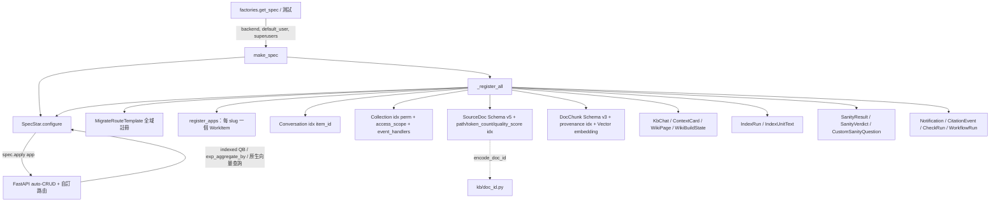

# 資料層（specstar）

本子系統是 `workspace_app` 的**型別化持久層邊界**：每一筆被儲存的記錄都是一個 `msgspec.Struct`，在一個由 `make_spec(...)` 建立的 `SpecStar` 上註冊，背後接 specstar 的 auto-CRUD、向量儲存與 blob 儲存，並有可抽換的 backend（測試用 in-memory、部署用 postgres/disk）。除了 `AgentConfig` 這個刻意的例外（它住在部署 config 而非 DB），平台所有狀態都從這裡長出來。

> **看這篇之前**：先讀 [架構總覽](../architecture.md) 抓全貌。

## 職責與邊界

這個子系統**只負責**：

- 宣告每一種被持久化的記錄型別（`msgspec.Struct`），以及它的 `indexed_fields`、`Schema` 遷移鏈、自然鍵 id 規則。
- 透過 `make_spec` 把整個資源表組裝、設定、註冊到**一個** `SpecStar` 實例上，讓任何拿到它的程式路徑都能直接做 indexed 查詢、`exp_aggregate_by` 聚合、原生向量查詢。
- 為新增的 index 提供 backfill 機制（`Schema.step` + migrate route），讓既有資料列補上遲到的索引。

它**不負責**：

- 業務邏輯與 runtime 行為——攝取、索引、檢索、回合驅動分別住在 [知識庫：攝取與索引](kb-ingest-index.md)、[知識庫：檢索與 Agent](kb-retrieval-agent.md)、[API 與回合引擎](api-and-turns.md)。資料層只給「形狀」，不給「動作」。
- backend 的實際接線（postgres/disk profile）——那由 `factories.get_spec` 在 [啟動與組裝根](boot-and-config.md) 覆寫。
- agent-config 的清單——那是部署 config 的 picker，刻意**不**註冊成資源（見下文）。
- 列級權限與 ACL 的判斷邏輯——資料層只把 `access_scope` / `event_handlers` 接到 `Collection` 上，判斷本身在 [平台服務（健康 / 觀測 / 權限 / 使用者）](platform-services.md)。

## 核心模組

| 路徑 | 角色 |
| --- | --- |
| `src/workspace_app/resources/__init__.py` | 組裝根：`make_spec` + `_register_all`；資源、`indexed_fields`、`Schema` 遷移鏈與 issue 標註理由的權威表。 |
| `src/workspace_app/resources/kb.py` | KB 記錄圖：`Collection`、`WikiPage`、`WikiBuildState`、`SourceDoc`、`DocChunk`（raw `embedding`/`embedding_alt` Vector）、`IndexRun`、`IndexUnitText`、`ContextCard`、`KbChat`/`KbMessage`/`RetrievedPassage`；在 import 時從 env 解析 `EMBED_DIM`/`CODE_EMBED_DIM`。 |
| `src/workspace_app/resources/conversation.py` | `Message` + `Conversation`（opaque indexed `item_id`、多聊天 `run_id`/`created_ms`）；`Citation` + `MessageMetrics` 放這裡以避開與 `kb.py` 的循環匯入。 |
| `src/workspace_app/resources/sanity.py` | `SanityResult`/`SanityVerdict`/`CustomSanityQuestion`（current-only，透過 `sanity_result_id`/`sanity_verdict_id` 產生 hash 過的 slash-free id）。 |
| `src/workspace_app/resources/agent_config.py` | `AgentConfig` + `Suggestion` 兩個 `msgspec.Struct`；**不**註冊成資源（picker 由部署 config 擁有）。 |
| `src/workspace_app/kb/doc_id.py` | `SourceDoc` 身分：`canonical_path` + `encode_doc_id`（ASCII `/` → `∕` U+2215，opaque，永不解析）。 |
| `src/workspace_app/apps/registry.py` | 掃描 `apps/<slug>/` 並為每個 App 的 WorkItem（`MODEL` + `INDEXED_FIELDS`）`add_model`。 |
| `src/workspace_app/apps/base.py` | `WorkItemBase`（Tier1 `title`/`owner`/`profile`；Tier2 opt-in `members`/`topics`）+ `IndexedFields` alias。 |
| `src/workspace_app/resources/check_run.py` | `CheckRun`（`check_id` indexed）——健檢歷史。 |
| `src/workspace_app/resources/citation_event.py` | `CitationEvent`（`document_id`/`collection_id` indexed）——append-only 引用日誌。 |
| `src/workspace_app/resources/notification.py` | `Notification`（`recipient` indexed）。 |

## 介面與接縫

資料層本身沒有自家的 Protocol/ABC——它接的是 specstar 的擴充點。重要接縫如下：

| 接縫 | 種類 | 定義位置 | 實作 |
| --- | --- | --- | --- |
| WorkItem 註冊 | discovery + `add_model` | `apps/base.py`（`WorkItemBase`/`IndexedFields`） | `apps/registry.py register_apps` 掃描；每個 `apps/<slug>/model.py` 提供 `MODEL` + `INDEXED_FIELDS` |
| BackendConfig | specstar config 接縫 | `resources/__init__.py make_spec(backend=...)` | in-memory 預設（測試）；postgres/disk 經 `factories.get_spec` 的 `_backend_for(settings)` |
| MigrateRouteTemplate | specstar route template | `specstar.crud.route_templates.migrate.MigrateRouteTemplate` | 在 `_register_all` 全域註冊 → 每個 model 都掛 `POST /{model}/migrate/execute` |
| Embedder 維度綁定 | env → Vector 寬度 | `resources/kb.py _resolve_embed_dim` / `_resolve_code_embed_dim` | `DocChunk.embedding`（`EMBED_DIM`）/ `DocChunk.embedding_alt`（`CODE_EMBED_DIM`） |

`make_spec` 是**唯一**公開入口（`register_all` 刻意不在 `__all__`）：它一次完成「建構 + 設定 + 註冊」。詳見[與其他子系統的關係](#與其他子系統的關係)。

## 運作方式 / 資料流

主要 runtime 路徑：

1. **建構**：`factories.get_spec`（prod）或測試呼叫 `make_spec(...)`，傳入 `default_user`（prod 是請求使用者的 callable）、`backend`、`superusers`。`make_spec` 先 `spec.configure(...)`，再呼叫內部的 `_register_all`。
2. **註冊順序很重要**：`_register_all` **先** `add_route_template(MigrateRouteTemplate())`（必須在 model 之前，這樣 `spec.apply(app)` 才會為每個 model 掛 migrate 路由），**再** `register_apps(spec)`（每個 App 的 WorkItem），**再**一個個 `add_model` 把 KB 圖、Conversation、sanity、雜項資源連同各自的 `indexed_fields` 註冊上去。
3. **App WorkItem**：`registry.register_apps` 透過 `discover_app_slugs()` 掃 `apps/`，對每個 slug 載入 `model.py`（valid identifier 用 `import_module`；含 hyphen 的 slug 如 `topic-hub` 用 `_load_model_module` 按檔案路徑 exec），取出 `MODEL`（`WorkItemBase` 子類）+ `INDEXED_FIELDS` 後 `add_model`。
4. **runtime 查詢**：所有讀寫都走 indexed QB 查詢（`.sort`/`.limit`）、`exp_aggregate_by(query=...)` scoped 聚合、或原生向量查詢——**從不** fetch-all 再用 Python 過濾，也沒有 ORM 層。
5. **id 規則**：`SourceDoc` 的 resource id 由 `encode_doc_id(collection_id, path)` 產生（自然鍵，`/` 換成 `∕`）；`DocChunk` 衍生且 current-only（`SourceDoc` 改變就重建）；新加的 index 經 `Schema.step` + migrate route 補回舊列。

## 關鍵不變式與眉角

!!! warning "永遠用 `make_spec`，不要裸 `SpecStar()`"
    在 API 邊界直接 `SpecStar()` 是 bug：registry 留空，第一個 resource-manager lookup 就 `KeyError`（例如 `Notification`）。`register_all` 是 `make_spec` 的內部細節，不在 `__all__`——你以為需要它時，其實需要的是 `make_spec`。也**永遠不要**用 module-level 的 `specstar.spec` 單例（測試隔離）。

!!! warning "`.contains` 在 indexed `list[str]` 上是「精確元素成員」"
    自 specstar 0.11.9 起，`.contains` 對 indexed `list[str]` 欄位做的是**精確元素成員**比對：`'m4'` 不等於 `'m40'`。前提是該欄位必須**同時**留在 `indexed_fields` 且標註為 `list[...]`，否則 SQL 會退化成 substring `LIKE`（而 in-memory 測試 backend 永遠做元素成員，會藏住 Postgres-only 的退化）。適用於 `KbChat.shared_with`、`ContextCard.norm_keys`。

!!! warning "頁面聚合走 `exp_aggregate_by(query=...)`，不要全域 group-by"
    一頁的 count/sum 要透過 scoped 到該頁 ids/collection 的 `exp_aggregate_by(query=...)` 推下去做；`.contains` 是**過濾器**，不是 group-by，產不出 per-element 計數。詳見 #103 / `docs/q-specstar-efficient-aggregates.md`。

!!! warning "自然鍵 id 是 opaque，永不解析"
    `SourceDoc` id（`encode_doc_id`）、`WikiPage` id（`{collection_id}/{path}` slash-free）、以及 hash 過的 sanity id 都是 opaque handle。要還原 `collection`/`path`/`created_by`，請讀記錄欄位（`path`、`collection_id`）+ specstar meta，**絕不**拆解 id。`SourceDoc` id 會出現在 `kb://doc/{id}` 連結並對使用者顯示，所以才用 `∕`（U+2215）而非 percent-encode 整個鍵。

!!! warning "新 index 只覆蓋之後寫入的列；backfill 要 bump 新版本"
    specstar 在寫入時抽取 `indexed_data`，**不**自動 backfill 既有列（它們群在 `None` 版本下、在聚合中少算）。backfill 唯一手段是 `rm.migrate`（經 `MigrateRouteTemplate` 的 `POST /{model}/migrate/execute`）。在「已是目前版本」的列上加 index 是 no-op，所以必須 bump 一個**新**版本，並提供從 `None` **和**前一版本兩條 `step`（見 `SourceDoc` v2→v3 路徑）。

!!! note "遷移 transform：資料不變就回傳原物件"
    `_reindex_only` 是 identity（reindex 是 migrate 的 write-back 副作用，transform 不改記錄）；`_backfill_token_count`（#88，v3→v4）才真的用 `msgspec.structs.replace` 從已存的 `text` 重算 `token_count`。`quality_score`（#105，v4→v5）用 no-op reindex，因為分數是 index time 由 judge 算的，migration 裡沒有 LLM。

!!! note "embedding 維度在 import 時綁定 Vector 寬度"
    `EMBED_DIM`/`CODE_EMBED_DIM` 在 `kb.py` import 時從 env 解析並綁死 `DocChunk` 的 Vector 欄位寬度；換 embedding 模型 = 重新索引事件。每個 chunk **恰好**設 `embedding` 或 `embedding_alt` 其一（由 Collection 的 `embedder_id` 決定），兩者皆 nullable 讓 retriever 能在兩欄位上平行 fan-out 後 RRF。

!!! note "衍生 / 暫態 / upsert 資源的生命週期"
    `DocChunk` 是衍生且 current-only（`SourceDoc` 變動就刪掉重建，rollback 即重新索引）；`IndexUnitText` 是暫態（finalize 時刪除）；`SanityResult`/`SanityVerdict` 是依自然鍵的 upsert。`IndexRun` 的 resource id **就是** doc id——once-only finalize 與「已有索引在跑」的 guard 都靠 CAS（`finalized` flag + `status` guard），**不**靠 queue（RabbitMQ 忽略 `partition_key`，#227）。

!!! note "specstar 自動 metadata 不要重定義"
    created/updated time、`updated_by`、revision 由 specstar 自動追蹤，讀 `.info` 即可，別在 Struct 上重定義。但 list 子物件（`KbMessage`/`Message`）自帶 `created_at`，因為 specstar 不追蹤 per-element 時間戳。另外 Struct 欄位用 `dict[str, Any]`（**不是** `object`，否則 JSON-schema 生成壞掉）；用 `assert isinstance(...)` 收斂 `resource.data` 給 `ty`。

## 設計決策與出處

| 決策 | 理由 | 出處 |
| --- | --- | --- |
| 單一 `make_spec` 根；`register_all` 不公開 | 一次呼叫完成建構 + 設定 + 註冊，沒有路徑會拿到空 registry | `resources/__init__.py` docstring |
| `SourceDoc` id = 自然鍵，`/` 換 `∕`，opaque | specstar id 不能含 ASCII `/`，而 id 會進 `kb://doc/{id}` 連結且對人顯示；percent-encode 會把它弄醜 | `kb/doc_id.py` docstring；CLAUDE.md |
| `Conversation.item_id` opaque + indexed，非 `Ref` | 一張共用 `Conversation` 表服務每個 App；`Ref` 只綁一個 model，刪除改用 per-App on-delete handler | `conversation.py` docstring；#89 |
| `SourceDoc` Schema v2→v5 混合 reindex/data steps | 每個 launch 後新加的 index（`path` #263、`token_count` #88、`quality_score` #105）都要把舊列重新抽取，且在已是目前版本上重新索引是 no-op，所以每次都被迫 bump 版本 | `resources/__init__.py` 註解；`docs/q-specstar-reindex-on-blob-edit.md` |
| `IndexRun` 以 doc id 為鍵，靠 CAS 不靠 queue | RabbitMQ 忽略 `partition_key`，所以 once-only finalize / coalescing 靠 CAS-claimed `finalized` flag + status guard | `kb.py IndexRun` docstring；#227 |
| `AgentConfig` 不是資源 | 註冊它會讓 FE 能寫入並偏離部署宣告的 preset 清單 | `resources/__init__.py _register_all` docstring；CONTEXT.md |
| `exp_aggregate_by(query=)` 做頁面 tally | `.contains` 產不出 per-element 計數；推下一個 scoped group-by 而非掃整張表 | CLAUDE.md；`docs/q-specstar-efficient-aggregates.md`；#103 |
| `Collection` 接 `access_scope` + `event_handlers` | `permission_checker=` 被 specstar spec-level AllowAll 預設遮蔽，故 write ACL 走 per-model `event_handlers`；`access_scope` 走列級讀/列可見性 | `resources/__init__.py` 註解；#262 |

## 與其他子系統的關係

- **[App 平台](apps-platform.md)**：每個 App 的 WorkItem 在此註冊；`item_id` 把 `Conversation`、FileStore、sandbox 交叉連到某個 WorkItem 的 `resource_id`。`WorkItemBase` / `IndexedFields` 的定義也在這裡（`apps/base.py`），per-App 的 `INDEXED_FIELDS` 住在 `apps/<slug>/model.py`。
- **[知識庫：攝取與索引](kb-ingest-index.md)**：`kb/doc_id.py` 供應 `SourceDoc` id；Ingestor 寫 `SourceDoc`/`DocChunk`；`index_coordinator` / quality 寫 `status`/`token_count`/`quality_score`；fan-out 索引狀態靠 `IndexRun`/`IndexUnitText`。
- **[知識庫：檢索與 Agent](kb-retrieval-agent.md)**：retriever 對 `DocChunk.embedding`/`embedding_alt` 做原生向量查詢；`ContextCard.norm_keys` 的精確成員 lookup 也在此。
- **[平台服務（健康 / 觀測 / 權限 / 使用者）](platform-services.md)**：`perm` 為 `Collection` 接上 `access_scope` 與 `event_handlers`（列可見性 + write ACL，#262）；sanity 矩陣（`SanityResult`/`SanityVerdict`/`CustomSanityQuestion`）與 `Notification`/`CheckRun` 也由此消費。
- **[API 與回合引擎](api-and-turns.md)**：`spec.apply` 為每個 model 自動發出 auto-CRUD；自訂路由（`render_document` `GET /kb/documents?id=`、wiki、sanity、migrate）疊在上面。
- **[Workflow 引擎](workflow-engine.md)**：`WorkflowRun` 只持有 `status`（檔案系統才是 journal）；`CitationEvent` 是 append-only 的 cited-N 日誌。
- **[啟動與組裝根](boot-and-config.md)**：`factories.get_spec` 是 prod 根，透過 `_backend_for(settings)` 覆寫 `backend`，並把請求的 `get_user_id` callable 當 `default_user` 注入 `make_spec`。

## 原始碼錨點

接手者建議從這幾個檔案讀起：

- `src/workspace_app/resources/__init__.py`：`make_spec`、`_register_all`、`_reindex_only`、`_backfill_token_count`、`Schema(SourceDoc, "v5")` 鏈、`Schema(DocChunk, "v3")` provenance 欄位、`add_model(Conversation, ["item_id"])`、`add_model(Collection, perm 索引 + access_scope + event_handlers)`。
- `src/workspace_app/resources/kb.py`：`Collection`、`SourceDoc`、`DocChunk`（`embedding`/`embedding_alt` Vector）、`IndexRun`、`IndexUnitText`、`ContextCard`、`KbChat`、`KbMessage`、`RetrievedPassage`、`_resolve_embed_dim`、`_KNOWN_EMBED_DIMS`。
- `src/workspace_app/resources/conversation.py`：`Message`、`Conversation`（`item_id`/`run_id`/`created_ms`）、`Citation`、`MessageMetrics`。
- `src/workspace_app/resources/sanity.py`：`SanityResult`、`SanityVerdict`、`CustomSanityQuestion`、`sanity_result_id`（sha256[:24]）、`sanity_verdict_id`。
- `src/workspace_app/resources/agent_config.py`：`AgentConfig`（`allowed_tools` 三態 None/`[]`/`[...]`）、`Suggestion`。
- `src/workspace_app/kb/doc_id.py`：`canonical_path`、`encode_doc_id`（`/` → `∕`）。
- `src/workspace_app/apps/base.py`：`WorkItemBase`、`IndexedFields`；`src/workspace_app/apps/registry.py`：`register_apps`、`_app_models`、`_load_model_module`。
- `src/workspace_app/resources/check_run.py`、`citation_event.py`、`notification.py`：較小的雜項資源（`CheckRun`/`CitationEvent`/`Notification`），實作細節見原始碼。

> 詞彙對照見 [詞彙表](../glossary.md)；跨子系統設計決策彙整見 [設計決策](../decisions.md)。
