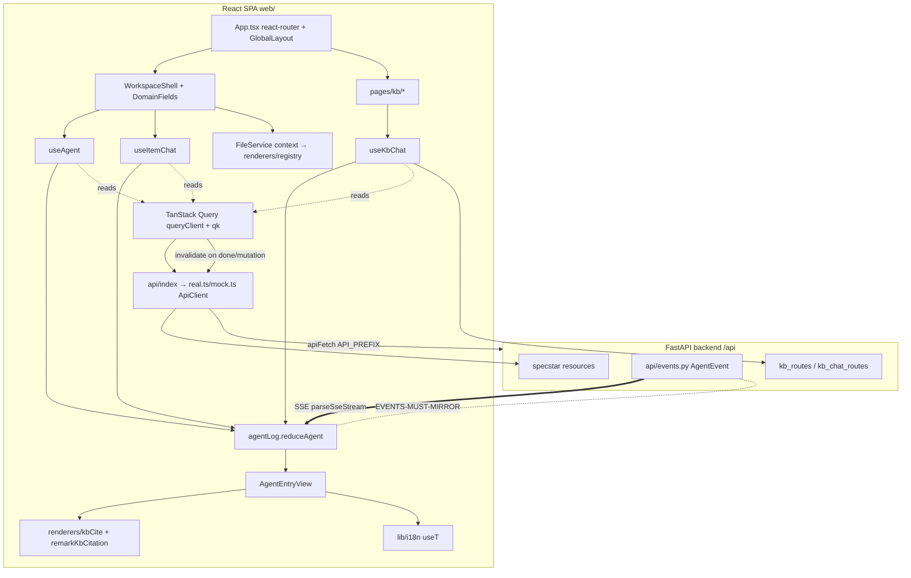

# 前端（web/）

`web/` 是一個 React + Vite + TypeScript 的單頁應用（SPA），是整個 ai-workspace 平台唯一的使用者介面：App launcher、各 App 的 item dashboard 與 VSCode 形狀的 workspace、知識庫瀏覽與聊天、Topic Hub 多聊天、workflow、以及 Diagnostics。它是 FastAPI 後端的**薄客戶端**——讀走 TanStack Query、寫走 mutation + 失效、所有即時 agent/turn 活動走指令式 SSE hook，把一條型別化事件流摺進**同一個 agent-log 渲染模型**，讓 RCA、KB chat、item chat 看起來完全一致。

> **看這篇之前**：先讀 [架構總覽](../architecture.md) 抓全貌。

## 職責與邊界

**負責**：

- 整個使用者可見表面——路由、版面、所有畫面元件。
- 把後端的 HTTP/SSE 介面投影成 UI 狀態：讀（cache/dedup/stale）、寫（mutation + 失效）、即時回合（指令式 SSE 摺疊）。
- 一個跨表面共用的 agent-log 渲染模型（reasoning fold / tool card / metrics / citation），確保 RCA、KB、item chat 三種聊天像素一致。
- 檔案樹 IDE（樹 + Monaco 編輯器 + 預覽 renderer），同一個外殼跑在 investigation 工作區檔案**或** KB 文件上。
- `[n]` 引用的點擊渲染、i18n、sub-path 部署感知的 fetch。

**不負責**：

- 任何業務邏輯、agent 迴圈、檢索、權限判斷——都在後端。前端只渲染後端送來的事件與資源。
- SSE 事件的產生（在 [API 與回合引擎](api-and-turns.md) 的 `ChatTurnEngine`）。
- 引用的解析（後端在回合結束後把 `[n]→Citation` 掛到持久化訊息上；前端只負責拉回來並渲染）。

## 核心模組

| 路徑 | 角色 |
| --- | --- |
| `web/src/events.ts` | SSE 事件型別聯集（`AgentEvent` / `WorkflowEvent` / `CellEvent`）+ `isTerminal` / `isCellTerminal` 守衛。**必須與後端 `src/workspace_app/api/events.py` 逐位元對齊**——這是最吃重的跨層契約。 |
| `web/src/pages/investigation/agentLog.ts` | 純 reducer `reduceAgent(log, ev)`，把 `AgentEvent` 摺進 `AgentLog`（entries + streaming/error/metrics/failover）。也含 `logFromMessages`（持久 thread → log）、`turnPhase`（idle/prep/waiting/thinking/answering 等候態推導）、`formatMetrics`、`isToolRunning`、`turnsFromEntry`。 |
| `web/src/components/AgentEntryView.tsx` | 單筆 agent-log entry 的共用渲染（`EntryView`）：訊息塊、可摺疊 `ReasoningBlock`（live 自動展開、「已思考 Ns」摘要）、`ToolCallCard`（本地化行為標籤 + 參數提示 + live stdout + 行內圖片 + 引用）、workflow `PhaseDivider`/`StepLine`、mention/banner。RCA 與 KB chat 共用。 |
| `web/src/hooks/useAgent.tsx` | RCA per-investigation agent context（`AgentProvider`/`useAgent`）。以 `useQuery` 注水 Conversation，開一條長存的 #43 broadcast 訂閱驅動所有觀看者的 log，提供 `send`/`cancel`/`undo`/`mention`。`send` 只 POST enqueue（不再自己 stream）；含 #202 跨 pod store-poll 後備。 |
| `web/src/hooks/useKbChat.tsx` | 驅動一條 KB chat thread；重用 agentLog 機制。指令式 SSE：`for-await` 摺 `reduceAgent`；stream 結束後 refetch 持久化 thread（帶 stream 省略的 `[n]` 引用）。`client`（`KbApi`）可注入供測試。 |
| `web/src/hooks/useItemChat.tsx` | 驅動一個 App item 的**一條**聊天（Topic Hub §3，free 或 workflow chat）；回傳與 `useAgent` 相同的 `AgentState`，讓完整的 RCA AgentPanel 能對著一條 chat 渲染。同 #43 broadcast + #202 poll 後備，鍵在 `chatId`。 |
| `web/src/api/types.ts` | Wire 型別（`Message`、`MessageCitation`、`Conversation`、`AppManifest`、`AppItem`、`FieldSpec`…）**與 `ApiClient` 介面**——每個後端呼叫經過的接縫。也含小顯示輔助（`formatInvestigationId`、`relativeTime`）。 |
| `web/src/api/index.ts` | 選 `ApiClient` 實作：`mockApi` vs `realApi`，由 `import.meta.env.VITE_USE_MOCK` 決定。全 FE 從這裡 import `api`。 |
| `web/src/api/real.ts` | 對 FastAPI 的真 HTTP `ApiClient`；async-generator 端點（`subscribeInvestigation`、`streamCellEvents`）用 `parseSseStream` 解 SSE；認得 specstar wire 信封 `SpecstarEntry<T>`。 |
| `web/src/api/mock.ts`、`kbMock.ts` | 記憶體內 `ApiClient`，給 dev（`VITE_USE_MOCK=1`）與測試用。 |
| `web/src/api/sse.ts` | `parseSseStream`：把 `text/event-stream` 的 `ReadableStream` 轉成型別化 `AsyncGenerator<AgentEvent>`；容忍壞 JSON payload（小模型會吐 junk）。 |
| `web/src/api/http.ts` | `apiFetch` + `API_BASE`/`API_PREFIX`——尊重 sub-path 部署的同源 fetch（Vite `BASE_URL`）；後端全在 `/api` 下（#177），SPA 擁有其餘 URL 空間。 |
| `web/src/api/queryKeys.ts` | 中央階層式 query-key 註冊（`qk.*`）。一處真理源，讓 `useQuery` 的讀鍵與 mutation 後 `invalidateQueries` 永遠一致；絕不行內寫死鍵陣列。 |
| `web/src/api/queryClient.ts` | 唯一的 TanStack `QueryClient`（retry 1、`refetchOnWindowFocus` false、staleTime 30s）。工具型 App 的預設，非即時儀表板。 |
| `web/src/api/fileService.ts` | `FileService` 接縫 + React context（#87）：檔案樹 IDE 跑在注入的 `FileService` 上（`investigationFileService` vs `kbFileService`），用 `FileCaps` 能力結構讓樹隱藏不支援的操作。 |
| `web/src/renderers/registry.ts` | 檔案預覽註冊表——**唯一**把 path → renderer Component + flags（`editToggle`/`rawEditor`/`outline`）的表。新增預覽型別 = 一個 entry。 |
| `web/src/renderers/kbCite.tsx` | 共用 `[n]→citation` 渲染：`buildByMarker`、`kbCiteUrlTransform`（讓 `kb-cite:` scheme 穿過 react-markdown sanitizer）、`kbCiteAnchor`（可點行內 pill）、`renderCitedText`（純文字 `<pre>` 拆分）。把 marker 解析規則集中一處。 |
| `web/src/renderers/report/remarkKbCitation.ts` | remark plugin，把 `[N]` 改寫成 `kb-cite:N` 連結，讓 markdown renderer 能轉成可點的引用 pill。 |
| `web/src/lib/i18n.tsx` | 手刻型別化 i18n（#160）：中央訊息目錄（zh-TW + en，缺翻譯 = 型別錯誤）、`LocaleProvider` + `useT()`/`translate()`、navigator 偵測 + localStorage 黏著。逐步採用。 |
| `web/src/App.tsx` | react-router-dom 路由樹（#93 決議：留在 react-router，**不**遷 TanStack Router）。所有路由嵌在 `GlobalLayout` 下（#158 全域導覽 + breadcrumb）。 |
| `web/src/pages/investigation/WorkspaceShell.tsx` | VSCode 形狀的通用 App workspace 外殼（top bar、activity bar、檔案樹、editor groups、bottom panel、agent panel）。領域 chrome 由 `DomainFields(manifest.layout[surface] × manifest.fields)` 資料驅動。 |
| `web/src/components/DomainFields.tsx` | 依 `manifest.layout × manifest.fields`（#89 P7b）渲染 App item 的領域欄位——取代寫死的 RCA chips，App 無關；`select` 色調取自 `field_styles` overlay。 |
| `web/src/pages/kb/` | KB 表面：`KbHome` 外殼、`KbCollectionPage`（Documents/Context Cards/Wiki tabs + 索引狀態列；#325 索引狀態列另含可關閉的「無法接受」區 `UploadBlockedList`，由瀏覽器預擋 `kb/uploadChecks.ts:screenFiles` 與伺服器 422 `UploadBlockedError` 共同餵入）、`KbChatPanel`/`KbChatView`（用 `useKbChat`；可選 `collectionIds`/`hideCollectionPicker` 鎖定並隱藏 collection picker，#230 help 用）、`KbDocIde`（collection 上的檔案 IDE）、`WikiBrowser`（#281 code-wiki 另渲染自身 build phase：cards→「Summarising source files」、finalizing→「Assembling directory & architecture pages」，並在 `isCodeWiki`（由 `collection.git_url` 帶入）時顯示「編輯與刪除要等下次 rebuild 才生效」的標頭提示）、`ContextCardsTab`、`kbRoutes.tsx`。 |
| `web/src/routes/` | AutoCRUD Web Generator 自動產生的 TanStack-Router-style admin scaffold（`__root.tsx`/`index.tsx`/`autocrud-admin/…`）。**不由 live `main.tsx` 入口掛載**——`main.tsx` 只渲染 `App.tsx` 的 react-router 樹（見下方眉角）。 |
| `web/src/pages/HelpPage.tsx`、`web/src/api/help.ts` | #230 `/help` 頁（掛在 `GlobalLayout` 下）：列出 guide／release-notes 文件並連入 KB 文件檢視，內嵌一個鎖定 Platform Help collection 的 `KbChatPanel`。client `getHelpInfo`（`GET /api/help`）＋ `qk.help`；入口三處——`GlobalNav` HelpLink、`Launcher` HelpCard、`OnboardingModal`「See the full guide →」。 |
| `web/src/components/ModelEffortPicker.tsx`、`web/src/lib/kbSearchMax.ts` | composer 的模型／推理力度選擇器；#334 在共用 KB-search 表面（KB chat＋app chat）內嵌 per-message kb_search 次數 stepper（`useKbSearchMax`，sticky localStorage、`KB_SEARCH_MAX_DEFAULT=3`／`KB_SEARCH_MAX_UI_MAX=10`、clamp helper）。`useAgent`／`useKbChat` 每則訊息帶 `maxKbSearches`（→ `max_kb_searches`，後端再 clamp）。 |
| `web/src/components/WorkflowsModal.tsx`、`api/workspaceWorkflows.ts`、`hooks/useWorkspaceWorkflows.tsx` | #323 使用者自編 workflow 面板（仿 `SkillsModal`：逐列 Run、下載整包 `.workflows/` zip、匯入 `.json`），資料走 `useWorkspaceWorkflows` + `qk.workspaceWorkflows`；由 `AgentPanel`／`AgentHeader` 標頭按鈕（Skills 旁）開啟。 |
| `web/src/components/ToolsPickerModal.tsx`、`ToolsChecklist.tsx`、`toolCatalog.tsx` | #322 per-App 工具挑選器：`AgentHeader` Tools 按鈕 → `ToolsPickerModal` → `ToolsChecklist`（每列 Default／On／Off 三態、搜尋、reset），經 read-modify-PUT `setField('attached_tool_prefs', …)` 存回（`WorkspaceShell`→`ItemChatShell`→`AgentPanel`→`AgentHeader`）；`toolCatalog.tsx` 讀 `GET /tools` 為未映射工具補標籤（i18n 疊在上層）。query key `qk.itemTools`／`qk.toolsCatalog`。 |

## 介面與接縫

前端的可替換點都是 TypeScript 介面或資料驅動 dispatch table（非後端 Protocol/ABC，但精神相同）：

| 接縫 | 種類 | 定義位置 | 實作 |
| --- | --- | --- | --- |
| `ApiClient` | TS interface | `web/src/api/types.ts` | `realApi`（`web/src/api/real.ts`）、`mockApi`（`web/src/api/mock.ts`） |
| `FileService` | TS interface + React context | `web/src/api/fileService.ts` | `investigationFileService`、`kbFileService`（`web/src/api/kbFileService.ts`）、`wikiFileService`（`web/src/api/wikiFileService.ts`） |
| `RendererDef` 註冊表 | 資料驅動 dispatch table | `web/src/renderers/registry.ts` | `Markdown`/`Report`/`Notebook`/`Csv`/`Html`/`Pdf`/`Image`/`Text` renderer |
| `AgentEvent`/`WorkflowEvent`/`CellEvent` 聯集 | TS discriminated union（後端鏡像） | `web/src/events.ts` | 由 `reduceAgent`（`agentLog.ts`）摺疊；由後端 `src/workspace_app/api/events.py` 產生 |
| `AgentState` | TS type（共用 chat-hook 契約） | `web/src/hooks/useAgent.tsx` | `useAgentInternal`、`useItemChat`（KB chat 用較窄的 `UseKbChat`） |
| Message catalog / `Locale` | 型別化 i18n 表 + context | `web/src/lib/i18n.tsx` | `LocaleProvider` + 各元件的 `useT` 消費者 |

`ApiClient` 的方法與後端路由 1:1（見 `web/src/api/types.ts` 的 `interface ApiClient`，方法如 `getConversation` / `sendMessage` / `subscribeInvestigation` / `cancelMessage` / `undoTurns` / `streamCellEvents` / `listAppItems` / `getAppManifest` …）。

`FileService` 的能力結構 `FileCaps`（`write`/`create`/`upload`/`delete`/`move`/`copy`/`folders`/`download`）讓同一個外殼對 investigation 檔案（全能力）與 KB 文件（v1 無新建/資料夾/移動/複製）渲染出不同的工具列。

## 運作方式 / 資料流

**讀路徑**：一個畫面掛 `useQuery`，鍵來自 `queryKeys.ts`；`queryFn` 呼 `api.<method>`（`api/index.ts` → `real.ts` 或 `mock.ts`），它 `apiFetch` 到 `${API_PREFIX}<route>` 並把 specstar 信封解成 `api/types.ts` 的 wire 型別。唯一的 `queryClient` 做 dedup 與 30s stale 快取。

**寫路徑**：`useMutation` 呼一個 api 方法，再對相關 `qk.*` 鍵（及依賴鍵）`invalidateQueries`。例如存 collections picker 會同時失效 `qk.itemCollections` 與 `qk.file(id, "/collections.json")`。

**即時 agent 回合（核心路徑）**：使用者送訊息 → chat hook（`useAgent`/`useKbChat`/`useItemChat`）把 `log.streaming` 翻 true 並經 `api.sendMessage` POST（只 **enqueue**，202）。一條長存的 SSE 訂閱（`api.subscribeInvestigation` / `client.streamMessage` → `real.ts` async-generator → `parseSseStream`）吐出型別化 `AgentEvent`。每個事件由 `reduceAgent`（`agentLog.ts`）摺進 `AgentLog`；`AgentEntryView` 渲染每筆 entry。遇到終止事件（`isTerminal`），hook 會 **refetch 持久化的 Conversation/chat 並用 `logFromMessages` 重拍快照**——因為持久 thread 帶著 SSE 流刻意省略的 `[n]` 引用。`useAgent`/`useItemChat` 還有 #202 store-poll 後備，覆蓋廣播在另一個 pod 而本機 stream 沉默的跨 pod 情況。

**side-effect 事件不進 log**：`file_changed` 不摺進 reducer，而是在 hook 裡失效 `qk.files`。workflow 的 step/phase 事件搭同一條 per-item stream，摺成 step/phase log entry（`reduceAgent` 的 `step_*`/`phase_entered` 分支）。引用在 `Message` 渲染時經 `kbCite`/`remarkKbCitation` 成為可點的 pill，點擊開啟來源文件。

## 關鍵不變式與眉角

!!! warning "`events.ts` ↔ 後端 `api/events.py` 必須同步"
    新增/改名任一事件型別或欄位而沒同時改另一邊，會**靜默失效**：`parseSseStream` 的 `JSON.parse` 吞掉未知、`reduceAgent` 的 switch `default` 丟掉未知，所以 desync 不報錯。這是最吃重的跨層契約——見 `events.ts` 頭註與 [線上契約](../contract.md) §3。

!!! warning "引用不在 SSE 流裡"
    每個 chat hook 在終止事件時**必須** refetch 持久 thread 並用 `logFromMessages` 重拍，才能拿到後端掛上的 `[n]→Citation`。略過 refetch 會丟掉所有可點來源。

!!! warning "Query key 只能來自 `qk.*`"
    絕不行內寫死鍵陣列。讀鍵與其 mutation 後失效鍵必須完全相符，否則靜默 stale-cache。鍵是階層式（prefix-match）：失效 `qk.kb.documents(id)` 會清掉它底下每一頁。

!!! note "全站唯一一個 `QueryClient`"
    在 `queryClient.ts`。測試元件/hook 必須用 `web/src/test/queryWrapper.tsx`（`QueryWrap`/`renderWithQuery`）包起來，否則 hook 會 throw。

!!! warning "`reduceAgent` 是純 reducer"
    無副作用（不 fetch、不導航）。`file_changed` 之類的副作用事件在 hook 處理，reducer 對它們原樣回傳 `log`。

!!! warning "`lastAssistantIdx` 語義不可破壞"
    一個 `tool_call` 或非 assistant 訊息會結束當前 assistant run，使下一個 `message_delta` 起新的 assistant entry 而非接到前一回合。破壞它會讓回合互相黏合。

!!! warning "`send()` 翻 streaming 但不在 broadcast hook 本地推 user 訊息"
    `useAgent`/`useItemChat` 是 broadcast-based：使用者訊息經 `user_message` 廣播抵達，本地推會重複。`useKbChat`（非 broadcast）則**會**本地推。

!!! warning "`cancel()` 必須立刻翻 `streaming=false`（#49）並打後端 cancel"
    只靠 stream 拆解可能讓 composer 卡在 working…。

!!! note "`kbCiteUrlTransform` 必須保留 `kb-cite:` scheme"
    react-markdown 預設 sanitizer 把未知 scheme 丟成 `''`（曾是 ReportRenderer 的潛伏 bug，#221）。所有 `[n]` 渲染都走 `renderers/kbCite`，讓 byMarker/muted/multi-match 規則處處一致。

!!! note "i18n 目錄每個鍵都要兩種語系"
    缺一個 locale 就是型別錯誤。UI 字串描述動作/結果——不放原始工具名/mime/系統名詞（`TOOL_LABEL` 把原始工具名映到友善標籤；未映射時先退到後端 tool catalog（`toolCatalog.tsx` 讀 `GET /tools`，#322），再退到泛用「使用工具」，原始名只放 hint）。

!!! note "檔案樹 IDE 不 import 具體 api 或 investigation id"
    它從 context 讀 `FileService`（`useFileService`）並尊重 `FileCaps`。同一外殼服務 investigation 檔案與 KB 文件。

!!! note "新增檔案預覽型別 = `registry.ts` 一個 entry"
    順序有意義（first match wins，text catch-all 永遠最後）+ 一個 `registry.test.ts` case。其他檔案不需動。

!!! warning "路由留在 react-router-dom（#93）"
    不要遷 TanStack Router。路由在 `/a/:slug` 下用 `slug`/`itemId` 參數；KB 用 splat `/kb/doc/*`。`web/src/routes/` 是 AutoCRUD 自動產生的 TanStack-Router-style admin scaffold，**不由 live `main.tsx` 入口掛載**（`main.tsx` 只渲染 `App.tsx`），別誤把它當成正式路由樹。

## 設計決策與出處

| 決策 | 理由 | 出處 |
| --- | --- | --- |
| 資料層 = TanStack Query（`useQuery` 讀、`useMutation`+失效 寫）；SSE 維持指令式 | GET 讀受惠於 cache/dedup/stale；串流回合是事件驅動不合 query 語義，故手刻 hook，只在初始注水 + done 時回同步快取碰 TanStack | CLAUDE.md FE 資料層慣例；`docs/plan-frontend.md` |
| `events.ts` 鏡像 `api/events.py`，手動鎖步 | SSE schema 是 agent↔UI 契約，兩邊照同 tag 摺/渲染；無 codegen，靠慣例 + 檔頭註解強制 | CLAUDE.md SSE 慣例；`events.ts` 頭註（[contract](../contract.md) §3） |
| 一個 `AgentEntryView` + 一個 `reduceAgent` 共用於 RCA/KB/item chat | 三表面必須一致（reasoning fold、tool card、metrics、引用）；集中渲染+摺疊避免漂移。KB phase 3 也是 agentic，端到端重用同 runner | CLAUDE.md（共用 `AgentEntryView`）；MEMORY `project_kb_phase3_agentic` |
| 引用在 done 時從持久 thread refetch，不串流 | 後端在回合後把 `[n]→Citation` 掛到持久訊息；SSE 省略，FE 在終止事件重拍 `logFromMessages` | CLAUDE.md KB 攝取/引用慣例；`useKbChat`/`useAgent` 註解 |
| #43 broadcast 模型——send 只 enqueue；長存 per-item/per-chat SSE 訂閱驅動所有觀看者；#202 加跨 pod store-poll 後備 | 多寫者協作：每個觀看者都看到每個回合即時（不論誰送）；poll 後備避免觀看者 stream 在非執行 pod 時卡 working… | MEMORY `project_collab_workspace_43`、`project_job_pod_split_acting_user`；`useAgent.tsx` 註解 |
| 留在 react-router-dom，僅把 KB 視圖 URL 化（不遷 TanStack Router） | 遷移成本不划算；splat 接 path leaf + `?doc=` overlay 即可滿足 URL 覆蓋 | MEMORY `project_issue_93_tanstack_router`；`docs/plan-issue-93.md` |
| 手刻型別化 i18n 而非用 library | 每個字串靜態（除 `{name}` 代換外無 plural/插值需求）；微型型別目錄維持最小且可逐步採用 | MEMORY `project_issue_160_dejargon_i18n`；`lib/i18n.tsx` 頭註 |
| `[n]` 引用渲染集中在 `renderers/kbCite` | report markdown、chat markdown、純文字 tool card 必須一致解析 marker；集中也修了 react-markdown scheme-drop bug | MEMORY `project_issue_221_clickable_citations` |
| 外殼 chrome 由 `manifest.layout × manifest.fields`（`DomainFields`）資料驅動 | RCA 變成眾 App 之一；寫死的 RCA breadcrumb/statusbar chip 改為 App 無關、由後端模型欄位 schema 投影 | MEMORY `project_issue_89_rca_template`；`DomainFields.tsx` 頭註 |
| IDE 的 `FileService` context 接縫 | 同一 VSCode 樹+編輯器須服務 investigation 工作區與 KB collection 而不知哪個；`FileCaps` 讓 UI 隱藏不支援的操作 | MEMORY `project_kb_doc_ide_87`；`renderers/README.md` |

## 與其他子系統的關係

- **[API 與回合引擎](api-and-turns.md)**：`ApiClient` 方法與 `src/workspace_app/api/` 的路由 1:1；所有 HTTP 經 `apiFetch` 在 `API_PREFIX`（`/api`，#177）下。`api/turns.py` 的 `ChatTurnEngine` 驅動 FE 訂閱的串流。
- **[Agent 執行時](agent-runtime.md)**：後端 SSE producer `src/workspace_app/api/events.py` 是 `events.ts` 的鏡像對象；`reduceAgent` 摺的就是它吐的 tag。
- **[資料層（specstar）](data-layer.md)**：wire 信封 `SpecstarEntry<T>` 在 `real.ts` 解碼；auto-CRUD 路由支撐 `AppItem`/`Conversation`/KB 模型。`web/src/routes/autocrud-admin/` 是其自動產生的 admin scaffold。
- **[知識庫：檢索與 Agent](kb-retrieval-agent.md)** 與 **[知識庫：攝取與索引](kb-ingest-index.md)**：`useKbChat`/`kbFileService` 打 `api/kb_routes.py`、`kb_chat_routes.py`；引用與檢索結果在 FE 端渲染。
- **[Workflow 引擎](workflow-engine.md)**：`WorkflowEvent` 變體搭 per-item stream 抵達，渲染成 phase/step entry。
- **[App 平台](apps-platform.md)**：`WorkspaceShell` + `DomainFields` 由 `AppManifest`（layout × fields）驅動，承載任意 App。新增 App 見 [adding-an-app](../adding-an-app.md)。
- **[背景工作與擴展](jobs-and-scaling.md)**：#202 store-poll 後備正是為了 job runner/API pod 拆分後，觀看者 stream 可能落在非執行 pod 的情況。
- **部署**：Vite build → `web/dist` 由後端自動掛載（單源部署，經 `BASE_URL` 感知 sub-path）。見 [部署](../deployment.md)。

## 原始碼錨點

接手者建議先讀：

- `web/src/events.ts`——跨層契約的源頭（`AgentEvent`/`WorkflowEvent`/`CellEvent`/`isTerminal`）。
- `web/src/pages/investigation/agentLog.ts`——`reduceAgent`、`logFromMessages`、`turnPhase`、`formatMetrics`，串流渲染狀態的唯一真理源。
- `web/src/components/AgentEntryView.tsx`——`EntryView`/`ToolCallCard`/`ReasoningBlock`/`TOOL_LABEL`/`CitationCard`/`StepLine`/`PhaseDivider`。
- `web/src/hooks/useAgent.tsx`、`web/src/hooks/useKbChat.tsx`、`web/src/hooks/useItemChat.tsx`——三種聊天 hook，看 #43 broadcast vs `useKbChat` for-await 兩種模式。
- `web/src/api/types.ts`——`ApiClient` 介面與全部 wire 型別。
- `web/src/api/index.ts` / `real.ts` / `sse.ts` / `http.ts`——api 選擇、真 HTTP + SSE、`parseSseStream`、`API_PREFIX`。
- `web/src/api/queryKeys.ts` / `queryClient.ts`——`qk` 註冊與唯一 client。
- `web/src/api/fileService.ts`——`FileService`/`FileCaps`/`investigationFileService`/`useFileService`/`useFileList`。
- `web/src/renderers/registry.ts`（`RENDERERS` 表、`pickRenderer`、`hasEditToggle`、`hasOutline`）+ `web/src/renderers/kbCite.tsx`（`CITE_HREF='kb-cite:'`）+ `web/src/renderers/README.md`。
- `web/src/lib/i18n.tsx`——`messages` 目錄、`useT`、`LocaleProvider`。
- `web/src/App.tsx`（`AppRoutes`、`GlobalLayout` 巢狀、`kbRoutes()`）、`web/src/main.tsx`（provider 串接：`QueryClientProvider` → `LocaleProvider` → `FontScaleProvider` → `App`）。
- `web/src/pages/investigation/WorkspaceShell.tsx` + `web/src/components/DomainFields.tsx`——VSCode 外殼與領域欄位投影。
