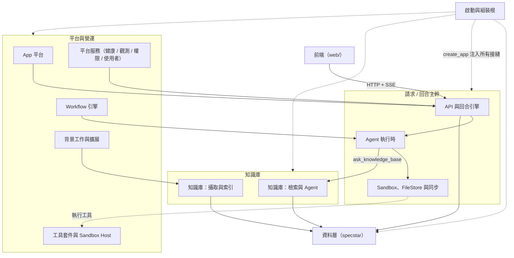

# 子系統深入（Subsystems）

把整個平台拆成 13 個可獨立閱讀的子系統，每一篇深入一個接縫：它做什麼、邊界在哪、關鍵設計決策為何如此。

!!! note "先抓全貌再下鑽"
    這個區段是「深入」層。建議先讀 [架構總覽](../architecture.md) 看分層與一次回合的資料流，再回 [開發者導覽](../index.md) 找到對應的開發慣例；本頁則幫你決定**該照什麼順序往下讀**。

---

## 子系統如何串接

下圖畫出子系統之間的依賴與資料流：前端打 API，API 的回合引擎驅動 Agent 執行時，Agent 透過 Sandbox/FileStore 操作檔案、或走 KB 檢索；KB 攝取把文件寫進資料層；App 平台、Workflow、背景工作與平台服務則環繞在這條主幹周圍。

---

## 13 個子系統

| 子系統 | 一句話職責 |
| --- | --- |
| [啟動與組裝根](boot-and-config.md) | 從 `python -m workspace_app` 到一個活著的 app 的組裝根：載入型別化 `Settings`、記錄 provenance、`factories.get_*` 建出每個接縫實作、注入 `create_app`。 |
| [API 與回合引擎](api-and-turns.md) | REST 路由總覽 + 兩條 SSE 串流；`ChatTurnEngine`（per-conversation lock、單一可取消的 in-flight 回合、`_drive` pump、SSE `gen()`）統一 RCA 與 KB chat。 |
| [Agent 執行時](agent-runtime.md) | `AgentToolContext` 雙形態（RCA：sandbox/filestore/sync；KB：retriever/collection_ids）+ `AgentRunner` Protocol（scripted vs litellm）+ 工具集與 `run_subagent` 橋接。 |
| [Sandbox、FileStore 與同步](sandbox-and-filestore.md) | 兩個命名空間（FileStore 虛擬根＝永久真相；sandbox＝執行環境）；`Sandbox` Protocol（Mock / LocalProcess）+ 懶建立 + `SandboxSync` 雙向搬檔。 |
| [知識庫：攝取與索引](kb-ingest-index.md) | `Ingestor.store`（快、同步：magic 嗅 content-type、解 zip/tar、xxh3 dedup）→ `Ingestor.index`（chunk + embed，off-loop）；SourceDoc / DocChunk 狀態機。 |
| [知識庫：檢索與 Agent](kb-retrieval-agent.md) | 混合檢索管線（dense＝specstar 原生向量 QB cosine + sparse＝BM25 → RRF → MMR → parent-doc merge）+ 選配 multi-query / HyDE / rerank + KB agent 的 `kb_search` 葉。 |
| [App 平台](apps-platform.md) | 多 App：每個 App＝`apps/<slug>/`（app.json 身份＋功能開關＋agent＋layout）；WorkItem 抽象、三層 agent 解析、launcher。 |
| [Workflow 引擎](workflow-engine.md) | API 觸發的 headless workflow（profile 層、Python `run()` 非 DSL）；FS-as-journal、decision/action 拆分、produce→review→commit 的 human_gate、steer-and-resume。 |
| [背景工作與擴展](jobs-and-scaling.md) | `coordinators.build_coordinators`（FastAPI-free 的單一組裝點，被 `create_app` 與 worker 共用）+ `run_consumers` gate + 各 JobType worker pod 化／獨立 HPA。 |
| [資料層（specstar）](data-layer.md) | `make_spec` 註冊的 resources（每 App 的 WorkItem、AgentConfig、Conversation、KB Collection / SourceDoc / DocChunk）+ 索引欄位 / 聚合 / migrate 慣例。 |
| [前端（web/）](frontend.md) | React + Vite + TS SPA 結構；資料層＝TanStack Query（GET 走 useQuery、寫走 useMutation）+ 命令式 SSE（useAgent / useKbChat）+ 共用 AgentEntryView。 |
| [工具套件與 Sandbox Host](tooling-and-sandbox-host.md) | `tooling/`（registry `discover_packages`、packages 的 `PACKAGES` 常數）+ sandbox-host 鏡像把 toolchain 預裝進執行環境。 |
| [平台服務（健康 / 觀測 / 權限 / 使用者）](platform-services.md) | `health/`（`CheckRegistry` + sanity matrix）、`ReplayService` 的觀測重播、權限與使用者解析等橫切服務。 |

---

## 建議閱讀路徑

### 新手上路（先懂一次回合怎麼跑）

1. [啟動與組裝根](boot-and-config.md) — 一切從 `create_app` 怎麼被組起來開始。
2. [API 與回合引擎](api-and-turns.md) — 請求進來、回合怎麼被驅動與串流出去。
3. [Agent 執行時](agent-runtime.md) — 回合內 agent 與工具怎麼跑。
4. [Sandbox、FileStore 與同步](sandbox-and-filestore.md) — 工具實際在哪裡讀寫檔案。
5. [前端（web/）](frontend.md) — UI 怎麼發請求、消費 SSE。

### 想懂知識庫（攝取 → 檢索 → 問答）

1. [知識庫：攝取與索引](kb-ingest-index.md) — 文件如何變成可檢索的 chunk。
2. [資料層（specstar）](data-layer.md) — SourceDoc / DocChunk 怎麼存、怎麼查。
3. [知識庫：檢索與 Agent](kb-retrieval-agent.md) — 混合檢索與 KB agent 怎麼回答。
4. [Agent 執行時](agent-runtime.md) — `ask_knowledge_base` 如何把問題委派給 KB 子 agent。

### 想懂部署與擴展（多 pod、背景工作）

1. [啟動與組裝根](boot-and-config.md) — `run_consumers` gate 與接縫注入。
2. [背景工作與擴展](jobs-and-scaling.md) — coordinator 組裝、worker pod 化、各 JobType HPA。
3. [資料層（specstar）](data-layer.md) — 共用 backend 與 migrate / 聚合慣例。
4. [平台服務（健康 / 觀測 / 權限 / 使用者）](platform-services.md) — 健康檢查、觀測重播等營運面。
