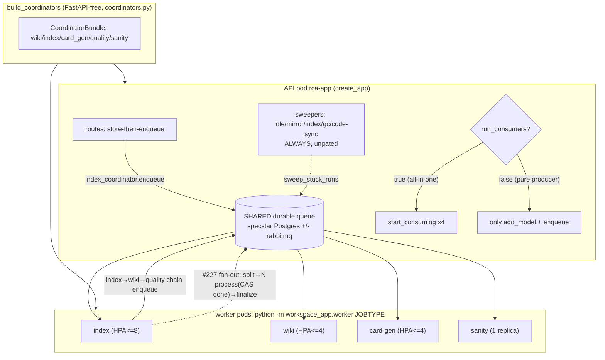

# 背景工作與擴展（Jobs and Scaling）

把四種重活從 API 請求路徑切到耐久佇列上、由一個 FastAPI-free 的單一組裝點建出來,讓 API 進程內全包消費（all-in-one）或退化成純 producer、由獨立 worker pod 各自 block-consume 一個 JobType 來獨立擴展（#312）。

> **看這篇之前**：先讀 [架構總覽](../architecture.md) 抓全貌。

## 職責與邊界

這個子系統負責「把長時間、可批次、可平行的後台工作從同步請求路徑搬走」這件事:

- **四種 JobType**:`index`（切塊 + 嵌入）、`wiki`（LLM wiki 維護）、`card-gen`（context-card 生成）、`sanity`（model-sanity battery）。
- **單一組裝點**:`coordinators.build_coordinators` 建出 `CoordinatorBundle`,把 `index → wiki → quality` 串起來。這個組裝是 FastAPI-free 的,**同時**被 API 的 `create_app` 與獨立 worker `python -m workspace_app.worker` 使用,避免兩處 drift。
- **兩種消費拓樸**:all-in-one（API 進程內 `start_consuming`)與 pod-split（API 純 producer + 各 worker pod 各 block-consume 一個 JobType,各掛 k8s HPA）。
- **大 index 工作的 fan-out / join**:一個大索引工作切成 N 個小 process job,靠 `IndexRun` 的 CAS 集合 join,而不是調高 broker ack timeout（#227）。

**不負責**的事（劃界,避免與鄰居重疊）:

- 不負責每個 coordinator 內部的 job 語意——chunk + embed 的形狀屬於 [知識庫:攝取與索引](kb-ingest-index.md);wiki 維護的 agent loop 屬於那條 LLM wiki 線;sanity 矩陣屬於 [平台服務](platform-services.md) 的健康/觀測。本篇只管「怎麼把它們組裝、排程、擴展」。
- 不負責**非佇列**的 per-pod 背景活兒（sandbox reap / mirror / GC / code-sync）——那些永遠掛在 API 上、不受 `run_consumers` gate(見不變式)。
- 不負責耐久佇列與資源持久化本身——那是 [資料層（specstar）](data-layer.md);本篇只假設它是共享後端。

## 核心模組

| 路徑 | 角色 |
| --- | --- |
| `src/workspace_app/coordinators.py` | FastAPI-free 單一組裝點。`build_coordinators` 建 `CoordinatorBundle(wiki/index/card_gen/quality/sanity)` 並接 index→wiki→quality;`build_ingestor`（pipeline 優先,否則 legacy `FixedTokenChunker`）、`resolve_wiki_config`（catalog purpose 或 bundled default + operator 的 model/endpoint override）。回傳的 coordinator 尚未消費。 |
| `src/workspace_app/worker/__init__.py` | worker 的純單元測試 seam。`_JOBTYPE_ATTR` 把 CLI token 映到 bundle 屬性;`select_coordinator` 取對應 coordinator,未知或未接線即 fail-loud `ValueError`;`consume_until_stopped` = `start_consuming` → `stop_event.wait()` → `finally asyncio.run(coordinator.aclose())` 排空。 |
| `src/workspace_app/worker/__main__.py` | `python -m workspace_app.worker <jobtype>` 的 settings 驅動 composition root + CLI glue（coverage 排除）。`build_bundle` 用 `factories` 建 embedder/ingestor/runner/catalog/queue,呼叫 `build_coordinators`（無 HTTP app/sandbox/filestore/tool packages）;`main` 載 config、`install_llm_logging`、建 spec、`select_coordinator`、綁 SIGTERM/SIGINT → `threading.Event`、`consume_until_stopped`。 |
| `src/workspace_app/api/app.py` | API composition + lifespan。`create_app` 呼叫同一個 `build_coordinators`,掛 `app.state`、`index_coordinator.install_reindex_on_edit()`（僅 API 側）。lifespan 在 `run_consumers`（預設 True）為真時才 `start_consuming` 四個 coordinator;非佇列 sweeper 永遠 `create_task`。 |
| `kubernetes/base/workers.yaml` | 四個 worker Deployment（`rca-worker-{index,wiki,card-gen,sanity}`),`command=python -m workspace_app.worker <jobtype>`,共用 `rca-config` configmap 與同一 image。index/wiki/card-gen 各掛 HPA;sanity 固定 1 replica 無 HPA。`terminationGracePeriodSeconds: 60` 讓 worker 排空。 |
| `kubernetes/README.md` | 部署文件 §Job workers (#312):`deployment.yaml`(`rca-app`) `RUN_CONSUMERS=false` 當純 producer;split 需要 SHARED backend;all-in-one 替代方案。 |

## 介面與接縫

| 接縫 | 形態 | 定義位置 | 實作 |
| --- | --- | --- | --- |
| `CoordinatorBundle` | frozen dataclass（coordinator 聚合） | `coordinators.py` | `wiki=WikiMaintenanceCoordinator`、`index=IndexCoordinator`、`card_gen=CardGenCoordinator`、`quality=QualityCoordinator \| None`、`sanity=SanityBatteryCoordinator \| None` |
| `LlmFactory` | type alias `Callable[[str, str], ILlm]` | `coordinators.py` | sanity battery 用;mirrors `health.sanity.coordinator.LlmFactory` |
| `select_coordinator` / `consume_until_stopped` | 純函式 seam（jobtype → coordinator + consume loop） | `worker/__init__.py` | `consume_until_stopped` 鴨子型別呼 `coordinator.start_consuming()` / `aclose()`（`ty: ignore[unresolved-attribute]`） |
| `start_consuming` / `aclose`（coordinator 消費協定） | 各 coordinator 的隱含協定 | `kb/index_coordinator.py`、`kb/wiki/coordinator.py`、`kb/card_gen_coordinator.py`、`kb/quality_coordinator.py`、`health/sanity/coordinator.py` | `IndexCoordinator`、`WikiMaintenanceCoordinator`、`CardGenCoordinator`、`QualityCoordinator`、`SanityBatteryCoordinator` |
| `Ingestor` / `Embedder` / `IParser` | KB 攝取 seam（`build_ingestor` 注入） | `kb/ingest.py`、`kb/embedder.py` | `FixedTokenChunker`（legacy）、pipeline 模式 LlamaIndex、`IParser.count_units/parse(unit_range)`（#227,實作細節見原始碼） |

!!! note "`quality` / `sanity` 可為 None"
    `CoordinatorBundle.quality` 與 `sanity` 在它們的 LLM seam 沒接時為 `None`（評分 / model-sanity 矩陣是 opt-in 的 live-LLM 功能）。`build_coordinators` 只在 `quality_judge_llm` / `sanity_llm_factory` 傳入時才建這兩個。`select_coordinator` 對 `None` coordinator fail-loud。

## 運作方式 / 資料流

**生產者路徑（API）**:上傳/編輯文件經 kb 路由 store-then-enqueue,呼 `index_coordinator.enqueue`(`api/app.py` 約 `enqueue=index_coordinator.enqueue`),把 index job 放進 specstar 的耐久佇列。無論哪個進程 enqueue,佇列是共享的。

**消費者路徑有兩種拓樸**:

- **All-in-one**:`run_consumers=True`(預設)時,API lifespan 對 wiki / index /(sanity,當有接線時)/ card_gen 各 `start_consuming`,在同一進程內消費。單 pod、本地、測試走這條。
- **Pod-split**:`RUN_CONSUMERS=false` 讓 API 只 `add_model` 註冊 + `enqueue`、不消費;每個 worker pod 跑 `python -m workspace_app.worker <jobtype>`,`build_bundle` 建出**完整** bundle(其它 coordinator 以 producer-only 同行,讓 index worker 仍能 chain `index→wiki→quality` 的 enqueue),`select_coordinator` 取出自己那一個,`consume_until_stopped` 阻塞消費直到 SIGTERM,然後 `aclose()` 排空。

**Index 重活路徑（#227）**:一個大 index 工作不是單一長 job。split job 先 `_delete_chunks`、`count_units()=N`、建 `IndexRun(total=N)`、fan-out N 個小 process job(每個 parse + chunk + embed 自己的 unit range、寫自己的 `DocChunk`、CAS-add `i` 到 `done`)。當 `len(done ∪ failed) == total` 且 CAS 搶到 `finalized` flag 才 enqueue finalize job,重組 `SourceDoc.text` 並翻 `ready` / `error` → 觸發 wiki hook。API 上永遠在跑的 `_index_sweeper` 週期性 `sweep_stuck_runs` 救回卡住的 fan-out（finalize 觸發遺失或 dead-letter）。實作細節見 `src/workspace_app/kb/index_coordinator.py` 與 `docs/plan-issue-227.md`。

**Worker 關機**:`consume_until_stopped` 在 `finally` 裡 `asyncio.run(coordinator.aclose())`;`aclose()` 會 poll 到佇列排空再停 consumer thread。`main` 把 SIGTERM / SIGINT 綁到 `threading.Event`,k8s 給 `terminationGracePeriodSeconds: 60` 讓它排空。

## 關鍵不變式與眉角

!!! warning "pod-split 一定需要 SHARED backend"
    預設 `FILESTORE_KIND=memory` + in-memory specstar backend 會隔離每個 pod——API 與 worker 的佇列是**不同物件**,worker 排不到任何東西。pod-split 必須讓每個 pod 指向同一個 **Postgres** specstar backend(+選配 `message_queue.kind: rabbitmq`)。這是 #312 的核心前提,`workers.yaml` 頂部與 `kubernetes/README.md` 都明寫。

!!! warning "API 純 producer 時仍必須 add_model + enqueue"
    `run_consumers=false` 只關掉進程內的 `start_consuming`;API 仍必須 `add_model` 註冊 model 並 `enqueue`,否則 worker 端沒有 model 註冊、或佇列根本不存在。

!!! warning "新增 coordinator 不可 inline 寫進 create_app"
    新 coordinator 必須加進 `build_coordinators` + `CoordinatorBundle` + `_JOBTYPE_ATTR` 三處,否則 worker 拿不到、API/worker 構造會 drift(CLAUDE.md「Job runner ⊥ API (#312)」鐵則)。

!!! note "run_consumers 只 gate 佇列消費者"
    `run_consumers` 只 gate 四個佇列消費者的 `start_consuming`。非佇列 sweeper(`_idle_killer` / `_mirror_sweeper` / `_index_sweeper` / `_code_sync_sweeper` / `_blob_gc_sweeper`)**永遠**在 API 上 `create_task`、不受 gate 影響——它們是 per-pod 的 sandbox reap / mirror / GC / code-sync / stuck-run 救援,屬於 API 進程責任,不是可被 worker 接走的佇列工作。

!!! note "一個 worker = 一個 JobType = 一個 Deployment = 一個 HPA"
    `_JOBTYPE_ATTR` 的 `'card-gen'` 保留連字號(user-facing 名),bundle 屬性是底線 `card_gen`。`select_coordinator` 對未知 jobtype 或未接線的 coordinator(sanity 無 LLM factory → `None`)fail-loud `raise ValueError`,絕不靜默 idle 在沒人餵的佇列上。

!!! note "#227:join 靠 CAS 不靠 partition_key"
    index process job 的 `partition_key=None`(平行 fan-out);specstar 的 RabbitMQ 後端**忽略** `partition_key`(契約違反),所以 join 不能依賴它——靠 `IndexRun` 的 CAS `done` / `failed` 集合 + `finalized` CAS flag。sanity cell job 保留 `partition_key=model`(Ollama 一次一模型),wiki 保留 `partition_key=collection_id`。

!!! note "耐久佇列保證安全"
    pending job 在 pod 被殺時會被 redeliver,所以 SIGTERM 排空只是讓 shutdown 優雅,abrupt kill 也安全(`consume_until_stopped` docstring + `workers.yaml`)。`build_ingestor` 必須與 `create_app` 一致地建 ingestor(pipeline 優先,否則 `FixedTokenChunker`),worker 才能 index 出相同形狀的 chunk。

## 設計決策與出處

| 決策 | 理由 | 出處 |
| --- | --- | --- |
| job runner 從 API 進程切出,FastAPI-free 的單一 `build_coordinators` 同時被 `create_app` 與 worker 用 | worker 沒有 HTTP app;讓 API 能純 producer、worker pod 各 block-consume 一 JobType 各掛 HPA;避免兩處 drift | #312;`coordinators.py` / `worker/__init__.py` docstring |
| `run_consumers` gate 預設 True(all-in-one),false 時 API 純 producer 仍 add_model + enqueue 不 start_consuming | 單 pod / 本地 / 測試走 all-in-one;k8s pod-split 走純 producer。共享耐久佇列不管誰 enqueue 都會被某個消費者排到 | #312;`api/app.py` lifespan;`kubernetes/README.md` |
| 非佇列 sweeper 永遠在 API,不受 `run_consumers` gate | 它們是 per-pod sandbox reap / mirror / GC / code-sync / stuck-run 救援,屬 API 進程責任,不是可被 worker 接走的佇列工作 | `api/app.py` lifespan;CLAUDE.md #312 |
| 大 index 工作 fan-out 成多個小 job + `IndexRun` CAS join,不調高 ack timeout | RabbitMQ broker-side ack timeout(預設 30 分)會關 channel、unacked 訊息無限 requeue 重跑;調高只搬天花板,每 job 短才根治 | #227;`docs/plan-issue-227.md` |
| index process job `partition_key=None`;join 靠 CAS 不靠 partition_key | specstar RabbitMQ 後端忽略 `partition_key`(契約違反),序列化/join 不能依賴它;CAS done/failed + finalized flag 對平行或序列都正確 | #227;`docs/plan-issue-227.md` |
| worker 無 request user,`get_user_id` 預設 `settings.server.default_user`;靠 specstar `preserve_job_creator` 保留每個 job 真正建立者 | worker pod 沒有請求使用者;default 只是 worker 自身產物的 fallback | #83 acting-user;`worker/__main__.py` |
| wiki/card-gen 的 HPA 用 CPU target 但建議用 min/max replicas 調而非信 CPU | 它們 IO-bound(等 LLM),CPU 利用率低報負載;KEDA 佇列深度擴展明確 out of scope | #312;`workers.yaml` HPA NOTE;README |

## 與其他子系統的關係

- [知識庫:攝取與索引](kb-ingest-index.md):index 工作驅動 `Ingestor`(chunk + embed → `DocChunk`)、index→wiki hook 維護 LLM wiki、quality 評分;`build_ingestor` 注入 embedder / pipeline / parser_registry。
- [API 與回合引擎](api-and-turns.md):`create_app` 把 coordinators 掛 `app.state` 並掛 route;上傳/編輯經 kb 路由 store-then-enqueue → `index_coordinator.enqueue`;`install_reindex_on_edit` 在 API 側用 `SourceDoc` patch event_handler 觸發 reindex。
- [資料層（specstar）](data-layer.md):耐久 job 佇列 + `IndexRun` / `SanityResult` 等資源;pod-split 共享同一 Postgres backend(+選配 rabbitmq)是 #312 前提。
- [啟動與組裝根](boot-and-config.md) / [部署](../deployment.md):`kubernetes/base/{deployment,workers}.yaml` + configmap `rca-config`(`RUN_CONSUMERS`、`OLLAMA_API_BASE`、`KB_EMBED_DIM` 等);`run_consumers` 由 `settings.server.run_consumers` / `RUN_CONSUMERS` env 映入。
- [平台服務（健康 / 觀測 / 權限 / 使用者）](platform-services.md):`SanityBatteryCoordinator` 經 `LlmFactory` 驅動 model-sanity matrix,sanity worker 固定 1 replica。
- worker 與 API 共用同一組 `factories.get_*` 建 embedder / runner / queue / llm seam(`build_bundle` 對齊 `create_app` 的構造)。

## 原始碼錨點

- `src/workspace_app/coordinators.py` — `build_coordinators` / `CoordinatorBundle` / `build_ingestor` / `resolve_wiki_config` / `LlmFactory`。
- `src/workspace_app/worker/__init__.py` — `_JOBTYPE_ATTR` / `select_coordinator` / `consume_until_stopped`。
- `src/workspace_app/worker/__main__.py` — `build_bundle` / `main`(SIGTERM/SIGINT → `threading.Event`)。
- `src/workspace_app/api/app.py` — lifespan 的 `if run_consumers`(start_consuming x4)、`build_coordinators` 呼叫點、`install_reindex_on_edit`、`_index_sweeper` / `_idle_killer` / `_mirror_sweeper` / `_blob_gc_sweeper` / `_code_sync_sweeper`、`enqueue=index_coordinator.enqueue`。
- `kubernetes/base/workers.yaml` — `rca-worker-{index,wiki,card-gen,sanity}` + HPAs。
- `kubernetes/README.md` — §「Job workers (#312)」。
- `docs/plan-issue-227.md` — `IndexRun` CAS join + partition_key principle(fan-out 實作細節)。
