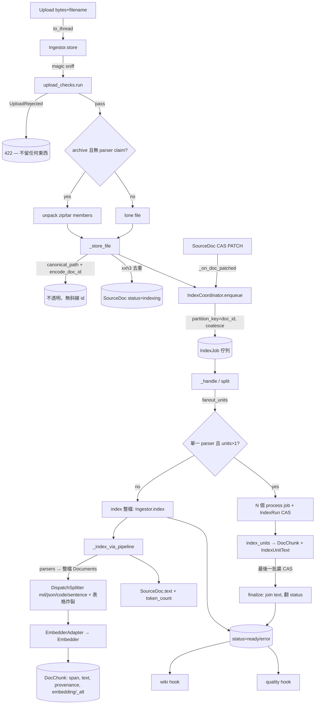

# 知識庫：攝取與索引

把一個上傳的檔案（或壓縮檔成員）變成可檢索的知識庫文件：一段**快速同步**的 `store` 先把原始位元組存成 `SourceDoc`（`status="indexing"`），一段**緩慢背景**的 `index` 再 parse → chunk → embed，寫出 `DocChunk` 後把文件翻成 ready／error。

> **看這篇之前**：先讀 [架構總覽](../architecture.md) 抓全貌。

## 職責與邊界

這個子系統負責「**上傳位元組 → 一份就緒（ready）的文件**」這條路：

- **負責**：內容類型嗅探（libmagic）、壓縮檔展開、doc id 鑄造與去重、`SourceDoc` 持久化、parser 分派、chunk 切分、自行 embed、`DocChunk` 落地、token 估算、跨 pod 的耐久索引佇列與 fan-out join、以及「文件就緒」之後觸發的 wiki／quality／context-card 鉤子。
- **不負責**：檢索本身（dense + BM25 → RRF → MMR → parent-doc merge）屬於 [知識庫：檢索與 Agent](kb-retrieval-agent.md)；個別 parser 的內部（PDF/HTML/DOCX/PPTX/CSV/Excel/JSON/chat 如何轉成 LI `Document`）屬於 parser 套件；佇列消費的 pod 切分與 k8s 擴展策略屬於 [背景工作與擴展](jobs-and-scaling.md)；resource 的儲存後端與 Vector store 屬於 [資料層（specstar）](data-layer.md)。

關鍵分界：**parser 吐整檔 `Document`，splitter 擁有切分粒度**。`SourceDoc.text` 是 join 起來的 parser Documents（無重疊、無 breadcrumb 的乾淨原文，給 wiki maintainer 讀）；`DocChunk.text` 才是折入 heading／section breadcrumb 後拿去 embed 的版本。

## 核心模組

| 路徑 | 角色 |
| --- | --- |
| `src/workspace_app/kb/ingest.py` | `Ingestor` — 核心。`store()`（快：magic 嗅探、`upload_checks` 閘門、zip/tar 展開 vs parser claim、xxh3 去重、`encode_doc_id`、`status="indexing"`）與 `index()`（慢：parse→chunk→embed→`DocChunk`、翻 ready/error）。`convert()`（#324）是 parse-only 手足：跑與 `_index_via_pipeline` 同一套 parser registry + VLM describer，但**不** chunk/embed、**不**碰 `SourceDoc`（沒有 collection_id/doc_id 故結構上無法持久化），回 `ConvertResult(text, kind∈{markdown,passthrough,none})` 讓呼叫端決定如何歸檔（markdown→`.md` 名、passthrough→原始正規化文字、none→跳過）；同步（caller 以 `asyncio.to_thread` offload），是 topic-hub 入庫前把上傳轉成文字的入口。內含兩條索引引擎（legacy `_index` 走 `Chunker`、生產 `_index_via_pipeline` 走 LlamaIndex）、parser packet 路由、provenance 蒐集、alt-embedder 路由，以及 #227 fan-out 原語（`fanout_units` / `prepare_fanout` / `index_units` / `_emit_packet`）。 |
| `src/workspace_app/kb/upload_checks/` | 上傳閘門（#325）：`IUploadCheck` ABC（`protocol.py`，介面/實作分離）+ `UploadCheckRegistry`（`registry.py`，`run()` 依註冊序跑每個 `applies` 的 check、首個拒收即 raise `UploadRejected`；`hints()` 收集瀏覽器可跑的 `client_prefilter`）+ bundled `OfficeEncryptionCheck`（`office.py`，OLE2 magic）/`PdfEncryptionCheck`（`pdf.py`，pypdf `is_encrypted` + 空密碼探測）+ `bundled_upload_checks()`。`UploadRejection`/`UploadCheckHint`/`UNREADABLE_MESSAGE_KEY` 為值物件。 |
| `src/workspace_app/kb/doc_id.py` | 不透明 doc id 機制：`canonical_path()`（去前導斜線、解析 `.` / `..`，zip-slip 安全）+ `encode_doc_id()`（自然鍵 `{collection_id}/{path}`，每個 ASCII `/` 換成 U+2215 `∕`）。id 只**組合**、永不**拆解**。 |
| `src/workspace_app/kb/chunker.py` | `Chunker` Protocol + `Chunk` struct（verbatim `start`/`end` span + 要 embed 的 `text`）+ `FixedTokenChunker`（滑動空白-token 視窗、含 overlap）。legacy／offline／測試用切分器；生產改用 LlamaIndex pipeline。 |
| `src/workspace_app/kb/embedder.py` | `Embedder` Protocol + 非對稱 query/doc 前綴基底 `_PrefixedEmbedder` + `HashEmbedder`（確定性，offline/測試）+ `LitellmEmbedder`（生產，經 LiteLLM/Ollama，分批、同模型副本 failover + 暫態重試）。我們自行 embed，原始向量存在 `DocChunk` 上。 |
| `src/workspace_app/kb/li_pipeline.py` | LlamaIndex `IngestionPipeline` 建構器。`DispatchSplitter` 依 mime/副檔名/`content_format` 把每個 `Document` 路由到對應 splitter（Markdown/JSON/Code/Sentence），把 heading+section breadcrumb 折進要 embed 的 text，並把大 Markdown 表格 row-explode。`EmbedderAdapter` 把我們的 `Embedder` 包成 LI `TransformComponent`。`build_doc_pipeline` / `build_chat_pipeline`。 |
| `src/workspace_app/kb/markdown_table.py` | 無相依的 GFM 表格讀取器（#116）：`find_markdown_tables`（header/rows/精確字元 span）+ `row_as_col_value`。讓 `DispatchSplitter` 把大表格炸成 `col: value` 列 chunk，而其字元 span 仍指向整張表以利 merge/citation。 |
| `src/workspace_app/kb/index_coordinator.py` | `IndexCoordinator`（#82）— 耐久、跨 pod 的索引佇列 + worker。`enqueue`（producer，`partition_key=doc_id`、pending 合併 + 活躍 `IndexRun` 守門）、`split`/`process`/`finalize` job handler（#227 fan-out）、編輯後重索引的 `SourceDoc` patch 鉤子（#87）、#186/#83 acting-user 綁定、#249 暫態重試分類、`sweep_stuck_runs` 安全網，以及文件就緒後觸發的 wiki + quality 鉤子。 |
| `src/workspace_app/kb/index_run.py` | `IndexRunStore`（#227）— fan-out 的 **CAS join 狀態**讀寫。`start`/`mark_done`/`mark_failed`/`claim_finalize`/`finish`/`is_active`，全部對 etag 做 compare-and-swap，**與佇列無關**。 |
| `src/workspace_app/kb/card_gen_coordinator.py` | `CardGenCoordinator`（#175）— 從選定文件背景草擬 glossary `ContextCard`。`enqueue`（`partition_key=collection_id`）、handler 走 draft→`merge_drafts`→`classify_against_existing` 寫到 job artifact；`save_review` / `commit` 把 accepted proposal 變成真正的 `ContextCard`。 |
| `src/workspace_app/kb/quality_coordinator.py` | `QualityCoordinator`（#105）— 文件評分的 specstar 耦合半邊。`score_doc` 拿就緒文件的 chunk 文字對其 collection 的 `quality_rubric` 評判，寫回 `quality_score`/`breakdown`/`rationale`；opt-in（無 rubric → 不評分）、failure-safe、以文件 owner 身分寫入。 |
| `src/workspace_app/kb/tokens.py` | `count_tokens`（#88）— CJK 感知 token 估算（`cjk_chars + non_cjk/4`），於 index/finalize 時存到 `SourceDoc.token_count`，供 collection 的「≈ N tokens」顯示。 |
| `src/workspace_app/resources/kb.py` | specstar resource Struct + embed-dim 解析。`SourceDoc`、`DocChunk`、`IndexRun`、`IndexUnitText`、`Collection`、`ContextCard`、`KbChat`、`RetrievedPassage`、`CodeWikiBuildRun`（#281 code-wiki fan-out join，鏡射 `IndexRun`）。`EMBED_DIM`/`CODE_EMBED_DIM` 於 import 時由 env 解析。 |
| `src/workspace_app/coordinators.py` | FastAPI-free 組裝根（#312）：`build_ingestor` + `build_coordinators` 把 `Ingestor` + `IndexCoordinator` + `CardGenCoordinator` + `QualityCoordinator` + wiki coordinator 兜成 `CoordinatorBundle`，由 `create_app` 與獨立 worker 共用。 |

## 介面與接縫

| 接縫 | 種類 | 定義位置 | 實作 |
| --- | --- | --- | --- |
| `Chunker` | Protocol | `src/workspace_app/kb/chunker.py` | `FixedTokenChunker`（legacy/測試）；生產改注入 `Ingestor(pipeline=...)` 由 `DispatchSplitter` pipeline 取代，**不是**走 `chunker=`。 |
| `Embedder` | Protocol | `src/workspace_app/kb/embedder.py` | `HashEmbedder`（offline/測試）、`LitellmEmbedder`（生產，LiteLLM/Ollama） |
| 索引引擎（chunker vs pipeline） | constructor 分支 | `src/workspace_app/kb/ingest.py` | `Ingestor._index`（legacy Chunker）vs `Ingestor._index_via_pipeline`（LlamaIndex）。建構時恰好一條被接上。 |
| `IParser` / `ParserRegistry` | 可插拔 parser 註冊表 | `src/workspace_app/kb/parsers/protocol.py`（`IParser`）+ `src/workspace_app/kb/parsers/registry.py`（`ParserRegistry`） | bundled fallback：`PdfParser`、`HtmlParser`、`DocxParser`、`ChatExportParser`、`JsonParser`、`CsvParser`、`ExcelParser`、`PptxParser`（見 `Ingestor.__init__`）；自訂 parser 經 `parser_registry` 注入。 |
| `IUploadCheck` / `UploadCheckRegistry` | 可插拔上傳閘門（#325） | `src/workspace_app/kb/upload_checks/protocol.py`（`IUploadCheck`）+ `registry.py`（`UploadCheckRegistry`） | 介面/實作分離鏡射 `IParser`/`ParserRegistry`；bundled `OfficeEncryptionCheck`（OLE2 magic）+ `PdfEncryptionCheck`（pypdf `is_encrypted` + 空密碼探測），預設 `bundled_upload_checks()`，經 `Ingestor(upload_checks=...)` 注入。 |
| `message_queue_factory` | 注入的佇列後端 | `src/workspace_app/kb/index_coordinator.py` | 預設 `SimpleMessageQueueFactory`（specstar Simple 佇列，靠共用後端做多 pod）；RabbitMQ／其他經 config 選定的 factory，**必須 per-model 傳給 `add_model`**（全域 `configure()` 不會傳到真實 pg/disk 後端）。 |
| `CoordinatorBundle` 組裝根 | FastAPI-free factory | `src/workspace_app/coordinators.py` | `build_ingestor` + `build_coordinators` — `create_app`（API）與 `python -m workspace_app.worker`（worker pod）共用。 |

`IParser` ABC（`parsers/protocol.py`）的契約：`matches(filename, mime, source)` 判斷是否歸它管；`count_units(...)` 回報可獨立 parse 的「單位」數（頁/列/JSON 頂層元素，預設 `1` = 不可分，永不 fan-out）；`parse(source, *, filename, mime, on_progress, on_preview, unit_range)` 把來源轉成 LI `Document`（可回 iterator 或 list）。`IParserInput` 提供 `as_bytes()`/`as_path()`/`as_stream()` 三種惰性、會快取的輸入形式（`MaterialisedParserInput` 是具體實作）。

**parser 設定接縫（#328，僅基礎建設、生產為 dormant）**：opt-in 的 `IParser.config_fields() -> list[ParamSpec]`（預設 `[]`）讓 prompt/參數驅動的 parser 宣告可調旋鈕；它**刻意不**放在 `parse()` ABC 上，既有 parser 維持 Liskov-clean — config-aware parser 自行替它的 `parse()` 加一個 optional `config` kwarg。`ParamSpec(key, kind∈{text,number,bool}, label, default)` 描述一個旋鈕。`kb.parser_config.effective_config` 是唯一的優先序解析器：parser 預設 < `Collection.parser_configs` < `SourceDoc.parser_config_overrides`，逐旋鈕 merge、只保留**已宣告**的 key。`Ingestor._parse_config_for` 在單檔與 fan-out 兩處把它穿進 `parse()`，對無旋鈕 parser 回 `None`（不傳 config，與接縫前 byte-identical）；`Ingestor.store` 在重傳時保留 `parser_config_overrides`。**目前 bundled parser 都還沒 override `config_fields()`，此路徑在生產為 dormant。**

## 運作方式 / 資料流

**上傳路徑（API，快）**：一個 POST 把 bytes+filename 交給 `Ingestor.store`（經 `asyncio.to_thread` 離開事件迴圈）。`store()` 用 libmagic 嗅探內容類型；緊接著（在展開壓縮檔或建立任何 `SourceDoc`／`_store_file` 之前）跑 `upload_checks.run()` 閘門 — 任一 check 拒收（加密／無法讀取的上傳）就 raise `UploadRejected`（route 轉成 HTTP 422），被拒上傳不留下任何東西。通過後，若是 zip/tar/gzip **且沒有任何已註冊 parser claim 它**，就展開每個成員，否則把整個檔案當單一成員（pptx/xlsx/docx 是 zip 容器，所以 parser claim 勝過盲目展開）。每個成員流經 `_store_file`：`canonical_path()` 正規化路徑、`encode_doc_id()` 鑄造不透明的無斜線 id（鍵在 collection+path，**不含 user**）；若位元組的 xxh3-128 已與既存 blob 相同就 no-op，否則就地建立或更新一筆 `SourceDoc(status="indexing")`。`store()` 回傳被觸碰的 doc id，route 再對每個 `IndexCoordinator.enqueue(doc_id, collection_id)` — 立即返回。

**索引路徑（job worker 執行緒，離開請求迴圈）**：`enqueue` 建立一筆 `IndexJob`（`partition_key=doc_id`），除非已有 pending job 指向該文件或有活躍的 `IndexRun`（合併）。消費者的 `_handle` 依 `kind` 分派。預設的 `split` job 呼叫 `Ingestor.fanout_units`：若恰好一個 parser claim 且回報 `>1` 單位，索引就 fan-out 成多個 per-unit-range 的 `process` job（先 `prepare_fanout` 清一次 chunk，再 `IndexRunStore.start` 種下含 CAS finalize gate 的 join 狀態）；否則整檔走單一 job 的 `Ingestor.index`。

`Ingestor.index` 還原原始位元組、刪掉該文件既有 chunk、跑 `_index`。生產（pipeline 模式）下 `_index_via_pipeline` 蒐集 `(parser_id, [Document])` packets — 每個 match 的 parser 都跑、各吐整檔 `Document`；若無 parser match 且位元組是 text/code 就做一個 inline-text packet；binary-no-parser 則 log 後回 chunks=0。每個 packet 流經 LlamaIndex pipeline：`DispatchSplitter` 依 mime/副檔名/`content_format` 選 splitter（markdown→`MarkdownNodeParser`+breadcrumb 折入+表格炸裂，json→`JSONNodeParser`，code→`CodeSplitter`，其餘→`SentenceSplitter`），`EmbedderAdapter` 再用我們的 `Embedder` 批次 embed node 文字。產出的 node 映回 `DocChunk`（`seq` 跨 packet 全域遞增、`start`/`end` 字元 span、provenance 從 node metadata 揀出、向量依 collection 的 `embedder_id` 落在 `embedding` 或 `embedding_alt`）。整份文件的乾淨原文（join 起來、無 overlap/breadcrumb）成為 `SourceDoc.text`。`index()` 接著把 status 翻 `ready`（`token_count=count_tokens(text)`），或失敗時翻 `error` 並寫一行 `status_detail`（job 路徑 `reraise=True`，讓暫態小毛病可重排）。

**fan-out**：每個 process job 跑 `index_units`（確定性 chunk id，redelivery 下冪等），把該批文字暫存進 `IndexUnitText`；最後完成 CAS join 的那批 enqueue 一個 `finalize` job，把暫存文字按批序重組進 `SourceDoc.text` 並只翻一次 status。正確性靠 `IndexRun` 的 compare-and-swap，**永不靠佇列**（RabbitMQ 後端會忽略 `partition_key`）。`sweep_stuck_runs` 是安全網：補救「都完成了卻沒人 finalize」與「卡住沒進度」兩種失敗分支。

文件就緒後，`IndexCoordinator` 觸發 **wiki 鉤子**（`use_wiki` collection 折入其 LLM wiki）與 **quality 鉤子**（collection 有 rubric 時呼叫 `QualityCoordinator.score_doc`）— 兩者皆 best-effort，任一失敗都不會讓索引 job 失敗。`SourceDoc` 內容編輯（CAS PATCH）會觸發 `_on_doc_patched → enqueue`，自動重索引。

## 關鍵不變式與眉角

!!! warning "doc id 是不透明 handle，永不拆解"
    id 由 `encode_doc_id` 從 `{collection_id}/{path}`（ASCII `/` → U+2215 `∕`）組成，但**永不**被拆解。要拿 path/collection_id 一律讀 `SourceDoc` 欄位、要拿 created_by/updated_by 一律讀 specstar meta，**不要 parse id**。每個攝取／搬移入口都**必須**先過 `canonical_path()` 再 `encode_doc_id`，讓 `'/a.md'`、`'a.md'`、`'./a.md'`、`'//a.md'` 等表面變體收斂成同一 doc；逃出 root 的 `..` 會 raise（zip-slip 守門）。

!!! warning "collection 是共享空間：id 鍵在 path 而非 user"
    同一 path = 一份文件，誰上傳都一樣；第二個寫者就地更新（last write wins，`created_by` 維持原始上傳者，`updated_by` 追最新）。位元組完全相同（`xxh3_128 == content.file_id`）是 no-op 重傳 — `_store_file` 回 `None`，不churn revision。

!!! note "parser 吐整檔，splitter 擁有粒度"
    parser emit **整檔** `Document`；`DispatchSplitter` 才決定切分。`SourceDoc.text` 是 join 的 parser Documents（無 overlap、無 breadcrumb），**不是**把 `DocChunk` 重新拼回 — 這樣 wiki maintainer 讀到的是乾淨原文。`DocChunk.start`/`end` 是 canonical text 的有效字元 offset（`text[start:end]` 是 verbatim 被引用片段），但 `DocChunk.text` 可能不同（為 embed 折入了 heading/section breadcrumb）。

!!! warning "DocChunk 是衍生且 current-only — 硬刪重建"
    `index()`（與 `prepare_fanout`）在重建前對該文件的 chunk 做 `permanently_delete`；soft delete 會洩漏進查詢／向量搜尋。每個 chunk **恰好**填 `embedding` 或 `embedding_alt` 其一：`embedder_id==0` → `embedding`（text 模型，`EMBED_DIM`）；`embedder_id!=0` → `embedding_alt`（code 模型，`CODE_EMBED_DIM`）。`Embedder.dim` **必須**等於綁定的 Vector 寬度；改 `KB_EMBED_DIM`／換模型是**整批重索引**事件。

!!! warning "fan-out 正確性靠 CAS，不靠佇列"
    process job **不帶** `partition_key`（RabbitMQ 會忽略），`seq` 以 `batch_index * _SEQ_STRIDE`（1,000,000）偏移避免碰撞，finalize 由 CAS-claimed 的 `finalized` flag 守門且冪等（`run.status` 一旦離開 `"running"` 就 no-op）。`status == "running"` 的 `IndexRun` 是「此文件已有索引在飛」這個與佇列無關的合併守門。

!!! note "acting-user 紀律（#83/#186）"
    job pod 沒有請求 user：把 `SourceDoc` manager 綁到文件的最後更新者（`updated_by` 不被洗掉），把衍生的 `DocChunk`／job 記到 run 的發起人（`job.info.created_by`）。`SourceDoc` 的最終寫入是整個 run 的最後一筆，綁它就夠。

!!! note "其他眉角"
    - `_PROVENANCE_KEYS` 是封閉白名單（`page`/`section`/`slide`/`sheet`/`jsonl_line`/`row`）— 加新 parser 的定位鍵要同步加這裡。
    - parser claim 勝過壓縮檔展開：zip/tar 只在**沒有**任何 parser match 時才展開（office zip 容器才不會被炸成內部 XML）。
    - upload checks（#325）跑在 magic 嗅探**後**、展開／`_store_file`**前**，所以被拒上傳不留任何痕跡：Office check 以**副檔名**判定（加密 OOXML 是 OLE2/CFB 容器、非 ZIP，已失去 OOXML 嗅探 mime，副檔名才可靠）；PDF check 為 server-only（無 `client_prefilter`）且放行「僅權限保護」（owner 密碼、空 user 密碼）的 PDF；共用一個 `UNREADABLE_MESSAGE_KEY`，文案只說「無法讀取」、刻意不過度宣稱「加密」。
    - 恰好一條 `chunker` / `pipeline` 被接上：legacy chunker 是 text-only（binary 成員在 `store` 時就跳過）；pipeline 模式存所有東西（未認領的 binary → `status=ready`、`chunks=0`、留在磁碟等未來 parser）。
    - wiki + quality 鉤子只在 `status="ready"` 後觸發，且 best-effort — 失敗只 log 並吞掉，**永不**讓索引 job 失敗。
    - `Collection.quality_rubric`／`wiki_*_guidance` 是**非索引**欄位：加這類欄位**無需** specstar migration（舊 row 以空預設解碼）；`SourceDoc.token_count` 與 `quality_score` **是**索引欄位（collection token SUM／quality 排序）。

## code-wiki 建構管線（#281）

`git_url`（程式碼）collection 的 wiki 不靠逐來源 prose fold，而是由 `CodeWikiBuilder`（`kb/wiki/code_wiki.py`）**讀原始碼**分三層建出。整條管線長在 **wiki coordinator**（`kb/wiki/coordinator.py`），**不是** [#100 workflow](../workflows.md)：

- **L0 檔案卡** `/files/<path>.md` = `outline()`（`kb/wiki/code_outline.py`，tree-sitter 確定性頂層符號骨架，`_LANG_BY_EXT` 涵蓋 `.py/.ts/.tsx/.js/.jsx`；不支援的副檔名或 parse 失敗退化成空字串、永不 raise）＋ 一句 `ILlm.collect` LLM 摘要。
- **L1 資料夾頁** `/dirs/<d>.md` = 由子項摘要 bottom-up roll-up。
- **L2** `/architecture.md` + `/topics/<slug>.md`（≤ `_MAX_TOPICS`＝6）+ 確定性 `/index.md`，只由頂層摘要（資料夾頁 ＋ 頂層散檔卡片）合成。

每一頁是對固定材料的**單次 `ILlm.collect`**（**非 agent loop**，由程式寫檔，避開 #50「敘述而不寫」失敗），且**只讀下一層摘要**，所以大 repo 的 context 維持有界、不爆也不漏。**per-page input-hash 增量**：檔案卡帶 `_SRC_MARKER`（來源內容 hash）、roll-up 頁帶 `_IN_MARKER`（子摘要 hash 的 sha256），未變更的頁直接跳過 — **無變更 rebuild = 0 次 LLM 呼叫**。

fan-out 重用既有 wiki JobType（`WikiJobPayload.op` 擴成 `code_split`/`code_card`/`code_finalize`，`code_card` 另帶 `batch_index`/`batch_paths`），靠 `CodeWikiBuildRun`（`kb/wiki/code_wiki_run.py` 的 `CodeWikiBuildRunStore`，etag-CAS join，鏡射 #227 的 `IndexRun`）收斂：`_handle_code_split` 規劃批次（`plan_card_batches`，目錄聚合、source-size 上限）+ `start(total=N)` + 散出 N 個 `partition_key=None` 的 card job；每個 `_handle_code_card` 建一批 L0 卡 + CAS `mark_done`/`mark_failed` + `claim_finalize`；`_handle_code_finalize` 由 CAS 恰好一個贏家認領，roll-up L1/L2 並 `_prune_orphans`（清掉來源已消失的 `/files`、`/dirs` 頁）。

觸發點是 `WikiMaintenanceCoordinator.trigger_code_build`（gated on `use_wiki` **AND** `git_url`），由 sync route／`code_sync_sweeper`／`wiki/rebuild` route 顯式呼叫 — 因為（A0）`code_repo.sync` 同步 ingest 會繞過 `IndexCoordinator`，`on_doc_indexed` 不會在 sync 路徑觸發；`git_url` collection 的 `on_doc_indexed` 一律改走 `_enqueue_code_build`，而 `on_doc_deleted` 在 `git_url` 上是 no-op（A1：prose unfolder 不能跑在 code wiki 上，刪檔不自動 rebuild，孤兒頁留給下次 build 的 `_prune_orphans` 收）。`code_wiki_llm` 由 `build_coordinators` 從 `kb.wiki.llm` preset（與 maintainer agent 同一個）接出：空 `wiki_model` ⇒ `None` ⇒ code-wiki 關閉。

## 設計決策與出處

| 決策 | 理由 | 出處 |
| --- | --- | --- |
| 把攝取拆成快 `store()` + 慢背景 `index()` | 上傳立即返回（`SourceDoc` 為 `status=indexing`）；chunk/embed 離開事件迴圈，慢的同步 embedder 呼叫不會餓死請求服務。 | `ingest.py` docstring；CLAUDE.md「KB ingestion is async + off the loop」 |
| 不透明、無斜線 doc id（U+2215 swap，不整鍵 percent-encode） | id 嵌在 `kb://doc/{id}` 連結（以 ASCII `/` 切割）故不能含 `/`，但要給人看故重可讀；只換 `/`，`:`／空白／unicode 保留。同一邏輯文件 → 同一 id 以利去重/冪等重傳。 | `doc_id.py` 模組 docstring |
| parser 吐整檔，splitter 擁有粒度 | 讓 chunking 收斂成單一可調超參，並讓 `SourceDoc.text` 是乾淨原文供 wiki maintainer 讀，與被 embed 的 breadcrumb 版 `DocChunk.text` 區分。 | `ingest._index_via_pipeline`／`_IndexOutput` docstring（#86）；MEMORY「chunking = hyperparams」 |
| 背景索引跑在耐久 specstar job 佇列（非 asyncio 佇列／in-process semaphore） | 多 pod 耐久 + per-doc `partition_key` 序列化；舊的 in-process `_index_sem` + `to_thread` 擋不住慢 embedder 餓死請求。embedder 吞吐靠加 worker pod 擴展，不靠 per-collection 序列化。 | `index_coordinator.py` 模組 docstring（#82/#134） |
| 把大索引 fan-out 成 per-unit-range process job + CAS `IndexRun` join | 一個 100 頁 VLM PDF 或 100k 列 CSV 在單一 job 會超過 broker 的 ~30 分鐘 consumer-ack timeout（RabbitMQ 406）。小批 + compare-and-swap finalize gate（確定性 chunk id、冪等）即使 broker 忽略 `partition_key` 也保證正確。 | `index_coordinator.py`／`IndexRun` struct docstring（#227）；MEMORY `project_issue_227_index_fanout` |
| 合併 pending 重索引 + 守在活躍 `IndexRun` 上 | 狂按重索引會排 N 個全量重索引 job（各自重 chunk/embed/觸發 wiki，並把文件卡在 indexing）；單一排隊 job 會重讀最新內容。`partition_key` 是 per-DOC 而非 per-collection，不同文件仍並行。 | `index_coordinator.enqueue` docstring（#134） |
| 非對稱 query/doc embedding 前綴，向量我們自算自存 | bge/e5/qwen3-embedding 類模型對 query 與 document 需不同 instruction 前綴；自行 embed 讓前綴在我們掌控，而非交給 specstar 自動編碼。 | `embedder.py` 模組 docstring；CLAUDE.md「Embeddings are computed by us and stored raw」 |
| CJK 感知 token 估算（`cjk + non_cjk/4`）取代 blob `bytes/4` | `bytes/4` 對 binary 格式錯得離譜（10MB PDF 只 50KB 萃取文字）。估「實際被切的文字」；CJK 約 1 token/字 vs Latin 約 4 字/token，貼合本 KB 的繁中語料。可換的 Ollama 模型沒附 offline tokenizer。 | `tokens.py` 模組 docstring（#88） |
| 大 Markdown 表格 row-explode 成各自橫跨整表的 `col:value` chunk | `SentenceSplitter` 會截斷／孤立寬表；逐列爆開讓欄名隨每個值走，而整表字元 span 讓結構 parent-doc merge 能重建表格、citation 仍能解析。小表保持整塊（`table_max_rows` 可調）。 | `li_pipeline.DispatchSplitter` + `markdown_table.py`（#115/#116） |
| 跨 worker 寫入保留真實 acting user（`rm.using(user=...)`） | job pod 沒有請求 user；不綁就會蓋成 worker 預設並洗掉 `updated_by`。`SourceDoc` 記給自己 owner（內容未被改寫），衍生 chunk/job 記給 run 發起人。 | `index_coordinator`／`ingest.index` docstring（#83/#186） |
| Job runner ⊥ API：一個 FastAPI-free `build_coordinators` 給 API 與 worker 共用 | worker 在自己 pod block-consume 一個 JobType 以利各自 k8s HPA 擴展；API 以 `run_consumers` gate 控制 in-process 消費，可當純 producer。 | `coordinators.py`；CLAUDE.md「Job runner ⊥ API (#312)」 |
| 可插拔上傳檢查在 `store()` 邊界擋下加密／無法讀取的上傳 | 加密檔在背景索引才爆會給使用者費解的錯誤；在邊界同步擋下並回可行動的 422，被拒上傳不留任何 `SourceDoc`／blob。介面/實作分離鏡射 `IParser`/`ParserRegistry`，預設 `bundled_upload_checks()`、可注入。 | `upload_checks/protocol.py` 模組 docstring（#325）；[決策紀錄](../decisions.md) |

## 與其他子系統的關係

- **[知識庫：檢索與 Agent](kb-retrieval-agent.md)**：消費本子系統寫出的 `DocChunk` 向量（`embedding`/`embedding_alt`）+ provenance；dense + BM25 → RRF → MMR → parent-doc merge 產出 `RetrievedPassage`。`Embedder.embed_query` 是 `embed_documents` 的 query 端對應。
- **[背景工作與擴展](jobs-and-scaling.md)**：`IndexCoordinator`/`CardGenCoordinator`/`QualityCoordinator` 與 wiki coordinator 共用 specstar job 佇列機制；`run_consumers` gate、worker pod 各 block-consume 一個 JobType 的擴展策略在那裡。
- **[啟動與組裝根](boot-and-config.md)**：`build_coordinators` / `build_ingestor` 把本子系統兜進 `create_app` 與獨立 worker；上傳/重索引/sync route 是 producer。
- **[資料層（specstar）](data-layer.md)**：`SourceDoc`/`DocChunk`/`IndexRun`/`IndexUnitText`/`Collection`/`ContextCard` 的持久化、Vector store、Binary blob、job 佇列 model。
- **LLM wiki**（`kb/wiki/coordinator.py`）：`IndexCoordinator._wiki_hook` 在文件就緒後呼叫 `WikiMaintenanceCoordinator.on_doc_indexed`，把新來源折入 `use_wiki` collection 的 wiki。
- **品質評分**（`kb/quality.py` 的 `QualityScorer`）：`QualityCoordinator.score_doc` 拿 chunk 文字對 `Collection.quality_rubric` 評判；檢索端日後依 `SourceDoc.quality_score` 下調權重。
- **Context cards**（`kb/card_gen.py`、`kb/context_cards.py`）：`CardGenCoordinator` 從 `SourceDoc` 萃取文字草擬 `ContextCard` — chunk-RAG 之外一條確定性 glossary 路徑（見 [App 平台](apps-platform.md) 的 topic-hub）。
- **filestore / doc IDE（#87）**：`SourceDoc` 內容的 CAS PATCH 觸發 `IndexCoordinator._on_doc_patched → enqueue`，編輯 KB 文件即重建其 chunk（見 [Sandbox、FileStore 與同步](sandbox-and-filestore.md)）。

## 原始碼錨點

接手者建議先讀的真實檔案：

- `src/workspace_app/kb/ingest.py` — `Ingestor.store` / `index` / `convert`（parse-only，#324）/ `_store_file` / `_index_via_pipeline` / `_emit_packet` / `fanout_units` / `index_units` / `_parse_config_for`（#328），以及 `_PROVENANCE_KEYS`、`_ARCHIVE_MIMES`、`_TEXT_MIMES`、`_CODE_EXTENSIONS`、`ConvertResult`、`chunk_id`。
- `src/workspace_app/kb/doc_id.py` — `canonical_path`、`encode_doc_id`、`_SLASH='∕'`（id 機制的全貌）。
- `src/workspace_app/kb/index_coordinator.py` — `enqueue`／`_handle`／`_handle_split`／`_handle_process`／`_handle_finalize`／`sweep_stuck_runs`／`install_reindex_on_edit`、`_SEQ_STRIDE`。
- `src/workspace_app/kb/index_run.py` — `IndexRunStore` 的 CAS join（`claim_finalize`／`mark_done`／`is_active`）。
- `src/workspace_app/kb/li_pipeline.py` — `DispatchSplitter`、`EmbedderAdapter`、`build_doc_pipeline`、`_heading_breadcrumb`、`_fold_section`。
- `src/workspace_app/kb/embedder.py` 與 `chunker.py` — 兩個可插拔接縫的 Protocol + 實作。
- `src/workspace_app/resources/kb.py` — `SourceDoc`/`DocChunk`/`IndexRun`/`IndexUnitText`/`Collection` struct + `EMBED_DIM`/`CODE_EMBED_DIM` 解析。
- `src/workspace_app/coordinators.py` — `build_ingestor`、`build_coordinators`、`CoordinatorBundle`。
- `src/workspace_app/kb/parsers/protocol.py` — `IParser` / `IParserInput` ABC（`matches`／`count_units`／`parse` 契約）+ `config_fields`／`ParamSpec`（#328 parser 設定接縫）。
- `src/workspace_app/kb/parser_config.py` — `effective_config`／`parser_id`（#328 三層優先序解析；已由 `Ingestor._parse_config_for` 接上，但無 bundled parser override `config_fields()`，故生產 dormant）。
- `src/workspace_app/kb/upload_checks/protocol.py` — `IUploadCheck`／`UploadCheckRegistry`／`UploadRejected`／`UploadRejection`／`UploadCheckHint`／`UNREADABLE_MESSAGE_KEY`（#325 上傳閘門）。
- `src/workspace_app/kb/wiki/code_wiki.py`／`code_outline.py`／`code_wiki_run.py` — code-wiki 三層 builder（`CodeWikiBuilder`／`plan_card_batches`／`_unfence`）、tree-sitter `outline`、`CodeWikiBuildRunStore` 的 CAS join（#281）。
