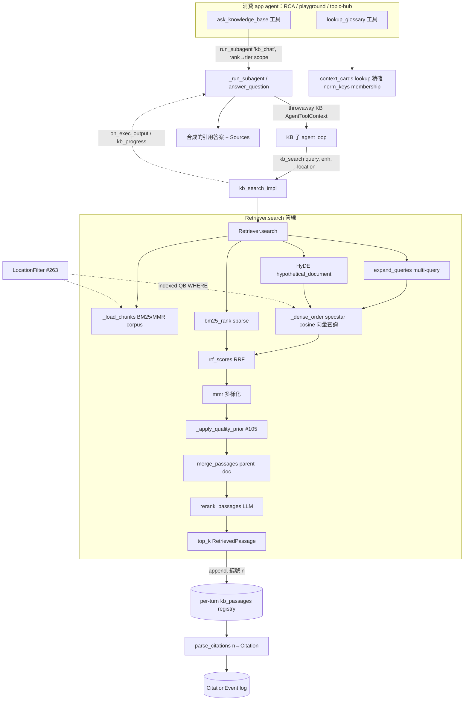

# 知識庫：檢索與 Agent

把 in-house 文件變成「可被 LLM 引用的 `[n]` 段落」的混合檢索管線，外加消費它的 agent 工具表面。一句話：dense（specstar 原生向量查詢）＋ sparse（BM25）→ RRF 融合 → MMR 多樣化 → parent-document 合併 → top-k `RetrievedPassage`，再選擇性套上 LLM 強化（multi-query / HyDE / rerank）與 #105 文件品質先驗。

> **看這篇之前**：先讀 [架構總覽](../architecture.md) 抓全貌。

## 職責與邊界

**負責**：

- 對一組 collection 做混合檢索（`Retriever.search`），輸出去重、合併成段落的 `RetrievedPassage` 列表。
- agent 工具表面：`kb_search`（檢索 leaf）、`ask_knowledge_base`（消費介面，委派給 throwaway KB 子 agent）、`lookup_glossary`（確定性 glossary 查詢）。
- 把答案文字裡的 `[n]` 標記解析回 `Citation`（`parse_citations`），並記錄引用分析事件（`CitationEvent`）。
- 純函式的 ranking 元件：RRF、MMR、BM25、query 轉換、rerank、provenance 聚合。

**不負責**：

- 產生被查的向量／文字／provenance — 那是 [知識庫：攝取與索引](kb-ingest-index.md)（`kb/ingest.py`、`kb/chunker.py`、`kb/embedder.py`）的事。本子系統只**讀** `DocChunk.embedding` / `SourceDoc.text`。
- 回合 / 取消 / SSE 的 pump — 那是 [API 與回合引擎](api-and-turns.md) 的 `ChatTurnEngine`。本子系統只提供工具 impl 與 `answer_question` 一個非串流子 agent 入口。
- agent loop 本身（呼叫工具、重試）— 那是 [Agent 執行時](agent-runtime.md) 的 `AgentRunner`。
- wiki 檢索是**平行的另一條路**（`search_wiki` / `read_source`），只在 `wiki_query` 開時由 wiki-aware runner 路由，細節見下游連結。

## 核心模組

| 路徑 | 角色 |
| --- | --- |
| `src/workspace_app/kb/retriever.py` | 編排者。`Retriever.search()` 跑整條管線；持有 `Enhancements`（per-call 覆寫）、`_resolve_enhancements`（caller>default，被 operator max 夾住）、`LocationFilter`（#263 結構化範圍，推進 dense＋sparse 兩條查詢）、`_dense_order`（specstar 原生 cosine 向量查詢，選擇性 code-vector fan-out）、`_load_chunks`（BM25/MMR corpus）、`_apply_quality_prior`（#105 加性先驗，smoothstep `_saturate`）、`_canonical_text`（parent 文字解析）。 |
| `src/workspace_app/kb/fusion.py` | 純 rank 融合＋多樣化。`rrf_scores`／`reciprocal_rank_fusion`（Reciprocal Rank Fusion，k=60，帶量值）與 `mmr`（Maximal Marginal Relevance，lambda=0.5）。 |
| `src/workspace_app/kb/bm25.py` | sparse 半邊。`bm25_rank` — in-process BM25（k1=1.5, b=0.75）over `(id, text)` corpus；丟掉零分文件；同分以 id 破題。 |
| `src/workspace_app/kb/query.py` | LLM 驅動 query 轉換。`expand_queries`（multi-query 改寫，原 query 永遠第一、去重）與 `hypothetical_document`（HyDE 偽文件）。prompt＋parse 純，LLM 注入。 |
| `src/workspace_app/kb/rerank.py` | `rerank_passages` — LLM 依相關性重排段落；被略過的段落保留原本尾序；解析純（regex 抓整數）。 |
| `src/workspace_app/kb/merge.py` | parent-document 檢索。`ScoredChunk` ＋ `merge_passages` 把同一文件中重疊／相鄰的 chunk 合成一個跨 `[min start, max end]` 的 `RetrievedPassage`，文字由注入的 `text_of` 提供，並聚合 provenance。 |
| `src/workspace_app/kb/provenance.py` | #254 結構位置聚合。`aggregate_provenance` union 各 chunk 的 provenance dict；`format_location` 渲染 agent-facing 的 `p.3–4 · Section` 標頭。泛用 — 從不特判某個 key。 |
| `src/workspace_app/kb/citations.py` | `parse_citations` — 把答案裡的 `[n]`（ASCII／全形／CJK 括號）對著 per-turn 段落 registry 解析成 `Citation`；去重、僅 in-range。 |
| `src/workspace_app/kb/cited.py` | 引用分析。`record_citations` 每個 `[n]` 寫一筆 `CitationEvent`；scoped push-down 聚合（`doc_cited_for_ids`、`chunk_cited` 等）算 cited 次數。 |
| `src/workspace_app/kb/llm.py` | `ILlm` ABC — **僅串流**文字補全（`stream()` 為唯一原語，`collect()` 把它榨乾）。`LitellmLlm` 生產實作（LiteLLM，含 Ollama `think=False` 的 reasoning_effort 處理）。驅動 expand/HyDE/rerank 並串流即時進度。 |
| `src/workspace_app/kb/context_cards.py` | #106 確定性 glossary。`norm`（NFKC＋casefold＋collapse）、`derive_norm_keys`、`lookup`／`find_cards_by_key` — 對 `norm_keys.contains` 做精確 element membership（無 LLM、無 retriever）。撐起 `lookup_glossary`。 |
| `src/workspace_app/agent/tools.py` | agent 工具表面。`kb_search_impl`（檢索 leaf：#195 budget、#263 location 解析、#68 強化串接、append 進 per-turn `kb_passages`、用 `on_exec_output` 串流 retriever 工作）、`ask_knowledge_base_impl`（消費介面：#280 rank→tier、委派 `run_subagent('kb_chat',...)`、bucket 引用）、`lookup_glossary_impl`。`_WORKSPACE_TOOLS` 列 `ask_knowledge_base` 而非 `kb_search`。 |
| `src/workspace_app/agent/context.py` | `AgentToolContext` — RCA 與 KB 共用的 dual-flavour per-run context。KB flavour 設 `retriever`＋`collection_ids`＋`kb_passages`＋`kb_search_max_calls`/`kb_search_calls`＋`collection_tiers`＋`kb_enhancements`＋`run_subagent`。 |
| `src/workspace_app/api/kb_chat_routes.py` | KB agent 回合表面。`answer_question` 跑**一次非串流** KB-agent 回合（給 `ask_knowledge_base` bridge 用），逐字捕捉工具錯誤／RunError，解析＋加 Sources footer；`kb_progress` 把子 agent 事件渲成 parent 進度行；`register_kb_chat_routes` 串流即時 KB 聊天。 |
| `src/workspace_app/api/app.py` | 組裝根：`_run_subagent` 泛用 bridge（purpose→AgentConfig、collection scope、引用 relay＋logging、wiki 路由）接進每個 app 回合的 `run_subagent`；`_run_subagent_with_depth` 為 kb_chat 加上 #280 tier scope ＋ composer depth/effort。 |

## 介面與接縫

| 接縫 | 種類 | 定義位置 | 實作 |
| --- | --- | --- | --- |
| `ILlm` | ABC | `src/workspace_app/kb/llm.py` | `LitellmLlm`（生產 LiteLLM）；`FallbackLlm`（#196 failover 包裝，見原始碼）；測試注入 fake |
| `Embedder` | Protocol/ABC | `src/workspace_app/kb/embedder.py` | `HashEmbedder`（測試）、`LitellmEmbedder`（Ollama／hosted）。實作細節見 [知識庫：攝取與索引](kb-ingest-index.md) |
| `AgentRunner` | Protocol | `src/workspace_app/api/runner.py` | `LitellmAgentRunner`（live LLM，驅 kb_search loop）、`ScriptedAgentRunner`（測試）、`WikiAwareRunner`（chunk/wiki 路由） |
| `run_subagent` bridge | callable 接縫 | `src/workspace_app/api/app.py` | `_run_subagent`（泛用 purpose→AgentConfig）、`_run_subagent_with_depth`（#280 tier scope ＋ kb_chat composer depth/effort） |
| `AgentToolContext`（RCA vs KB dual-flavour） | dataclass | `src/workspace_app/agent/context.py` | RCA flavour（sandbox＋files）、KB flavour（retriever＋collection_ids＋kb_passages） |
| Retriever 純函式注入點 | callable 注入 | `src/workspace_app/kb/retriever.py` | `text_of=_canonical_text`（merge）、`similarity=cosine over _chunk_vec`（mmr）、`on_progress` sink（即時串流） |

`ILlm` 是這個子系統最關鍵的接縫：它**只有** `stream()` 一個抽象方法，`collect()` 在其上實作（榨乾 stream、轉發每個 chunk 給 `on_chunk`、回傳串接後的**非 reasoning** 內容）。刻意沒有非串流 `complete()` — 詳見下方不變式。

## 運作方式 / 資料流

### kb_search 路徑（leaf）

只有**本身就是 KB agent** 的 agent 會拿到 `kb_search`。`kb_search_impl`：

1. **先扣 budget**（#195）：`kb_search_calls >= kb_search_max_calls` 就回 sentinel，叫模型用已取得的段落作答，不再跑昂貴的 retriever。
2. **解析 location**（#263）：若帶了 `page_*`/`sheet` 卻沒帶 `document`，**在花掉 budget 前**回一個可復原訊息；有 `document` 就用 `resolve_document` 把檔名→不透明 `source_doc_id`，組 `LocationFilter`。
3. **解析強化串接**（#68）：`caller (ctx.kb_enhancements)` > `LLM tool args` > `operator default`，最後在 `Retriever` 裡被 operator `max` 夾住。
4. 呼叫 `Retriever.search`。`search` 內部：`_load_chunks` 載入（選擇性 location-scoped 的）chunk 全集供 BM25/MMR；`_resolve_enhancements` 算出 ints/bool（**沒接 LLM 時三項全強制關掉**）；`expand>0` 時 `expand_queries` 擴成 N 個改寫；每個 query 經 `_dense_order`（specstar 原生 cosine 向量查詢 over `embedding`，接了 code embedder 時再對 `embedding_alt` fan-out）與 `bm25_rank` 各得一條 ranked list；`hyde>0` 時每個 `hypothetical_document` 被 embed 成另一條 dense probe。所有 ranked list → `rrf_scores`（RRF）→ 取 top `candidates` → `mmr` 多樣化（cosine of 存的 chunk 向量）→ `_apply_quality_prior`（#105：`final = 正規化 RRF + w·(smoothstep(quality/100) − 0.5)`，soft demote，選擇性硬 `quality_floor`）→ `merge_passages` 對 canonical `doc.text` 重建 parent 段落 → 選擇性 `rerank_passages` → 取 `top_k`。
5. 回到工具：每個段落 append 進 per-turn `kb_passages`，依 `(document_id, start, end)` 去重後編號 `[n]`（前綴 `format_location`），帶剩餘 budget 註記回傳；retriever 的強化-LLM thinking 經 `on_exec_output` 即時串流。

答案產生後，`parse_citations(answer, kb_passages)` 把 `[n]` 解析成 `Citation`。

### ask_knowledge_base 路徑（消費介面）

非 KB 的 app agent（RCA／playground／topic-hub）呼叫 `ask_knowledge_base_impl(question, rank=0)`。它把 `rank`→`collection_tiers` 的優先 tier（#280），再經 `run_subagent('kb_chat', question, on_exec_output, investigation_id, scope)` → `answer_question` 開一個**丟棄式** KB 子 agent context（自己的 `retriever`＋`collection_ids`＋`kb_passages`），跑它自己的 `kb_search` loop。子 agent 的搜尋／推理經 `kb_progress` over `on_exec_output` relay 回 parent 串流成 tool-log 行，但**吵雜的原始段落留在子 agent 的 context 裡**。合成的引用答案（＋Sources footer）回傳；解析後的引用依工具名 bucket 進 `subagent_citations` 並記成 `CitationEvent`。

`answer_question` 還會逐字捕捉子 agent 的工具錯誤與 `RunError`：若所有工具呼叫都失敗，回傳真正的錯誤（而非讓 LLM 合成出「我無法存取 KB」的禮貌幻覺）。

### lookup_glossary 路徑

確定性 — `lookup_glossary_impl` 對 context cards 做一次精確 `norm_keys.contains` membership 查詢，無 retriever／LLM。因此可直接授予任何 app（不像 `kb_search`）。

## 關鍵不變式與眉角

!!! warning "`kb_search` 與 `ask_knowledge_base` 不可合併、不可互換（#270）"
    `kb_search` 是檢索 **leaf** — 需要 context 裡有 `retriever`＋`collection_ids`，**只**授予本身就是 KB agent 的 agent（kb_chat presets、infer_modules 分類器）。其他每個 app agent 拿 `ask_knowledge_base`（委派型消費介面）。接新 app 時列 `ask_knowledge_base`，**永遠不要**列 `kb_search`／`search_wiki`（沒 retriever/wiki context 會直接失敗）。兩者不可約：`ask_knowledge_base` 會生出一個 KB agent，那個內層 agent 必須用**非委派**工具（`kb_search`）搜尋，否則會對自己無限呼叫 `ask_knowledge_base`。

!!! warning "`_WORKSPACE_TOOLS` 列 `ask_knowledge_base`，不是 `kb_search`"
    RCA 預設工具表（`build_tools(None)`）含 `ask_knowledge_base`。`kb_search` 在 `_IMPLS` 裡可被查到，但是 opt-in only — 只在 KB context 才會被授予。

!!! warning "強化串接順序固定"
    `Python caller`（`Enhancements`／`ctx.kb_enhancements`）> `LLM tool args` > operator `default`，再被 operator `max` 夾（ints floored at 0／capped at max；rerank 有效值 = raw AND max，所以 `max=False` 是硬 kill switch）。`kb_search_impl` 先把 caller-set 的欄位疊在 LLM args 上（caller 非 None 者勝），剩下交給 `Retriever` 的 `_resolve_enhancements` 套 default＋max。**沒接 LLM 時三項一律強制關掉**，不管解析出來的值是什麼（`Retriever.search` 在 `self._llm is None` 時把 resolved 重設為全 0/False）。

!!! warning "location filter 沒有 `document` 就無意義"
    `kb_search` 在帶了 page/sheet 卻沒帶檔名時，**在花 budget 前**回一個可復原訊息。location 以 indexed QB WHERE 推進 dense 向量查詢**與** BM25/MMR corpus 兩邊（`_scoped`），絕非 Python post-filter — 所以該欄位必須維持 index 在 `DocChunk` 上。

!!! warning "budget 在搜尋前先扣"
    `kb_search_calls += 1` 發生在呼叫 `retriever.search` **之前**，所以空手或出錯的搜尋一樣消耗一單位 — 一個什麼都 match 不到的小模型才不會無限重搜。

!!! warning "每次 `ask_knowledge_base` 必須剛好 append 一筆 bucket"
    引用依工具名 bucket（`subagent_citations['ask_knowledge_base']`），persist 時把第 N 筆 bucket 對到第 N 個同名 tool message。所有早退路徑（無 tier、rank 越界）都必須 `bucket.append([])`，否則配對會漂移。

!!! note "per-turn `kb_passages` 是引用的 ground-truth"
    `[n]` 標記對回 `passages[n-1]`；編號在一個回合內跨多次 `kb_search` 持續（以 `(document_id, start, end)` 去重）。`parse_citations` 支援 ASCII `[1]`、全形 `［1］`、CJK `【1】`（Qwen 寫中文時會吐寬括號）。

!!! note "所有 LLM 呼叫都串流"
    `ILlm` **沒有**非串流 `complete()`；`collect()` 在 `stream()` 上把它榨乾。新增任何非串流 KB LLM 呼叫都違反觀測性政策。

!!! note "#105 品質先驗是 scoped 的"
    當**沒有任何**候選文件帶 quality 分數時，排序逐位元組維持原本的 rank-based 相關性（沒有 rubric 的 collection 完全不受影響）。先驗是加性、centered at 0.5（未評分 = +0 中性，永不墊底）、saturating、small-weighted（真相關永遠贏）；soft demote，除非 operator 設了 `quality_floor`。

!!! note "chunk offset 索引進 `doc.text`，不是原始 bytes"
    chunk offset 指向 parser 抽出的 `doc.text`（canonical text），絕非原始 bytes — 對 image/pdf/docx bytes 解碼會得到 U+FFFD 亂碼（#114）；沒有抽出文字的 legacy 文件得到一個可讀的 marker。`SourceDoc` id 不透明且不含 `/`，永不解析它取 path/collection/user；顯示檔名是 `posixpath.basename(doc.path)`。

!!! note "context-card 查詢是精確 element membership"
    對正規化的 `norm_keys`（NFKC＋casefold＋collapse）做精確 membership — `'M4'` 永不 match `'M40'` card；`norm` 函式必須能被外部 caller 重現（刻意保持簡單）。

## 設計決策與出處

| 決策 | 理由 | 出處 |
| --- | --- | --- |
| `kb_search`（leaf）與 `ask_knowledge_base`（consumer）是兩個不可合併的工具 | Context isolation：吵雜檢索（multi-query/HyDE/rerank、原始段落、整頁 wiki）留在丟棄式子 agent context，讓消費者的視窗保持精簡 — 對小型本地模型最關鍵。且內層 KB agent 必須用非委派工具搜尋否則無限遞迴 — leaf 不可約。 | #270／CLAUDE.md |
| RRF 融合 ＋ MMR 多樣化（兩者皆純、參數少） | 混合異質 scorer（dense＋sparse＋per-variant）的標準輕量做法；RRF 量值帶有 rank order 丟掉的資訊（dense＋BM25 都高的文件勝過只一邊高的），#105 先驗會複用它。 | `kb/fusion.py` docstring；`docs/plan-kb-retrieval-enhancements.md` |
| 品質先驗是 second-phase 加性文件先驗，smoothstep 飽和、small weight | IR 文件先驗文獻（Craswell SIGIR'05、Kraaij SIGIR'02、Zhou & Croft CIKM'05）：加性（非乘性，乘性會讓偏斜特徵壓過相關性）、centered at 0.5（未評分=中性、永不墊底）、飽和（95-vs-100 幾乎無差）、small w（真相關永遠贏）。recall 不變，只重排倖存者。 | #105；`retriever.py` `_apply_quality_prior`/`_saturate` 註解 |
| `LocationFilter` 在排序前以 indexed QB WHERE 縮小**兩條**查詢的候選集 | scoped query（「為什麼 X 失敗，據 30-90 頁」）應是在範圍**內**做向量排序，而非另一條路；每個檢索訊號都要看到同一個縮小集合；indexed provenance 欄位讓它是真 WHERE 而非 Python post-filter。 | #263；`docs/plan-issue-263.md` |
| 強化串接 caller > LLM-args > default，再被 max 夾 | KB-chat 使用者選了 depth 時 caller 權威設定，模型自己填更深的 args 也不能覆寫使用者的「quick」；operator max 是最終仲裁，`max=False` 是硬 kill switch。 | #68／#195；`kb_search_impl` + `_resolve_enhancements` |
| `ask_knowledge_base` rank → tier fallback，消費者自行判斷／升級 | per-profile 預設 tier ＋ agent 驅動的分層 fallback：消費者從 rank 0（最高優先）開始，只在未解決時才升級，比較各 tier 答案而非自動信任更廣 tier。 | #280；`docs/plan-issue-280.md` |
| `lookup_glossary` 可直接授予任何 app（不像 `kb_search`） | 它是便宜、確定性、精確 key 的 context-card 查詢（無 LLM、無 retriever），沒有 context 依賴可失敗 — 是 never-grant-kb_search 規則的例外。 | #106；CLAUDE.md；`context_cards.py` |
| `ILlm` 僅串流 | 一次性非串流呼叫會藏起模型的工作、傷害觀測性；需要最終文字的 caller 用 `collect()`（底層仍串流，即時 thinking 浮現於聊天，#10）。 | `feedback_always_stream_llm`；`kb/llm.py` |

## 與其他子系統的關係

- **上游 — [知識庫：攝取與索引](kb-ingest-index.md)**：產出本子系統查的 `DocChunk` 向量（`embedding`/`embedding_alt`）＋ `SourceDoc.text` ＋ provenance；`KB_EMBED_DIM` 必須與 embedder 寬度一致。
- **資料層 — [資料層（specstar）](data-layer.md)**：`DocChunk`/`SourceDoc`/`RetrievedPassage`/`ContextCard` 模型（`src/workspace_app/resources/kb.py`；`Citation` 定義在 `src/workspace_app/resources/conversation.py`，由 `kb.py` re-export）＋ `CitationEvent`（`src/workspace_app/resources/citation_event.py`）＋原生向量查詢（QB cosine `order_by`）＋ retriever 依賴的 indexed provenance/collection 欄位。
- **驅動 — [API 與回合引擎](api-and-turns.md)**：共用的 per-conversation 回合 pump（`ChatTurnEngine`）同時驅動 RCA 工作區聊天與 KB 聊天；KB 聊天建一個 KB `AgentToolContext` 與把 `TurnMessage`→`KbMessage` 的 `on_complete`。
- **執行 — [Agent 執行時](agent-runtime.md)**：跑呼叫 `kb_search`/`ask_knowledge_base` 的 agent loop（`AgentRunner`/`litellm_runner`）；同一 runner 透過 dual-flavour `AgentToolContext` 服務兩種 flavour。
- **消費者 — [App 平台](apps-platform.md)**：`apps/rca`、`apps/playground`、`apps/topic-hub`（經 `app.json` `agent.tools`）列 `ask_knowledge_base`（topic-hub 另加 `lookup_glossary`）；經 `api/app.py` 接的 `run_subagent` bridge 觸及 KB agent。
- **平行路徑 — wiki 子系統**（`kb/wiki/`、`search_wiki`/`read_source` 工具）：另一條檢索路；`answer_question` 在 `wiki_query` 開時路由到 wiki-aware runner。詳見 [知識庫：攝取與索引](kb-ingest-index.md) 與原始碼。
- **組裝 — [啟動與組裝根](boot-and-config.md)**：生產 `Retriever` 的構造點（`candidates`/`top_k`/`quality_weight`/`code_embedder`/`enhancement_defaults`）由工廠（`factories.py`/`coordinators`）注入；KB `AgentConfig` 與 `EnhancementSettings` 來自 config catalog（`agents.kb_chat` presets、`kb.retrieval_llm`、`kb.retrieval.enhancements`）。
- **下游 — [前端（web/）](frontend.md)**：`CitationEvent` 餵 cited 次數（`kb/cited.py`）；FE 在 SSE `done` 時 refetch thread 渲染持久化的 `[n]`→`Citation`（可點，#221）。

## 原始碼錨點

接手者建議閱讀順序：

- `src/workspace_app/kb/retriever.py` — `Retriever.search`（整條管線）、`_resolve_enhancements`、`LocationFilter.conditions`、`_apply_quality_prior`、`_dense_order`、`_saturate`。
- `src/workspace_app/agent/tools.py` — `kb_search_impl`、`ask_knowledge_base_impl`、`lookup_glossary_impl`、`_WORKSPACE_TOOLS`、`_IMPLS`、`build_tools`。
- `src/workspace_app/agent/context.py` — `AgentToolContext`（RCA vs KB 接縫）。
- `src/workspace_app/kb/fusion.py` — `rrf_scores`、`mmr`。
- `src/workspace_app/kb/bm25.py` — `bm25_rank`。
- `src/workspace_app/kb/merge.py` — `merge_passages`、`ScoredChunk`。
- `src/workspace_app/kb/query.py` — `expand_queries`、`hypothetical_document`；`src/workspace_app/kb/rerank.py` — `rerank_passages`。
- `src/workspace_app/kb/provenance.py` — `aggregate_provenance`、`format_location`。
- `src/workspace_app/kb/citations.py` — `parse_citations`；`src/workspace_app/kb/cited.py` — `record_citations`。
- `src/workspace_app/kb/llm.py` — `ILlm`、`LitellmLlm.stream`；`src/workspace_app/kb/context_cards.py` — `norm`、`lookup`。
- `src/workspace_app/api/kb_chat_routes.py` — `answer_question`、`kb_progress`；`src/workspace_app/api/app.py` — `_run_subagent`。
