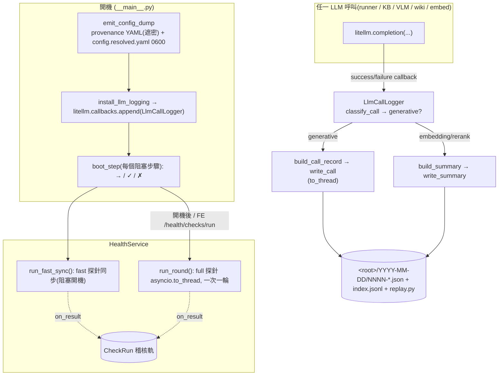

# 平台服務（健康 / 觀測 / 權限 / 使用者）

四個橫切服務:用 live capability 探針確認「模型真的會做事」（health）、把每一次 LLM 呼叫與開機步驟落成可重播/可命名的記錄（observability）、在儲存層與路由層雙閘把關「誰能看/能改哪一筆」（perm）、把 user id 解析成可顯示的人並讓 agent 反查 handle（users）。它們不屬於任何單一功能,而是被 API / agent / KB / job 全線共用。本篇也一併收錄兩個同樣橫切的關注點:**即時遙測**（monitor——把 SDK trace 流轉成可訂閱的事件,#11）與 **LLM 韌性**（failover——busy-aware 的多端點切換,藏在既有 `ILlm`/`IVlm` seam 之後,#196/#249）;它們與已在本篇的重複退化守門同屬「跨切的可靠性/觀測」一族。

> **看這篇之前**：先讀 [架構總覽](../architecture.md) 抓全貌。

## 職責與邊界

- **health（健康/sanity）** — `假 LLM 測試只驗 OUR code,只有 live canned 探針才驗 THE MODEL`（#51）。`ISanityCheck` 是一個自足的能力探針(餵一段對話,斷言模型真的能做這件事),`CheckRegistry` + `run_check` 統一執行,`HealthService` 開機跑 fast 集合(同步)、開機後跑 full 集合(非同步)、FE 可手動重跑。`ReplayService` 把過去一次 LLM 互動的 context 重打到當前模型,**只跑 context→LLM、不跑工具、不寫狀態**。`SanityBatteryCoordinator` 是 Diagnostics 那張 model × 題目 × reasoning-level 矩陣。
- **observability（觀測）** — 兩個 operator 訴求:`啟動時看不出「我設的」與「預設的」`(feature A:provenance config dump)、`一次 LLM 呼叫到底送了什麼、能不能重打`(feature B:經 litellm 全域 `CustomLogger` 落地的可重播 call log)。再加 `boot_step` 讓開機卡住時「沉默之處自己報名」(#208)。
- **perm（權限）** — `agent 與它讀到的內容都不可信;不是好聲好氣問模型,這個函式才是閘`(#262)。`authorize()` 是唯一決策點;`access_scope`(404 可見性)在儲存層 AND 進每個讀,`CollectionPermissionChecker`(403 寫 ACL)疊在其上。
- **users（使用者）** — 使用者由公司目錄擁有,我們只存 id、在 render 時經 `UserDirectory` 解析成人。`find_by_handle` 讓 agent 反查它只看得到 handle 的人(#275);`speaker_label` / `speaker_note` 餵 LLM 多人協作的署名(#242)。
- **monitor（即時遙測，#11）** — `IMonitor` 是「活的」遙測 sink:`MonitorProcessor` 訂閱 OpenAI Agents SDK 的 trace 流,把 span 轉成 `MonitorEvent` 灌進 sink;FE 經 `GET /monitor`(近期)與 `GET /monitor/stream`(SSE)看即時跑動。它與 observability 的「檔案式 LLM call log」是兩條互補的線:後者落地每一次 `litellm.completion` 供事後重打,前者是 SDK 層 span 的即時串流。
- **failover（LLM 韌性，#196/#249）** — `FallbackLlm`/`FallbackVlm` 是包在既有 `ILlm`/`IVlm` seam **之後**的 busy-aware 轉接器:多個端點按優先序試,首 token 逾時(TTFT)或忙就跳下一家,跨家共用一個 cooldown 登記簿。對上游(runner / KB / VLM)完全透明——它們仍只看到一個 `ILlm`。
- **help（平台說明，#230）** — 一個眾所周知的系統 KB collection(name=`"Platform Help"`),開機從打包進 wheel 的 `help_content/*.md`(`CHANGELOG.md` + `getting-started.md`)seed——**repo 是唯一真相來源,UI 上的編輯下次開機被覆蓋**。collection 由幻影 `system` 使用者擁有,經 #262 `Permission`(`visibility="restricted"` + 把讀類動詞 `read_meta`/`read_content`/`read_chat`/`converse` 全給 `ALL`)做到「人人可讀/搜尋/問答、只有 owner+superuser 能改」——刻意**不是** `public`(那等於全動詞開放)。前端 `/help` 薄頁靠 `GET /help` 拿到 collection 與文件清單,內嵌一個鎖定此 collection 的 KB chat。

何時觸發:health fast 集合在開機阻塞跑、full 集合開機後與 FE 觸發跑;observability logger 在第一個 LLM 呼叫前註冊、config dump 在 `get_spec` 前印;monitor 的 `MonitorProcessor` 在 `create_app` 經 `set_trace_processors` 接上;perm 在每個受保護資源的讀/寫;users 在每次 render 人名與每個 agent 回合的署名;failover 在每一次 LLM/VLM 串流呼叫(端點 ≥2 時);help collection 在開機 `seed help collection` step 以 best-effort 離 loop seed、`GET /help` 隨每次請求 idempotent 解析(永不 404)。

## 核心模組

| 路徑 | 角色 |
| --- | --- |
| `src/workspace_app/health/protocol.py` | `ISanityCheck`(abc.ABC,一個能力探針) + `CheckResult`(msgspec.Struct,`VALID_STATUSES = pass/fail/skip/error`)。`fast=True` 的才在開機同步跑 |
| `src/workspace_app/health/registry.py` | `CheckRegistry`(register,check_id 去重)+ `run_check`:每條執行路徑唯一的 wrapper——stamp latency/checked_at、把 raise 轉成 `status="error"`(指向接線),讓探針本身保持簡單 |
| `src/workspace_app/health/service.py` | `HealthService`:快取每條最新結果、`run_fast_sync()`(開機阻塞、僅 fast)、`run_round(only=)`(經 `asyncio.to_thread` 離 loop、一次一輪以 lock 拒重入)、`on_result` 持久化 hook(失敗吞掉不破壞整輪) |
| `src/workspace_app/health/checks/` | bundled 探針:`ToolCallCheck`(模型會不會 call tool,否則退化成只敘述的 chatbot)、`EmbedderDimCheck`、`InsightExtractionCheck`/`RetrievalExpandCheck`、`VlmDescribeCheck` |
| `src/workspace_app/health/replay.py` | `ReplayService`:`replay_turn`(重播產生某訊息的模型互動)/ `replay_doc`(chat-export insight 抽取或 VLM 圖片描述)。`ReplayToolCall` 只記 INTENT;`ReplayRequest`/`ReplayResult`;`ReplayInvalidTarget`/`ReplayUnsupported` |
| `src/workspace_app/health/sanity/` | `SanityBatteryCoordinator`(coordinator.py,enqueue + 背景消費,每 cell 一 job #227)、`questions.py`(`QUESTIONS` code registry)、`judge.py`(`judge_cell`/`judge_verdict`,LLM-as-judge #231)、`jobs.py`(`SanityRun`)。`LlmFactory` 接 kb_search 同一個 `ILlm` seam |
| `src/workspace_app/resources/check_run.py` | `CheckRun`:每次探針執行的持久化稽核軌(最新一筆在 `HealthService` in-memory 快取) |
| `src/workspace_app/api/health_routes.py` | `/health/checks`、`/health/checks/run`、`/health/replay/{turn,doc}`、`/sanity/*` |
| `src/workspace_app/observability/boot.py` | `boot_step` context manager:`→ 進入 / ✓ 完成(1.2s) / ✗ 失敗` 逐行 flush,hang 留下未配對的 `→` 行自己報名(#208) |
| `src/workspace_app/observability/logger.py` | `LlmCallLogger(CustomLogger)`:註冊進 `litellm.callbacks`,**每一個** litellm 呼叫都觸發。`不卡`(I/O 經 `asyncio.to_thread`)、`不錯`(全 best-effort 吞例外) |
| `src/workspace_app/observability/record.py` | 純函式 `build_call_record`/`build_failure_record`/`build_summary`/`classify_call`:把 callback payload 無損重塑成 `request`(= `litellm.completion(**request)` 可複貼)+ `response` + `meta` |
| `src/workspace_app/observability/writer.py` | `LlmLogWriter`:日期分區、`index.jsonl` 一行摘要 + 每呼叫一個 json,並丟一支 `replay.py` 重打小工具 |
| `src/workspace_app/observability/setup.py` | `install_llm_logging` / `llm_log_enabled`:`WORKSPACE_LLM_LOG` env(prod off-switch)蓋過 config `observability.llm_log.enabled`(預設 True) |
| `src/workspace_app/config/dump.py` | `emit_config_dump` / `render`:observability feature A——provenance 標註 YAML,stdout 遮密、`config.resolved.yaml`(0600)露真值。歸屬 [啟動與組裝根](boot-and-config.md) |
| `src/workspace_app/perm/model.py` | `Permission`(嵌在資源上的值物件)、`Subject`(`user:`/`group:`/`all`)、`Visibility`、10 個 `Verb`、`AI_FORBIDDEN`(`change_permission`/`use_terminal`) |
| `src/workspace_app/perm/authorize.py` | `Actor`(human/ai 工廠;`is_ai`/`ceiling`/`groups`)+ `authorize(actor, verb, permission, *, created_by, superusers)`:唯一決策點 |
| `src/workspace_app/perm/scope.py` | `collection_access_scope(superusers)` → 餵 specstar `access_scope` 的 row-level 讀可見性(看不到 ⇒ 404) |
| `src/workspace_app/perm/checker.py` | `CollectionPermissionChecker(IPermissionChecker)` + `collection_permission_event_handler`:per-verb 寫 ACL(403) |
| `src/workspace_app/users/protocol.py` | `UserDirectory` Protocol(`get`/`find_by_handle`/`all_users`)+ `User` dataclass |
| `src/workspace_app/users/mock.py` / `labels.py` | `MockUserDirectory`(seeded);`display_handle`/`speaker_label`/`speaker_note` |
| `src/workspace_app/kb/job_audit.py` | `preserve_job_creator(job_rm)`:worker pod 無 request user 時保留 job 真正建立者(見不變式) |
| `src/workspace_app/agent/repetition.py` / `api/repetition_guard.py` | `RepetitionDetector` + `guard_repetition`:mid-stream 重複退化守門(#113/#146) |
| `src/workspace_app/monitor/base.py` | `IMonitor`(abc.ABC,`record` / `query` / `subscribe`)+ `MonitorEvent`;`_publish` 餵所有訂閱者佇列 |
| `src/workspace_app/monitor/memory.py` / `specstar_impl.py` / `processor.py` | `InMemoryMonitor`(預設、ring buffer)、`SpecstarMonitor`(+`TelemetryEvent` 持久化)、`MonitorProcessor`(SDK `TracingProcessor`,span→`MonitorEvent`) |
| `src/workspace_app/failover/llm.py` | `FallbackLlm(ILlm)` / `FallbackVlm(IVlm)`:每個端點包成一個 `Provider`,`stream()` 交給 `failover_stream` |
| `src/workspace_app/failover/core.py` | `failover_stream`(串流)/ `failover_call`(非串流)+ `Provider`(`ttft_s`/`idle_s`)+ `AllProvidersFailed`/`TtftTimeout`/`StreamStalled`:優先序切換政策 |
| `src/workspace_app/failover/cooldown.py` / `registry.py` / `observe.py` | `CooldownRegistry`(跨家共用、注入 clock)、`get_cooldown_registry`、`make_switch_logger`(切換時記 `on_degrade`) |
| `src/workspace_app/kb/help_collection.py` | Platform Help collection 種子:`ensure_help_collection`(idempotent 建/找)、`seed_help_collection_best_effort`(開機 seed,吞 ingest 失敗讓 embedder 掛了仍可讀但未索引)、`_help_permission`(restricted + 讀動詞給 `ALL`)、`HELP_COLLECTION_NAME`(`"Platform Help"`)/`HELP_SYSTEM_USER`(`"system"`)/`help_content_dir`(#230) |
| `src/workspace_app/api/help_routes.py` | `register_help_routes` 註冊 `GET /help`(掛在 `/api` router ⇒ `GET /api/help`);回 `HelpInfo {collection_id, documents:[{id,path,title,kind}]}`,`_kind` 把 `CHANGELOG.md`→`release_notes` 其餘→`guide`;隨需 `ensure_help_collection` 故永不 404(#230) |

## 介面與接縫

| 接縫 | 形態 | 定義位置 | 實作 |
| --- | --- | --- | --- |
| `ISanityCheck` | abc.ABC(`I<Name>` 慣例) | `health/protocol.py` | `ToolCallCheck` / `EmbedderDimCheck` / `InsightExtractionCheck` / `RetrievalExpandCheck` / `VlmDescribeCheck`;operator 經 `health.checks` dotted path 加自家的 |
| `CustomLogger` | litellm 提供的 hook 基底 | `litellm.integrations.custom_logger` | `LlmCallLogger`(註冊進 `litellm.callbacks`,全域、零 per-call-site 接線) |
| `UserDirectory` | Protocol(duck typing) | `users/protocol.py` | `MockUserDirectory`(測試/本地);真目錄之後包公司系統,經 `create_app(users=…)` 注入 |
| `IPermissionChecker` | specstar 介面 | `specstar.permission` | `CollectionPermissionChecker`(allow-by-default,只對寫/生命週期動作表態) |
| `AccessScope` | specstar 介面(`user → 述詞`) | `specstar.permission` | `collection_access_scope` 回傳的閉包(`UNRESTRICTED` 為唯一可 grep 的「看全部」路徑) |
| `LlmFactory` | `Callable[[str, str], ILlm]` | `health/sanity/coordinator.py` | sanity battery 用真實 `ILlm` seam;測試傳 fake |
| `IMonitor` | abc.ABC(`I<Name>` 慣例) | `monitor/base.py` | `InMemoryMonitor`(預設)/ `SpecstarMonitor`(持久);經 `create_app(monitor=…)` 注入,`MonitorProcessor` 是它的 SDK trace 餵料端 |
| `ILlm` / `IVlm`（failover 轉接） | 既有 seam(見 [Agent 執行時](agent-runtime.md)) | `kb/llm.py` / `kb/vlm/protocol.py` | `FallbackLlm`/`FallbackVlm` 在端點 ≥2 時取代單一實作——上游無感,仍只看到一個 `ILlm`/`IVlm` |

## 運作方式

開機健康檢查 + LLM call log 如何落地:

`run_check` 是每條執行路徑的唯一 wrapper:量延遲、stamp `checked_at`、把任何 raise 轉成 `status="error"`,所以個別探針只要「做探測、回 pass/fail/skip」。`HealthService.run_round` 用 lock + `_running` 旗標確保一次只有一輪在跑(探針都打同一個本地模型,平行只會互搶);第二次觸發直接回 `False`,FE 顯示 `running`。

`ReplayService` 的忠實性靠「用 live 表面同一段 code 重建 context」:turn replay 直接 import runner 私有的 `_agent_for`(system prompt + 工具 schema 必須 bit-identical)與 `api.turns.history_items`(忠實展開工具歷史),所以一次 replay 失敗代表「這個模型做不到那回合要的事」,而不是「replay harness prompt 不一樣」。回應裡的 tool call 只當 INTENT 報出,工具本身碰都不碰。

**failover 切換政策**(`failover/core.py`):多個端點按嚴格優先序逐一嘗試,`CooldownRegistry` 標記為冷卻中的直接跳過。`_drive` 對每個 provider 的(阻塞、同步)iterator 設兩道死線:首 token 必須在 `ttft_s` 內到(否則視為「忙」,記 `TtftTimeout` 換下一家)、串流途中靜默超過 `idle_s` 算 `StreamStalled`。關鍵分界是**第一個 item 之前 vs 之後**:首 item 之前失敗 ⇒ 安全換家;首 item **之後**才失敗 ⇒ 直接傳播(一段已經開始輸出的串流不能無聲重來,否則使用者會看到重複/錯亂的文字)。全部端點都失敗或都在冷卻 ⇒ `AllProvidersFailed`。內層每個 `LitellmLlm` 端點以 `num_retries=0` 建構——重試完全由 failover 迴圈「換家」接管(#196);非串流路徑(embeddings)走對應的 `failover_call`。chain 在 [啟動與組裝根](boot-and-config.md) 的 `factories.resolve_llm_chain` 組好:端點只有一個時就是純 `LitellmLlm`(無 failover 開銷),≥2 時才包成 `FallbackLlm`。

**monitor 即時遙測**(`monitor/`):`create_app` 用 `set_trace_processors([MonitorProcessor(monitor)])` 把 sink 接到 SDK 的 trace 流(會**取代**預設 processor),每個 agent span 即時變成 `MonitorEvent`;`IMonitor._publish` 推給所有訂閱者佇列,`GET /monitor/stream` 把它們 SSE 出去。這是繼 agent 回合(`AgentEvent`)與 notebook cell(`CellEvent`,見 [API 與回合引擎](api-and-turns.md))之後的第三條 SSE 串流,但屬於側通道的觀測,不在關鍵回合路徑上。

## 關鍵不變式與眉角

!!! warning "observability hook 永遠不可破壞一個 turn"
    `LlmCallLogger` 的成功/失敗 callback 全包在 `try/except` 吞到 debug log;檔案 I/O 經 `asyncio.to_thread` 離 event loop。`HealthService._record` 的 `on_result`(寫 `CheckRun`)、`emit_config_dump` 的寫檔同理——壞掉的觀測絕不能讓 chat turn 失敗或卡住開機。

!!! warning "replay 只跑 context→LLM,不跑工具、不寫狀態"
    `ReplayService` 把 tool call 報為 `ReplayToolCall`(INTENT)而**不執行**;要看模型對工具輸出的反應,是把歷史已持久化的 output 折進 context,而非真的再呼叫工具。doc replay 是 dry-run——不重新索引、不寫 chunk。這是 #51 P4 的鎖定契約。

!!! warning "perm:authorize() 是唯一閘,AI 永遠不得越 AI_FORBIDDEN"
    `change_permission` 與 `use_terminal` 在 `AI_FORBIDDEN`:無論 preset ceiling、owner、superuser,只要 `actor.is_ai` 就硬擋(`authorize` 第一條)。直接 human superuser 旁路一切,但「被 superuser 驅動的 AI」不旁路——它仍是 `ceiling ∩ speaker`。每個路由與每個 agent 工具都必須過這個函式;`access_scope` 先把看不到的 row 變 404,checker 再決定可否寫。

!!! warning "Collection 寫 ACL 走 event_handlers,不是 permission_checker(specstar 0.11.11)"
    `add_model(permission_checker=…)` 會被 spec 層的 truthy `AllowAll()` 預設**遮蔽**(`self.permission_checker or permission_checker`),所以 per-verb 寫 ACL 改掛在 per-model 的 `event_handlers` slot,包進 `PermissionEventHandler`(見 `perm/checker.py` 模組 docstring)。代價:event handler 對**每一次** RM 寫都會跑(含程式性寫入),所以唯一的程式性非建立寫(code-repo sync 蓋 git metadata)必須以 collection owner 身分動作才過 `write_meta`。

!!! warning "worker 無 request user:靠 rm.using(user=…) 保留真實 updater"
    job pod 沒有請求使用者,`get_user_id` 預設 `settings.server.default_user`。`preserve_job_creator(job_rm)` 把 job RM 的預設 acting-user 拿掉(`user_ctx = Ctx(...)`),讓 specstar 自己的生命週期寫(claim PROCESSING / complete COMPLETED,跑在 consumer thread)落回 job 的 `created_by`,而不是 worker 的 bare default(#186 根因)。代價:之後**每個** enqueue 都必須顯式 `job_rm.using(user=…)`,bare `create` 會 raise——producer 都照做(request 內用 requester,worker fan-out 用 `job.info.created_by`)。文件處理、wiki、card-gen、quality、workflow resume 全用同一招(`kb/index_coordinator.py`、`kb/wiki/coordinator.py`、`kb/card_gen_coordinator.py`、`workflow/capabilities.py`)。

!!! note "find_by_handle 是嚴格的,get 是寬容的"
    `UserDirectory.get` 對未知 id 回一個 graceful placeholder(`User(id, name=id)`),這樣舊紀錄上的 stale id 永遠不會弄壞 render。但 `find_by_handle`(#275 的 `lookup_user` 工具反查)對未知 handle 回 `None`——這樣呼叫端能明確告訴 agent「這個 handle 認不得」,而不是默默生一個假人。

!!! note "重複退化守門:活的 repeat 留著,只截持久化"
    `guard_repetition`(#113)轉發每個事件**不動**——repeat 在串流裡照樣現給使用者看(決策 b),只在第一次偵測到 loop 時補一個 `RepetitionStopped` + `RunDone` 並停止,持久訊息的截斷由 turn reducer 下游做。`RepetitionDetector` 的 floor 刻意放寬(`repeats=10`、`min_loop_chars=1200`、fenced code 內不偵測):退化是**無界**的、會跑過任何結構,而再寬的表格列也會在換行處結束——所以用「量」而非「種類」分辨,寬表/清單不誤判(#146)。content 與 reasoning 各一個 detector(reasoning 是最會燒 token 的頻道)。

!!! warning "failover:首個 item 之後失敗不得換家"
    切換只在「還沒吐出第一個 token」時安全。一旦串流開始輸出,`failover_stream` 對之後的失敗一律**傳播**而非重試下一家——否則使用者會看到半段答案被另一個模型的重來蓋掉。因此 TTFT(把「忙」變成可快速跳過的訊號)與 idle 死線是這套政策的核心,內層 `num_retries=0` 確保重試只有「換家」一種,不會在單一端點上偷偷重打。

!!! note "monitor / 觀測 hook 一律 best-effort,絕不擋回合"
    `MonitorProcessor` 把 SDK span 灌進 sink、`IMonitor._publish` 餵訂閱佇列都是非阻塞且吞例外的;`set_trace_processors` 會**取代**SDK 預設 processor(這是 issue #11 的刻意選擇,不是疊加)。遙測掛了最多是少一條 `/monitor/stream` 事件,絕不能讓 agent 回合失敗——與本篇其餘觀測 hook(LLM call log、`CheckRun`)同一條鐵律。

## 設計決策與出處

| 決策 | 理由 | 出處 |
| --- | --- | --- |
| sanity check 是 functional capability 探針,不是 connectivity(HTTP 200) | 假 LLM 測試只驗 OUR code;qwen3:14b 事件——模型「敘述」而不 call tool,只有 live canned 探針抓得到 | #51;`health/protocol.py` docstring;`plan-sanity-checks.md` |
| fast 集合開機同步、full 集合開機後 + FE 非同步、一次一輪 | connectivity-grade 要擋開機到能用;能力探針慢且打同一本地模型,平行只會互搶 | #51 Q2;`health/service.py` |
| replay = (context snapshot, target LLM) → raw output,不執行工具不寫狀態 | 重點是 SHOW 模型在某 context 的反應供人比對;用 live 同一段 code 重建 context 才能把鍋指向模型而非 harness | #51 Q4;`health/replay.py` |
| LLM call log 經一個全域 litellm `CustomLogger` 落地 | 涵蓋 runner/KB/retrieval/VLM/wiki/embed 所有呼叫點、零 per-call-site 接線;request 塊即 `litellm.completion(**request)` 可複貼重打 | observability feature B;`observability/logger.py`/`record.py`/`writer.py` |
| config dump 標 provenance(`← config.yaml / env / default`)、stdout 遮密 + 0600 露真值 | operator 的痛是「分不清我設的與預設的」;遮密版 paste-safe,真值版(0600)是可重現 run 的 reproducer | observability feature A;`config/dump.py` |
| 開機每個阻塞步驟用 `boot_step` 敘述 | pod hang 在 config dump 後一串無聲阻塞步驟裡,任何一個停住都長一樣(沉默);未配對的 `→` 行讓 hang 自己報名 | #208;`observability/boot.py` |
| `authorize()` 單一決策點;`access_scope`(404)+ checker(403)分層 | agent 與內容都不可信;row-level 可見性在儲存層 AND 進每讀(無 per-route 接線),per-verb 寫 ACL 疊其上 | #262;`perm/`;`plan-permissions.md` |
| `AI_FORBIDDEN = {change_permission, use_terminal}` 硬擋 | 改 access control、開人類 shell 不是 agent 該做的事,無論 ceiling/owner/superuser | #262;`perm/model.py`/`authorize.py` |
| 寫 ACL 掛 `event_handlers` 而非 `permission_checker` | specstar 0.11.11 的 `permission_checker` 被 spec 層 `AllowAll` 預設遮蔽;event handler 對每次 RM 寫都跑 | specstar 0.11.11;`perm/checker.py` docstring |
| 使用者由公司目錄擁有,我們只存 id、render 時解析 | 不重造 user 系統;`UserDirectory` 一個 Protocol 換真目錄,其餘不動 | `users/protocol.py` |
| label 用 `Name (handle)`(email local-part),id 留結構化 context | 同名同姓會撞,handle 像 Slack `@handle`/GitHub `@login` 唯一可讀;LLM 讀 label 分辨協作者 | #242;`users/labels.py` |
| worker lifecycle 寫靠 `preserve_job_creator` + `rm.using` 保留 creator | worker pod 無請求使用者,default 只是它自身產物的 fallback;否則 job 稽核被改寫成匿名 | #186/#83;`kb/job_audit.py` |
| 重複退化在 stream 端守、留活 repeat、用「量」分辨結構 | 沒有 backend penalty 可靠擋住 neural text degeneration(Holtzman 2020;Ollama 默默丟 `repetition_penalty`);活 repeat 讓使用者看見模型失常 | #113/#146;`agent/repetition.py`;`plan-repetition-guard.md` |
| failover 藏在 `ILlm`/`IVlm` seam 之後、靠「換家」而非單點重試 | 本機 Ollama 一次只服務一個請求,「忙」是常態;TTFT 把忙變成可快速跳過的訊號,上游無需知道有幾個端點 | #196/#249;`failover/core.py`/`llm.py`;`plan-llm-failover.md` |
| 首 item 之後失敗一律傳播、內層 `num_retries=0` | 已開始輸出的串流不能無聲重來;重試只能是「換家」,單點重打會與 failover 迴圈打架 | #196;`failover/core.py`;`factories.resolve_llm_chain` |
| monitor 用 SDK trace processor 餵一個可訂閱 sink,而非自刻埋點 | 重用 Agents SDK 既有的 tracing,零 per-call-site 接線即拿到即時 span;`set_trace_processors` 取代預設 | #11;`monitor/processor.py`/`base.py` |

## 與其他子系統的關係

- [啟動與組裝根](boot-and-config.md):`__main__.py` 串起 `emit_config_dump` → `install_llm_logging` → `get_spec`/`create_app`,全程包 `boot_step`;`factories.get_check_registry` 建 `CheckRegistry`、`create_app` 建 `HealthService` 並 `register_health_routes`;superusers 從 `settings.server.superusers` 同時穿進 `get_spec` 與 `create_app`,讓路由 `authorize()` 與儲存 `access_scope` 一致。
- [API 與回合引擎](api-and-turns.md):`/me`、`/users`、`/health/*`、`/sanity/*` 路由;`speaker_note` 餵進每個回合的 system 指令(`litellm_runner.py`);`guard_repetition` 包在 runner 的事件串流上。
- [背景工作與擴展](jobs-and-scaling.md):`SanityBatteryCoordinator` 與其它 coordinator 同形(enqueue + 背景消費 + `aclose`);所有 coordinator 都靠 `preserve_job_creator` + `rm.using` 保留 job creator。
- [Agent 執行階段](agent-runtime.md):`ReplayService` 直接重用 runner 的 `_agent_for` 與工具組裝;`lookup_user` 工具(`agent/tools.py`)經 `find_by_handle` 解析人;`RepetitionDetector` 守 agent 的退化。
- [知識庫:攝取與索引](kb-ingest-index.md) / [知識庫:檢索與 KB agent](kb-retrieval-agent.md):health 探針驗 embedder 維度、insight 抽取、retrieval expand、VLM 描述;perm 的 `Permission`/`access_scope`/checker 保護 `Collection`(`resources/__init__.py`)。
- [資料層（specstar）](data-layer.md):`CheckRun` / `SanityResult` / `SanityVerdict` / `CustomSanityQuestion` 是 specstar 資源;`access_scope` + `event_handlers` 在 `add_model(Collection, …)` 接上。
- 決策彙整見 [decisions.md](../decisions.md);部署/環境變數(`WORKSPACE_LLM_LOG`、superusers、`default_user`)見 [deployment.md](../deployment.md)。

## 原始碼錨點

- `src/workspace_app/health/protocol.py` / `registry.py` / `service.py` — `ISanityCheck` / `CheckResult` / `run_check` / `HealthService`(fast-sync vs round)。
- `src/workspace_app/health/replay.py` — `ReplayService.replay_turn` / `replay_doc`(忠實 context 重建、INTENT-only tool call)。
- `src/workspace_app/health/sanity/coordinator.py` — `SanityBatteryCoordinator`(矩陣 enqueue/消費、`LlmFactory`、`judge_*`)。
- `src/workspace_app/observability/logger.py` / `record.py` / `writer.py` / `setup.py` — 全域 `CustomLogger` LLM call log + gate。
- `src/workspace_app/observability/boot.py` — `boot_step`(#208 開機敘述)。
- `src/workspace_app/config/dump.py` — `emit_config_dump`(provenance config dump,feature A)。
- `src/workspace_app/perm/authorize.py` / `scope.py` / `checker.py` / `model.py` — `authorize()` + `access_scope` + 寫 ACL。
- `src/workspace_app/users/protocol.py` / `labels.py` / `mock.py` — `UserDirectory` / `find_by_handle` / `speaker_label`。
- `src/workspace_app/kb/job_audit.py` — `preserve_job_creator`(worker updater 保留)。
- `src/workspace_app/agent/repetition.py` / `api/repetition_guard.py` — 重複退化守門。
- `src/workspace_app/monitor/base.py` / `processor.py` / `memory.py` — `IMonitor` + `MonitorProcessor`(SDK trace → sink)+ `InMemoryMonitor`;路由 `GET /monitor` + `/monitor/stream`(`api/meta_routes.py:{get_monitor,stream_monitor}`,連同 `/activity` 經 `register_meta_routes` 註冊)。
- `src/workspace_app/failover/core.py` / `llm.py` / `cooldown.py` — `failover_stream` 政策 + `FallbackLlm`/`FallbackVlm` + `CooldownRegistry`;chain 在 `factories.resolve_llm_chain`。
- `src/workspace_app/kb/help_collection.py` / `api/help_routes.py` — Platform Help collection seed(`ensure_help_collection` / `seed_help_collection_best_effort` / `_help_permission`)+ `GET /help`(`HelpInfo` / `HelpDocument`);開機 seed 在 `api/lifecycle.py`(`app.state.help_collection_id`)、route 在 `create_app` 經 `register_help_routes(api, spec)` 掛上 `/api`(#230)。
- `docs/plan-sanity-checks.md` / `docs/plan-permissions.md` / `docs/plan-repetition-guard.md` / `docs/plan-llm-failover.md` — 各自鎖定的設計。
