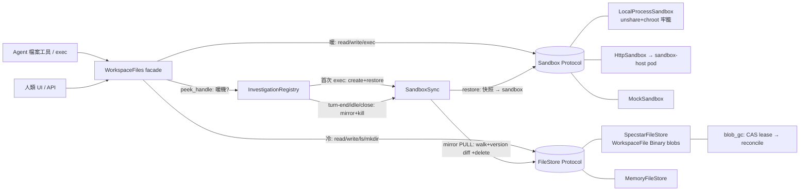

# Sandbox、FileStore 與同步

一個 item 的工作檔案有兩個協作的命名空間:**Sandbox**（活著的執行環境,熱機時的真實來源）與 **FileStore**（持久的虛擬根快照,冷機時的真實來源)。`SandboxSync` 在兩者之間搬檔,sandbox 在第一次 `exec` 時才惰性建立、閒置/關閉時拆除——「活著看 sandbox、死了看快照」徹底消除了舊的雙來源漂移。

> **看這篇之前**：先讀 [架構總覽](../architecture.md) 抓全貌。

## 職責與邊界

這個子系統負責**一個 workspace（investigation / item）工作檔案的存放與生命週期**:

- **Sandbox** — 隔離的指令執行環境，外加一份工作檔案副本。熱機時它是唯一可寫的真實來源。
- **FileStore** — 持久、per-workspace 的虛擬根，agent 的檔案工具直接打這裡（純檔案操作永不喚醒 sandbox）。冷機時它是真實來源。
- **SandboxSync** — restore（快照 → 新醒的 sandbox）與 mirror（活 sandbox → 快照，PULL-only、可偵測刪除）。
- **blob_gc** — 回收 per-file FileStore 背後沒人引用的 blob 位元組。

**不負責**的部分（明確劃界，避免重疊）：

- **誰**在什麼時機呼叫 restore/mirror/kill——那是 `InvestigationRegistry` 這個生命週期驅動者的事（見[與其他子系統的關係](#與其他子系統的關係)），它消費本子系統但不屬於它。
- **暖/冷路由**（agent 與人類的檔案操作該打 sandbox 還是快照）由上層的 WorkspaceFiles facade 用 `peek_handle` 決定。
- **sandbox-host pod 的內部**（`IsolatedProcessSandbox`、setpriv/cgroup 隔離、線上協定）屬於[工具套件與 Sandbox Host](tooling-and-sandbox-host.md)；本子系統只提供 in-process 的 `HttpSandbox` 客戶端。
- **排程**（誰多久跑一次 mirror sweep / blob GC）住在[背景工作與擴展](jobs-and-scaling.md)。

## 核心模組

| 路徑 | 角色 |
| --- | --- |
| `src/workspace_app/sandbox/protocol.py` | `Sandbox` Protocol（14 個方法）+ `SandboxHandle` / `SandboxSpec` / `ExecResult` / `FileEntry` dataclass + `SandboxNotFound`。定義 mirror 用來 diff 的不透明 `FileEntry.version` 變更戳，以及 `/`-rooted 路徑、非零退出不丟例外等全後端共通約定。 |
| `src/workspace_app/sandbox/local_process.py` | `LocalProcessSandbox` — 受信任單機/VM 部署的預設。有 unprivileged user namespace 時用 `unshare --user --mount` + chroot 牢籠（`_JAIL_BOOTSTRAP`）跑每個 exec；否則退回工作子目錄裡的純 subprocess。擁有雙逾時 exec pump、process-group SIGKILL、與 host 子類覆寫的 `_exec_argv` hook。每個 sandbox 的 infra 兄弟目錄（workspace `root/` 之外、不被 walk/sync、回收即刪）：`.tools`（工具）、`.jailbin`（`python` shim，#350）、`.ready`（readiness marker，#366）、`.home`（per-sandbox HOME，#393——unjailed exec 以 `SANDBOX_HOME` 傳給 carrier launcher，讓使用者 `pip --user` 安裝落在自己 sandbox 而非共用 `/tmp`）。 |
| `src/workspace_app/sandbox/http_client.py` | `HttpSandbox` — 第 4 種後端（#60），把 14 個方法忠實 marshal 到獨立的 sandbox-host pod。把 `(pod_url, remote_id)` 打包進不透明 handle，讓任何 app replica 直連擁有該 sandbox 的 pod（stateless / HPA-ready）；死 pod / 傳輸錯誤映成 `SandboxNotFound`。`exec` 走 NDJSON 串流；`expose_port` v1 丟 `NotImplementedError`。 |
| `src/workspace_app/sandbox/mock.py` | `MockSandbox` — 給測試的記憶體內 `dict[path]->bytes` 後端；content-hash 版本戳；`mkdir` 是 validate-and-no-op（扁平 store 無可觀測的空目錄）。 |
| `src/workspace_app/sandbox/docker.py` | `DockerSandbox` — **已棄用**（#252）：一個 handle 一個 container；仍可本機一次性用，但不再維護，由 `sandbox.kind: http` 取代。 |
| `src/workspace_app/sync/sandbox_sync.py` | `SandboxSync` — restore/mirror 生命週期。`restore()` 把每個快照檔串進剛醒的 sandbox 並 seed `{path: version}` diff 狀態；`mirror()` PULL 活 sandbox 進快照（walk + version-diff 複製變動檔、刪掉 sandbox 已沒有的快照檔）。每個檔都經 on-disk staging temp 串流，大檔絕不整份進 RAM（#219）。 |
| `src/workspace_app/sync/ignore.py` | `DEFAULT_IGNORES` + `should_ignore` — reverse-sync 過濾器：跳過 build/cache 雜訊（`.venv/`、`node_modules/`、`__pycache__/`、`.git/`、`*.pyc`…）與任何超過 `MAX_FILE_SIZE`（10 MB）的檔，免得一個 dump 灌爆 specstar。 |
| `src/workspace_app/sync/__init__.py` | 套件門面，re-export `SandboxSync` 與 ignore helper。 |
| `src/workspace_app/filestore/protocol.py` | `FileStore` Protocol — 持久的 per-workspace 虛擬根。方法：`write`/`write_from_path`/`read`/`read_to_file`/`ls`/`exists`/`delete`/`mkdir`/`rmdir`/`is_dir`/`listdir`。一等公民的誠實目錄（無 `.keep` hack）；`dir_ancestors` helper；`FileNotFound`/`FileExists` 例外。`workspace_usage`/`file_size` 標為選用的 duck-typed 能力，非核心。 |
| `src/workspace_app/filestore/specstar_impl.py` | `SpecstarFileStore` — 生產級 FileStore（#219）：每個檔是一個 `WorkspaceFile` specstar resource，內容是 `Binary` blob（位元組 offload 到 blob store），所以一次寫入是 O(一個檔)。目錄住在小的 per-workspace `_WorkspaceDirs` record。slash-free id 由 `_fid`/`_wsid` 產（U+2215 + percent-encode）。`content.size` 索引成 `content_size` 供 #245 usage `Sum` 聚合；冪等自註冊 model。 |
| `src/workspace_app/filestore/memory.py` | `MemoryFileStore` — 無 specstar 的記憶體內預設，`__main__` 用它免得漏出 ~19 條 `/-workspacefiles/*` CRUD 路由；重啟即清空。複製誠實目錄 + usage 語意供 dev/test。 |
| `src/workspace_app/filestore/blob_gc.py` | Blob GC 排程（#245/#370）：包 specstar v0.11.10 的 `SpecStar.gc(mode="reconcile")`。一列的 `_GcLease` CAS lease（`register_gc_lease`/`try_claim_gc`/`run_blob_gc`）讓每個 window 只有一個 pod 跑會刪東西的 reconcile，其餘 no-op。 |
| `src/workspace_app/filestore/migrate.py` | 一次性遷移（#219）：把舊的 inline-bytes `_WorkspaceFiles` record 改寫成 per-file `WorkspaceFile` Binary + `_WorkspaceDirs`；冪等。每次部署在新 store 服務前跑一次。 |

## 介面與接縫

| 接縫 | 定義位置 | 種類 | 實作 |
| --- | --- | --- | --- |
| `Sandbox` | `src/workspace_app/sandbox/protocol.py` | Protocol（14 方法） | `LocalProcessSandbox`（正式/VM）、`HttpSandbox`（正式/pod）、`MockSandbox`（測試）、`DockerSandbox`（已棄用） |
| `FileStore` | `src/workspace_app/filestore/protocol.py` | Protocol | `SpecstarFileStore`（正式）、`MemoryFileStore`（`__main__` 預設 + 測試） |
| `_SyncHook` | `src/workspace_app/api/registry.py` | Protocol（窄子集） | `SandboxSync` |
| `_exec_argv` | `src/workspace_app/sandbox/local_process.py` | override hook | sandbox-host 的 `IsolatedProcessSandbox`（前綴 setpriv + cgroup-join wrapper），見[工具套件與 Sandbox Host](tooling-and-sandbox-host.md) |

`Sandbox` 的 14 個方法是 `create` / `kill` / `exec` / `upload` / `download` / `upload_file` / `download_to_file` / `walk` / `exists` / `delete` / `mkdir` / `rmdir` / `rename` / `expose_port`。後端透過 `create_app(sandbox=...)` 注入；寫新後端只要照各 docstring 契約實作每個方法，其餘程式不需改動。

## 運作方式 / 資料流

**冷啟動。** 一個 item 的檔案只活在 FileStore 快照裡。純讀/寫/`ls`/`mkdir` 直接打快照、永不喚醒 sandbox（`peek_handle` 回 `None`）。

**喚醒（首次 exec）。** `InvestigationRegistry.ensure_handle` 取 per-session lock，呼叫 `Sandbox.create(default_spec)` 拿到 `SandboxHandle`，再 `SandboxSync.restore(workspace_id, handle)`：對快照 `ls()`，每個檔走 `FileStore.read_to_file` → staging temp → `Sandbox.upload_file`，最後 `walk()` 一遍 sandbox 把 `self._versions[workspace_id] = {path: version}` seed 起來（用 `should_ignore` 過濾）。此後 sandbox 成為真實來源。

**熱機（exec）。** 跑 argv（`LocalProcessSandbox` 下經 `unshare`+chroot 入牢籠；`HttpSandbox` 下經 NDJSON HTTP 打給擁有的 pod），把 stdout/stderr chunk 串流給 `on_output`，並用 `exec_timeout`（總時長）+ `log_timeout`（閒置）兩個 deadline 限制 runtime，回 `exit_code`（逾時 124、找不到 127、不可執行 126；非零從不丟例外）。`LocalProcessSandbox` 還用 `start_new_session=True` 讓子行程自成 process group，逾時或取消時 SIGKILL 整個 group，連背景的孫行程一起收（#74）。

**Mirror（節流 sweep / turn-end / refresh / idle-kill / close）。** `SandboxSync.mirror` walk 活 sandbox，對每個非 ignore 且 `version` 與上次不同的 `FileEntry`，走 `Sandbox.download_to_file` → staging temp → `FileStore.write_from_path`；任何先前看過、現在 sandbox 已沒有的 path 從快照刪掉。在 `SpecstarFileStore` 下每次寫入落成一個 `WorkspaceFile` Binary（位元組 chunk 進 blob store）。idle-kill/close 做最後一次 mirror 後 `Sandbox.kill`，把真實來源翻回快照。死的 HTTP pod 浮現為 `SandboxNotFound`，下一次 exec 就 cold-restore。

**Blob GC（獨立）。** `blob_gc.run_blob_gc` 週期性 CAS 搶 lease 並跑 specstar 的 reconcile，隔離+刪掉沒有任何活 `WorkspaceFile`/KB record 引用的 blob。

## 關鍵不變式與眉角

!!! warning "任一瞬間只有單一真實來源"
    活著 ⇒ sandbox；死了 ⇒ FileStore 快照。刻意不存在兩邊都可寫的視窗（sandbox-as-SoT 重設計，`docs/plan-sandbox-sot.md`）。Agent 永遠看 sandbox；人類讀快照（落後 ≤ mirror window，會收斂）。

!!! warning "sandbox 惰性建立——只有 exec 喚醒它"
    只有 `exec`（任何需要活行程的操作）才透過 `ensure_handle = create+restore` 喚醒 sandbox。純檔案操作一律路由到快照，**絕不能**喚醒（`peek_handle` 維持 `None`）。

!!! warning "FileEntry.version 是不透明的"
    唯一契約是「內容可能變過時才會不同」。**永不解析它。** Local 用 `mtime_ns-size`、Mock 用 content hash、HTTP 轉送 host 的。mirror 拿它 diff 上次快照的版本。

!!! note "路徑是 POSIX 且 /-rooted 於 workspace 根（不是 host 根）"
    開頭的 `/` 指 workspace 根。`FileEntry` 路徑以 `/` 開頭，所以能跟 FileStore key 原封不動 round-trip。`LocalProcessSandbox._resolve` 把絕對路徑當 relative-to-cwd 處理，避免逃出 sandbox。

!!! warning "exec 對「跑了但失敗」的指令從不丟例外"
    非零退出進 `ExecResult.exit_code`（124=逾時、127=找不到、126=不可執行）。只有未知 handle 才丟 `SandboxNotFound`。

!!! note "誠實目錄"
    空資料夾真的存在（無 `.keep` hack）。`write()` 自動建祖先目錄；刪一個**檔案**會留下它的父目錄；只有 `rmdir` 移除整棵子樹。

!!! warning "刪除不從快照反向傳播到 sandbox"
    mirror 是 **PULL-only**：它只刪 sandbox 已丟掉的快照檔，從不把快照的刪除推進活的 sandbox。

!!! warning "LocalProcessSandbox：只 walk/sync workspace 子目錄"
    檔案操作 + `walk` 範圍限定在 `_WORKSPACE='root'` 子目錄；chroot 根（infra：bind-mount 的 `/usr`、`/etc`、`/.tools`、`/dev` 節點）在 workspace 之外，**絕不能**被 walk/sync。`_TOOLS='.tools'` 與 bootstrap 的掛載路徑必須鎖步一致。

!!! note "大檔全程經 on-disk staging temp 串流"
    `FileStore.read_to_file`/`write_from_path` ↔ `Sandbox.upload_file`/`download_to_file`——整份檔絕不進 RAM（#219）。例外：`HttpSandbox.upload_file` 目前仍 `local_path.read_bytes()` 整份讀進來（其自身註解標記為待 host 協定改成串流上傳）。

!!! warning "specstar resource id 不能含 ASCII '/'"
    `_fid`/`_wsid` 把 `workspace_id` percent-encode、把 path 的 `/` 換成 U+2215。**永不手刻或解析這些 id。**

!!! warning "blob_gc.reconcile 會刪除且是全掃描"
    每個 window 只准一個 pod 透過 `_GcLease` CAS lease 跑它；且**只能在所有引用 blob 的 model 都註冊的 spec 上跑**（完整 live set），絕不能在 model 不齊的瘦 pod 上跑——否則會算出不完整的 live set 而誤刪被引用的 blob。

!!! note "content_size 聚合對未遷移列會少算"
    寫在索引之前的列其 `content_size` sum 成 `None`→0，直到操作員跑 `migrate/execute`；別把 0 當未遷移 workspace 的權威用量。

## 設計決策與出處

| 決策 | 理由 | 出處 |
| --- | --- | --- |
| 熱機時 sandbox 是單一真實來源；FileStore 是快照/還原/冷讀目標；只有 exec 喚醒 sandbox | 舊雙來源（sandbox + filestore 都可寫）造成 LLM 看到的與實際存在的漂移；讓任一時刻恰好一側可寫，從構造上消除落差 | `docs/plan-sandbox-sot.md` §1-2（grill Q1-Q8） |
| Mirror 為 PULL-only + 不透明 per-file version diff + 偵測刪除，節流 ≤window 並在 turn-end/idle/close 強制 flush | 便宜後端維持便宜（無 per-op 狀態）、shell 建的檔（檔案工具沒看過）仍持久、crash 最多丟一個 window；否決 turn-boundary-only（不夠即時）與 teardown-only（丟整個 session） | `docs/plan-sandbox-sot.md` §3-4（Q2,Q3b） |
| 每個 workspace 檔是自己的 specstar `WorkspaceFile` resource + `Binary` blob，而非一個 inline `dict[str,bytes]` record | 寫入變 O(一個檔)、無整個 workspace 的 read-modify-write、大檔不 inline；Binary restore 是 eager+per-file，「讀一個檔」不會誤載整個 workspace | `src/workspace_app/filestore/specstar_impl.py` 模組 docstring（#219） |
| `LocalProcessSandbox` 用 unshare userns + chroot 把 exec 關進牢籠，workspace=`/root`、infra 在 workspace 之外 | host 檔案系統不可達 + 系統目錄唯讀，agent 動不了 host；同時 provisioned tools（python-stack venv shim）與 overlay 對 walk/sync 隱形；userns 不可用時透明退回純 subprocess | `src/workspace_app/sandbox/local_process.py` 模組 + `_JAIL_BOOTSTRAP` 註解 |
| `HttpSandbox` 把 `(pod_url, remote_id)` 編進不透明 handle 直連擁有的 pod；死 pod 映成 `SandboxNotFound` | app 端維持完全 stateless/HPA-safe，無共享路由 store；host-pod 死亡看起來就像冷 sandbox，registry 直接從快照重建 | `docs/plan-http-sandbox.md`（Routing, Error model） |
| `DockerSandbox` 棄用，改用 `sandbox.kind: http`（cgroup 下的 `IsolatedProcessSandbox`） | Docker-per-sandbox 早於 warm-host-pod 模型，且其 image 與 python-stack 工具 bundle 不同步 | `src/workspace_app/sandbox/docker.py` 模組 docstring（#252） |
| 誠實目錄（真 mkdir/rmdir、空目錄持久）、無 `.keep` sentinel、刪檔留父目錄 | 檔案樹語意必須挺過 round-trip，空資料夾是合法狀態；rmdir 是唯一的子樹移除器 | `src/workspace_app/filestore/protocol.py` 目錄註解 + plan-sandbox-sot.md Q4/Q6 |
| Blob GC 鎖在一列 CAS lease 後，且只在完整 model 的 spec 上跑 | reconcile 是會刪除的全掃描——每個 pod 都跑會 N× 工作量並 race 刪除，而 model 不齊的 pod 會算出不完整 live set 而誤刪被引用的 blob | `src/workspace_app/filestore/blob_gc.py` 模組 docstring（#245/#370） |

## 與其他子系統的關係

- **[API 與回合引擎](api-and-turns.md)** — `InvestigationRegistry`（`src/workspace_app/api/registry.py`）是本子系統的生命週期擁有者:`ensure_handle`(create+restore)、`peek_handle`(暖/冷路由的 liveness 查詢)、`flush`/`mirror_warm`/`kill_idle`/`close_all`(mirror 後視情況 kill)。它透過窄的 `_SyncHook` Protocol 呼叫 `SandboxSync`，並持有 `Sandbox` 與預設 `SandboxSpec`。
- **WorkspaceFiles facade**（API 檔案工具層）— 用 `peek_handle` 把 agent/人類的檔案操作路由 暖→sandbox / 冷→FileStore，並做 content-based CAS（edit_file/write_file），詳見 `docs/plan-sandbox-sot.md` P4。
- **[工具套件與 Sandbox Host](tooling-and-sandbox-host.md)** — `HttpSandbox` 是 in-process 客戶端；host pod、`IsolatedProcessSandbox`、setpriv/cgroup 隔離、`/.tools` python-stack provisioning 與線上契約（[sandbox-host.md](../sandbox-host.md)、[sandbox-host-wire.md](../sandbox-host-wire.md)）都住那裡。`_exec_argv` 是連接兩者的 override 接縫。
- **[資料層（specstar）](data-layer.md)** — `SpecstarFileStore` 存 `WorkspaceFile`/`_WorkspaceDirs` resource + Binary blob；`blob_gc` 驅動 `SpecStar.gc`；兩者冪等自註冊 model。與 KB（`SourceDoc`）和 wiki（`WikiPage`）共用同一 blob store。
- **[啟動與組裝根](boot-and-config.md)** — `factories.get_sandbox` / config `SandboxSettings` 選後端（`local`/`http`/`docker`/`mock`）注入 `create_app`；`SandboxSpec.image`/`env`/`exposed_ports` 從 config 流入。
- **[背景工作與擴展](jobs-and-scaling.md)** — mirror sweep（`mirror_warm`）、idle-kill 與 `blob_gc.run_blob_gc` 的排程器住那裡（本 pass 未讀其呼叫點）。
- **[知識庫:攝取與索引](kb-ingest-index.md)** — `content_size` 索引 + `Schema(v2).step(None,...)` backfill 鏡像 `SourceDoc` 模式；操作員跑 `POST /{model}/migrate/execute` 為舊列重萃 `indexed_data`。

## 原始碼錨點

給接手者，建議照這個順序讀：

- `src/workspace_app/sandbox/protocol.py` — 先讀。`Sandbox` 的 14 方法契約、`FileEntry.version` 不透明戳、`ExecResult` 退出碼約定。
- `src/workspace_app/filestore/protocol.py` — `FileStore` 契約、`dir_ancestors`、誠實目錄註解。
- `src/workspace_app/sync/sandbox_sync.py` — `restore` / `mirror` / `_staging_file` / `self._versions` diff 狀態，整個同步邏輯的核心。
- `src/workspace_app/sync/ignore.py` — `DEFAULT_IGNORES`、`MAX_FILE_SIZE`、`should_ignore`。
- `src/workspace_app/api/registry.py` — `InvestigationRegistry.ensure_handle`/`peek_handle`/`flush`/`mirror_warm`/`kill_idle`/`close_all` 與 `_SyncHook`，理解誰在何時驅動同步。
- `src/workspace_app/sandbox/local_process.py` — `_JAIL_BOOTSTRAP`、`_jail_argv`、`_userns_supported`、`exec`（`_pump`/`_watchdog`/`_terminate` 雙逾時）、`_exec_argv`、`_kill_process_group`。
- `src/workspace_app/sandbox/http_client.py` — `_encode_handle`/`_decode_handle`、`exec`（NDJSON）、`_request` → `SandboxNotFound` 映射。
- `src/workspace_app/filestore/specstar_impl.py` — `WorkspaceFile`、`_WorkspaceDirs`、`_fid`/`_wsid`、`_write_from_path_sync`（blob chunking，`_CHUNK=8MB`）、`_workspace_usage_sync`（Sum/content_size）、`_rmdir_sync`。
- `src/workspace_app/filestore/blob_gc.py` — `_GcLease`、`try_claim_gc`（CAS `expected_etag`）、`run_blob_gc`。
- `src/workspace_app/filestore/migrate.py` — `migrate_inline_to_binary`、legacy `_WorkspaceFiles`。
- `docs/plan-sandbox-sot.md`（sandbox-as-SoT 重設計）、`docs/plan-http-sandbox.md`（#60 線上/隔離/路由）。
