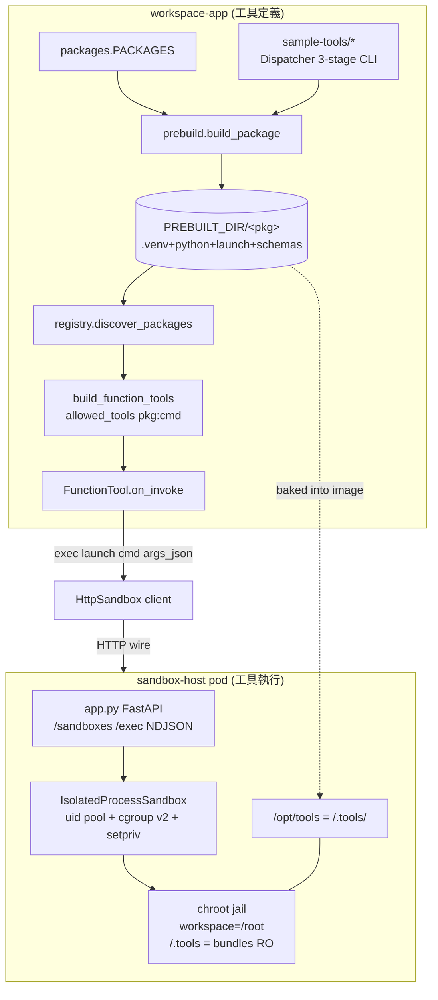

# 工具套件與 Sandbox Host

把 agent 的工具拆成兩半：**工具定義（schema / registry）留在 app 端**，**工具執行（jail + uid/cgroup 隔離）放在 host 端**，兩者之間唯一的交接物是一個不透明的 `/.tools` bundle 目錄。

> **看這篇之前**：先讀 [架構總覽](../architecture.md) 抓全貌。Sandbox 與檔案同步的上層脈絡見 [Sandbox、FileStore 與同步](sandbox-and-filestore.md)；HTTP 線上契約的完整細節見 [sandbox-host-wire.md](../sandbox-host-wire.md)。

## 職責與邊界

這個子系統涵蓋兩個各自獨立、但靠一條 bundle 接縫銜接的部分：

**App 端（工具定義）— `src/workspace_app/tooling/`**

- 維護 demo 部署的工具套件登錄表（`packages.PACKAGES`）。
- 把每個套件原始碼 **prebuild** 成自帶 `.venv` + 可攜 cpython + `launch` + `schemas/` 的 sandbox-droppable bundle。
- 啟動時掃描 bundle 目錄，依 `AgentConfig.allowed_tools` 展開成 OpenAI Agents SDK 的 `FunctionTool`，其 `on_invoke` 會 `exec` 進 sandbox。
- 提供工具作者用的 `Dispatcher`（3-stage binary contract）。

**Host 端（工具執行）— `sandbox-host/`**

- 一個獨立的 FastAPI 服務，把單一被注入的 `Sandbox` 透過 HTTP 暴露出去。
- 生產後端 `IsolatedProcessSandbox`：每個 handle 配一組 pooled numeric uid/gid + 一個 cgroup v2，外加 chroot jail。
- 把 prebuild 出來的 toolchain bundle 烤進自己的 image，在 jail 裡以 read-only 掛在 `/.tools`。

**不負責**：

- 不負責 agent 回合的編排、cancel、SSE — 那是 [API 與回合引擎](api-and-turns.md) / [Agent 執行時](agent-runtime.md)。
- 不負責 sandbox handle 的生命週期登錄（idle reap / mirror sweep 在 app 端的 `InvestigationRegistry`），host 只管自己 pod 內的 handle 與 idle backstop。
- App-side 的 `HttpSandbox` client、wire 的 handle 編碼（pod_url + remote_id）細節屬於 [Sandbox、FileStore 與同步](sandbox-and-filestore.md) 與 [sandbox-host-wire.md](../sandbox-host-wire.md)，本篇只連結不複述。

## 核心模組

| 路徑 | 角色 |
| --- | --- |
| `src/workspace_app/tooling/packages.py` | 套件登錄表：`PACKAGES = {name → host source dir}` + `PREBUILT_DIR`（env `WORKSPACE_TOOLS_DIR`，預設 `<repo>/.workspace-tools`）。CLI 套件的 key 必須等於 `[project.scripts]` console_script；venv carrier 的 key 只是 bundle 目錄名。`rca-tools` gitignored、source 不在就略過。 |
| `src/workspace_app/tooling/prebuild.py` | 把套件 source build 成自帶的 bundle。`build_package`（生產路徑：`uv sync --frozen --no-editable` + `--reinstall/--refresh-package` 破 cache，#64）；`build_package_uvrun` / `provision_uvrun`（#63 輕量 DEBUG bundle，symlink source + `uv run --project`）。`_LAUNCH` / `_PYTHON_LAUNCH` 帶 AT_SECURE 動態載入器解法；`_is_venv_carrier` 以「無 `[project.scripts]`」分流；`_dump_schemas` 跑 3-stage contract 快取 schema；`_source_hash` / `_should_rebuild` 驅動增量重建。 |
| `src/workspace_app/tooling/registry.py` | App 端（在 agent-host 進程建 FunctionTool,非 sandbox-host)：`discover_packages(prebuilt_dir)` 走 `PREBUILT_DIR` → `list[PackageInfo]`（STRICT：每個子目錄都得是完整 bundle，否則 `RuntimeError`；缺目錄 `FileNotFoundError`）。`build_function_tools` 展開 `allowed` 的 colon 語法（`pkg` / `pkg:cmd`；`None`=全部、`[]`=無）成 `FunctionTool`，`on_invoke` 在 sandbox 跑 `<install_dir>/launch <cmd> <args_json>`。`_check_collisions` 在跨套件命令撞名時 raise；`_review_chart` 接 #285 VLM 圖表自審。 |
| `src/workspace_app/tooling/dispatcher.py` | 工具作者用的 `Dispatcher`：實作 3-stage binary contract（無參數 → 列出命令 JSON；`<cmd>` → 印 pydantic JSON schema；`<cmd> <args_json>` → 驗證 + 跑 handler）。每個 `@d.command` 一個 pydantic Args model，同時當 LLM schema 與 runtime 驗證的單一事實來源；錯誤的子命令/參數 exit 2。 |
| `scripts/prebuild_tools.py` | Operator 進入點 `uv run python scripts/prebuild_tools.py [--force]`：iterate `PACKAGES`、缺 source 就跳過（`rca-tools` 保持可選）、`build_package` 進 `PREBUILT_DIR/<name>`。改任何工具 source 後**必須**重跑。 |
| `sample-tools/` | 倉庫內含四個各自獨立的 uv workspace（自帶 pyproject + uv.lock，絕對 import only；外加 gitignored 的 `rca-tools`，`PACKAGES` 共五筆登錄）。`data-fetch` / `csv-column-summary` / `sci-plot` = CLI 套件（3-stage Dispatcher，自帶 pandas/matplotlib）；`python-stack` = venv carrier（無 scripts；綁 pandas/numpy/scipy/matplotlib + office stack openpyxl/XlsxWriter/python-pptx，#252）；`rca-tools` = gitignored 的 in-house 多命令套件。 |
| `sandbox-host/src/sandbox_host/protocol.py` | Host 自己的 sandbox 資料形狀 + 內部 `Sandbox` Protocol（11 ops）。刻意不 import `workspace_app` 任何東西 — 唯一的跨進程契約是 HTTP wire。`image` / `exposed_ports` 收下但 process 後端會忽略。 |
| `sandbox-host/src/sandbox_host/app.py` | FastAPI 殼，把單一注入的 `Sandbox` 暴露成 HTTP。Routes：`POST/DELETE /sandboxes`、檔案操作、`POST /sandboxes/{rid}/exec`（NDJSON 串流 `{o:b64}` chunk 再 `{exit,out,err}`）。`_HostController` 追蹤 live handle + idle clock；create 回 `advertise_url`（POD_IP）+ `remote_id`。`check_cgroup_ready` 餵 boot + `/readyz`；`/drain`（PreStop）+ `/healthz`。錯誤映到 404 `{error,detail}`。 |
| `sandbox-host/src/sandbox_host/isolated_process.py` | 生產後端：`LocalProcessSandbox` 子類，加上 per-handle pooled uid/gid（`_UidPool`）+ per-handle cgroup v2（`_CgroupManager`：`memory.max`/`cpu.max`/`pids.max`）。create 擁有 workspace（chown + chmod 700 + 預設 POSIX ACL via setfacl，讓 root 寫入的檔案仍可由 uid 寫）；`_exec_argv` 把命令包成先 join `cgroup.procs` 再 `setpriv` 降權。`isolate=False` — uid + cgroup 就是隔離，無 namespace。Host 必須以 root 跑。 |
| `sandbox-host/src/sandbox_host/local_process.py` | 基礎後端（host 上的 subprocess）。`_JAIL_BOOTSTRAP`：unprivileged user + mount-namespace chroot，workspace = `/root`（agent cwd / `$HOME`），sandbox root 是 infra；read-only bind `/usr`、`/etc`，`SANDBOX_TOOLS_DIR` → `/.tools`（`/root` 的 sibling，永不被 walk/sync），並在 carrier 被 provision 時把 `python`/`python3` shim 到 `/.tools/python-stack/launch`（含 `/etc/profile.d` tmpfs overlay 讓 login shell PATH 保住 shim）。 |
| `sandbox-host/src/sandbox_host/service.py` | 可測組裝根：`SandboxHostSettings` → `build_sandbox(IsolatedProcessSandbox)` → `make_host_app`。`resolve_tools_dir`（#251 接上 prebuilt `/.tools`，unset = 無工具，寬鬆）、`advertise_url`（POD_IP 或 loopback）、`resolve_cgroup_root`。 |
| `sandbox-host/src/sandbox_host/config.py` | 獨立 12-factor 設定：`SandboxHostSettings` dataclass + `load_settings(env)` 讀 `SANDBOX_HOST_*`。**不**讀 workspace_app 的設定。 |
| `sandbox-host/src/sandbox_host/__main__.py` | `python -m sandbox_host` serve glue（排除 coverage）：`load_settings`、boot 時 fail-loud `check_cgroup_ready`、`build_host_app(pod_ip=POD_IP)`、uvicorn serve + SIGTERM→drain + idle-reaper loop。 |
| `sandbox-host/src/sandbox_host/mock.py` | host 測試用的 in-memory `Sandbox`（取代 `IsolatedProcessSandbox` 注入）。 |
| `sandbox-host/Dockerfile` | 獨立 image。Stage 1（拋棄式）只帶 workspace_app + sample-tools 去跑 `scripts/prebuild_tools.py` → `/build/.workspace-tools`。Stage 2 精簡 runtime：fastapi/uvicorn + util-linux（setpriv/unshare）+ acl（setfacl）+ make_deck（#284）toolchain（nodejs/npm + pptxgenjs、libreoffice-impress + poppler-utils、fonts-noto-cjk）烤進去（因為 host 在這 image 內 jail 且忽略 `SandboxSpec.image`）；把不透明 bundle 目錄複製到 `/opt/tools`（`SANDBOX_HOST_TOOLS_DIR`）。 |

## 介面與接縫

| 接縫 | 種類 | 定義位置 | 實作 |
| --- | --- | --- | --- |
| `Sandbox` | Protocol（11 ops） | `sandbox-host/src/sandbox_host/protocol.py` | `local_process.py:LocalProcessSandbox`（基礎）、`isolated_process.py:IsolatedProcessSandbox`（生產）、`mock.py:MockSandbox`（測試） |
| `AclRunner` | Callable seam（`setfacl` 系統二進位邊界） | `sandbox-host/src/sandbox_host/isolated_process.py` | `_run_setfacl`（預設 shell out）、測試注入的 spy（免 root / 免 `acl` 套件） |
| `ReadinessCheck` | Callable seam | `sandbox-host/src/sandbox_host/app.py` | `check_cgroup_ready` |
| 3-stage tool binary contract | process / CLI 契約 | `src/workspace_app/tooling/dispatcher.py` | `sample-tools/*/src/*/cli.py` 透過 `Dispatcher` |
| `FunctionTool.on_invoke`（LLM tool → sandbox exec） | OpenAI Agents SDK `FunctionTool` | `src/workspace_app/tooling/registry.py` | `_to_function_tool.on_invoke` |

`Sandbox` Protocol 的 11 個方法：`create` / `kill` / `exec` / `upload` / `download` / `walk` / `exists` / `delete` / `mkdir` / `rmdir` / `rename`。`exec` 接一個 `OutputSink`（`Callable[[bytes], None]`），逐 chunk 餵 stdout/stderr，同一份 bytes 也累進 `ExecResult`。

`protocol.py` 是 host 對 sandbox 形狀的**獨立副本** — 它故意不 import `workspace_app`，host 與 app 之間唯一耦合就是 HTTP wire 契約，因此 host 可以是完全自主的隔離服務。

## 運作方式 / 資料流

三個時間軸：

**PREBUILD（operator，在 host 上）** — `scripts/prebuild_tools.py` iterate `PACKAGES`。對每個 source，`prebuild.build_package` 跑 `uv venv --relocatable` + `uv sync --frozen --no-editable`（對著套件已 commit 的 `uv.lock`）裝進 `PREBUILT_DIR/<name>/.venv`，複製可攜 cpython，寫 AT_SECURE 的 `launch` shell（venv carrier 則寫純 python launcher），`_dump_schemas` 再跑一次 `launch`（3-stage contract）把 `commands.json` + `schemas/<cmd>.json` 快取下來，最後寫 `.built` source-hash。

**STARTUP（app / host 進程）** — `registry.discover_packages(PREBUILT_DIR)` 嚴格驗證每個 bundle → `list[PackageInfo]`；依 `AgentConfig.allowed_tools`，`build_function_tools` 在跨套件撞名檢查後，把 `pkg` / `pkg:cmd` 選擇展開成 `FunctionTool`。

**RUNTIME（LLM 回合）** — LLM 呼叫某個 `FunctionTool` → `on_invoke` 先 `ensure_sandbox()` 取得 handle，再呼 `actx.sandbox.exec([<install_dir>/launch, cmd, args_json])`。HTTP 部署時 `actx.sandbox` 是 app 端的 `HttpSandbox` client → `POST /sandboxes/{rid}/exec` 打到 sandbox-host pod → `app.py._exec_ndjson` 串流輸出 → `IsolatedProcessSandbox._exec_argv` 把 argv 包成「join per-handle cgroup + `setpriv` 降到 pooled uid」，在 chroot jail 裡跑，bundle 以 read-only 掛在 `/.tools/<name>`。工具進程透過自己的 `Dispatcher`（驗證參數 → 跑 → stdout/stderr）分派，結果文字回流；若命令輸出了圖片且其 schema 接受 `style`，`registry._review_chart` 跑 #285 的 VLM 自審迴圈（下載 render → describe → restyle → 重 exec，≤2 passes）。

## 關鍵不變式與眉角

!!! warning "STRICT discover — 半成品 bundle 一律 fail-fast"
    `discover_packages` 對每個子目錄要求 `commands.json` + `schemas/` + 每個列出的命令都有對應 schema 檔，否則 `RuntimeError`；缺 `PREBUILT_DIR` 本身則 `FileNotFoundError`。**沒有 silent-skip**。這源自一個 May-30 production-style 事故：三個半成品套件 → discover 回 `[]` → agent 以零工具運作、直到 LLM 回覆才被發現。想要「零套件」的部署要清空 `PACKAGES`，不要靠 discover no-op。

!!! warning "改了工具 source 一定要重跑 prebuild"
    增量重建是 **content-hash**（`_source_hash`，不是 mtime，#64）+ `uv --reinstall/--refresh-package`，所以同版本的小改也會真的重建。uv 以 (name, version) 快取 wheel，沒有強制 refresh 的話同版本編輯會被靜默保留舊 wheel；舊的 mtime 檢查也漏掉沒動 mtime 的編輯。

!!! note "PACKAGES key 的鐵律"
    CLI 套件的 key **必須**等於該套件 `[project.scripts]` 的 console_script entry（`launch` wrapper 會呼 `.venv/bin/<name>`）；venv carrier 的 key 只是 bundle 目錄名。

!!! note "venv carrier 不暴露任何 FunctionTool"
    venv carrier = 無 `[project.scripts]` → prebuild 寫純 python launcher + 空的 `commands.json`（`"[]"`）+ 空 `schemas/`（讓 discover 滿意但暴露 0 個工具）。jail bootstrap 只在該 carrier 被 provision 時，才把 `python`/`python3`/`python3.x` shim 到 `/.tools/python-stack/launch`。

!!! warning "allowed_tools 的 None vs [] 不可混淆"
    `build_function_tools(None)` = 暴露所有套件的所有命令（對齊 `build_tools(None)`）；`allowed_tools=[]` = 明確「不要任何套件」。未知的 pkg/cmd 名會被**靜默略過**（設定打錯不能讓 LLM 收 500）；但同一次選擇裡兩個不同套件匯出同名命令會 raise `ValueError`（避免 flat name 互蓋）。

!!! warning "host 與 app 不共用任何 Python module"
    耦合**只有** HTTP wire 契約（[sandbox-host-wire.md](../sandbox-host-wire.md)）。`protocol.py` 是 sandbox 形狀的刻意獨立副本。

!!! warning "HTTP host 忽略 SandboxSpec.image / exposed_ports"
    沒有 container；隔離是 uid + cgroup v2（`IsolatedProcessSandbox` 無 namespace）。任何 sandbox 需要的 toolchain（例如 make_deck 的 node/libreoffice）**必須烤進 sandbox-host IMAGE**，不能靠 `image` 請求。

!!! warning "host 必須 root 且要有 delegated cgroup v2"
    host 要 root（setuid/chown 到外部 uid）+ 一塊被 delegate 的 cgroup v2 subtree。當 cgroup v2 不在或不可寫，`check_cgroup_ready` 會在 boot 與 `/readyz` 兩處 fail loud — **絕不在無隔離下開服**。

!!! note "jail 裡 workspace 是 /root，工具在 sibling /.tools"
    provisioned tools 在 `/.tools`（`/root` 的 sibling，在 workspace 之外），所以永遠不會被 walk、sync、或出現在檔案樹。`launch` 的 `HOME`/caches 指到 `/tmp`，read-only 工具掛載與 workspace 都保持乾淨。

!!! warning "sticky per-handle 路由"
    `create` 回 `advertise_url`（來自 POD_IP）+ `remote_id`；client 必須把兩者一起編碼，讓之後每個操作都路由回**擁有該 local handle 的同一個 pod**。因此 pod-split sandboxing 需要 sticky per-handle 路由，而不是共用後端。

!!! note "套件源碼一律絕對 import"
    sample-tool 套件強制絕對 import（ruff `TID252` ban-relative-imports = all）；工具碼會被複製/搬移，相對 import 會壞。每個套件也**必須** commit `uv.lock`，否則 `build_package` raise（reproducible bundle 的前提）。

## 設計決策與出處

| 決策 | 理由 | 出處 |
| --- | --- | --- |
| 工具定義在 app、執行在 host、交接 = 不透明 `/.tools` bundle 目錄 | host 不 import workspace_app 任何東西，保持精簡隔離服務；加工具只要編輯 `PACKAGES` + 重 prebuild，host 不需 registry metadata | `sandbox-host/Dockerfile` 頭註 + `packages.py`；`docs/plan-skills-and-tools.md`、`docs/plan-http-sandbox.md` |
| `discover_packages` 嚴格 fail-fast（不 silent-skip 半成品） | May-30 事故：3 個半成品套件 → discover 回 `[]` → agent 零工具運作至 LLM 回覆才被發現；改成啟動時就炸 | `registry.py:discover_packages` docstring |
| content-hash 重建 + `uv --reinstall/--refresh-package` | uv 以 (name,version) 快取 wheel，同版本編輯會靜默保留舊 wheel；mtime 檢查也漏編輯 | `prebuild.py:_should_rebuild`（#64） |
| 隔離 = pooled uid/gid + cgroup v2，無 namespace；image 忽略 | 這是在他們 pod 裡可行的模型；HTTP host 無法 honour 任意 container image，故 toolchain 烤進單一 image | `isolated_process.py` 模組 docstring + `protocol.py` SandboxSpec 註 |
| venv carrier（python-stack）取代 host site-packages / per-image 安裝 | agent 的 raw `exec(['python', ...])` 直接看到 pandas/numpy/scipy/matplotlib + office stack，不污染 host deps；jail 把 python shim 到 carrier launcher | `python-stack/pyproject.toml` + `local_process.py:_JAIL_BOOTSTRAP`（#252） |
| AT_SECURE / 顯式動態載入器 launch wrapper | glibc 的 AT_SECURE 在 userns chroot jail 裡會剝掉 `$ORIGIN`/RPATH/`LD_LIBRARY_PATH`，弄壞 relocatable venv；顯式呼 `ld-linux` 還原 | `prebuild.py` `_LAUNCH`/`_PYTHON_LAUNCH` 註解 |
| uv-run debug bundle（`build_package_uvrun`，`--project` 不是 `--directory`） | 快速迭代、不複製 venv；`--project` 保住 caller cwd，讓工具的 workspace-relative 寫入落在 sandbox 而非 source 樹 | `prebuild.py` `_UVRUN_LAUNCH` 註解（#63） |
| `advertise_url(POD_IP)+remote_id` sticky handle 路由 | 每個 handle 的後端狀態活在單一 pod，之後操作必須直接路由回去 | `app.py` 模組 docstring + `service.advertise_url` |
| make_deck toolchain 烤進 image（node/pptxgenjs/libreoffice/poppler/CJK 字型） | host 在此 image 內 jail 且忽略 `SandboxSpec.image`，deck deps 無法搭純 python 的 `/.tools` bundle | `sandbox-host/Dockerfile` stage 2（#284） |

## 與其他子系統的關係

- **[Sandbox、FileStore 與同步](sandbox-and-filestore.md)** — app 端的 `HttpSandbox` client 是本篇 host 的對端；`actx.sandbox` 在 HTTP 部署時就是它。sandbox handle 的生命週期登錄（idle/mirror sweep）在那一側。
- **[Agent 執行時](agent-runtime.md)** — `FunctionTool.on_invoke` 透過 `AgentToolContext`（`actx.sandbox` / `actx.ensure_sandbox` / `actx.on_exec_output` / `actx.describer`）接上 agent 回合；`_review_chart` 用到的 VLM 自審（`run_review`，`src/workspace_app/agent/plot_review.py`）也在 agent 端。
- **[App 平台](apps-platform.md)** — 每個 App / Preset 的 `AgentConfig.allowed_tools` 決定 `build_function_tools` 暴露哪些命令（colon 語法 `pkg` / `pkg:cmd`）。
- **[背景工作與擴展](jobs-and-scaling.md) / [部署](../deployment.md)** — sandbox-host 以獨立 k8s Deployment 跑，sticky per-handle 路由 + `/drain`（PreStop）+ idle-reaper 對應 pod 的 scale / rollout。
- **make_deck（app 端工具）** — 其 `FunctionTool` 與 preflight 檢查住在 app 端（`src/workspace_app/agent` 或 `tooling`，本篇未逐行追），但它依賴的 node/libreoffice/poppler toolchain 由 `sandbox-host/Dockerfile` 供應。

## 原始碼錨點

接手者建議的閱讀順序：

- `src/workspace_app/tooling/packages.py` — 從 `PACKAGES` / `PREBUILT_DIR` 看清楚有哪些套件、慣例為何。
- `src/workspace_app/tooling/prebuild.py` — `build_package`、`_is_venv_carrier`、`_dump_schemas`、`_should_rebuild`：bundle 怎麼被造出來。
- `src/workspace_app/tooling/registry.py` — `discover_packages`、`build_function_tools`、`_to_function_tool`、`_review_chart`：bundle 怎麼變成 LLM 工具。
- `src/workspace_app/tooling/dispatcher.py` — `Dispatcher`：工具作者寫 `cli.py` 時的 3-stage 契約。
- `scripts/prebuild_tools.py` — operator 進入點。
- `sandbox-host/src/sandbox_host/protocol.py` — `Sandbox` Protocol（11 ops）與獨立資料形狀。
- `sandbox-host/src/sandbox_host/app.py` — `make_host_app`、`_exec_ndjson`、`check_cgroup_ready`：HTTP 殼。
- `sandbox-host/src/sandbox_host/isolated_process.py` — `IsolatedProcessSandbox`：uid pool + cgroup + setpriv 隔離。
- `sandbox-host/src/sandbox_host/local_process.py` — `_JAIL_BOOTSTRAP`：chroot jail 與 `/.tools` / python shim（檔案上半 jail bootstrap；下半的 file-op 與 exec pump/timeout 內部實作細節見原始碼）。
- `sandbox-host/src/sandbox_host/service.py` / `config.py` / `__main__.py` — 組裝根、12-factor 設定、serve glue。
- `sandbox-host/Dockerfile` — 兩階段 image，prebuild 交接到 `/opt/tools`。

!!! note "未在本篇完整追蹤的細節"
    - make_deck 的 preflight / FunctionTool 程式碼在 app 端（`sandbox-host/src` 下無 `make_deck` 符號），本篇僅標明 toolchain 來源在 Dockerfile。
    - wire 契約的 handle 編碼（pod_url + remote_id）、retry / 路由細節見 [sandbox-host-wire.md](../sandbox-host-wire.md) 與 app 端 `HttpSandbox`。
    - `rca-tools` source 在此 worktree gitignored / 不存在，其命令集由 `packages.py` 註解推得，未實讀。
    - `_review_chart` 依賴的 `actx.describer` / `agent.plot_review.run_review` 屬 app 端，完整行為未在此追。
