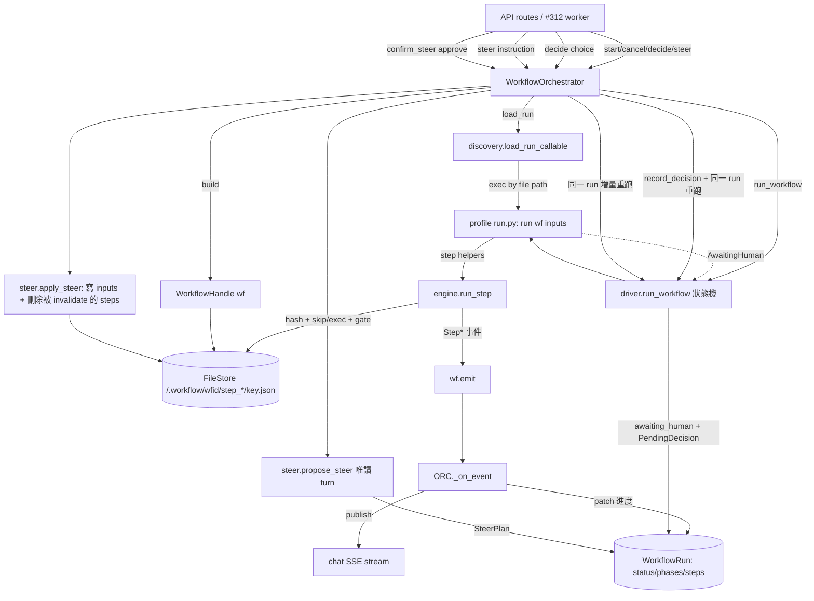

# Workflow 引擎（workflow-engine）

API 觸發、headless、profile 層級的 workflow 引擎：一個 profile 只要宣告了 workflow,就能被 `run()`（Python 編排碼,不是 DSL）跑起來。核心觀念是 **filesystem-as-journal** — 每個 step 都把 `{input-hash, result}` 寫進 `/.workflow/<workflow_id>/step_<name>/<key>.json`,所以重跑一個 run 會直接跳過仍然有效的前綴(不重打 LLM/sandbox/chat),而不是抽象地 replay。

> **看這篇之前**：先讀 [架構總覽](../architecture.md) 抓全貌；workflow 的撰寫者面向手冊在 [workflows.md](../workflows.md) 與 [workflows-authoring.md](../workflows-authoring.md)。

## 職責與邊界

這個子系統負責 workflow 的「引擎層」,涵蓋四件事：

- **Journal step 引擎**（`engine.py`）：唯一決定一個 step 該 run 還是 skip 的地方,並把結果落盤成 journal artifact。
- **Run 狀態機**（`run.py` + `driver.py`）：把 `WorkflowRun` 從 `pending` 推到 `running` / `awaiting_human` / `done` / `error` / `cancelled`。
- **編排與排程**（`orchestrator.py`）：排程、併發上限、每 run 預算、step 事件 → 進度、human gate 的 decide→resume、以及 #288 的 steer-and-resume。
- **載入與宣告**（`discovery.py` + `manifest.py`）：用 file path 載入 profile 的 `run()`,以及 `_profile.json` 宣告的相位骨架。

它**不負責**的事(明確劃界,避免與鄰居重疊)：

- 不擁有 Conversation/SSE/sandbox 的實際接線 — 那些由 API 層注入(`wire_handle`/`publish`/`release`)。Orchestrator 對 App 一無所知,`chat_id` 在這裡只是一個不透明的 stream key。詳見 [API 與回合引擎](api-and-turns.md)。
- 不擁有 step「怎麼做」的細節 — `engine.run_step` 只收 `execute`/`check` coroutine,agent turn / sandbox 指令 / 能力呼叫由呼叫方提供。
- 不持久化 step 的「輸出」 — 那是 FS artifact;`WorkflowRun` 只存「狀態」。

## 核心模組

| 路徑 | 角色 |
| --- | --- |
| `src/workspace_app/workflow/engine.py` | Journal step 引擎。`run_step` 是唯一的 run-vs-skip 決策點：算 `input_hash(args)`,hash 命中且 artifact 存在就回傳快取結果,否則執行(對 `check` gate 做 retry-with-feedback)再落盤 `{hash, result}`。定義 `StepFailed`/`fail()`、`CheckResult`、`Check`/`Execute` 接縫,並透過 handle 的 `emit` 發 Step* 事件。 |
| `src/workspace_app/workflow/run.py` | 持久化的 `WorkflowRun`（specstar Struct,索引 `item_id`+`status`）+ `RunStatus` 狀態機 + 子結構 `PhaseState`/`StepState`(#178 step board)/`Failure`/`PendingDecision`/`SteerInputEdit`/`SteerPlan`。只存狀態,不存 step 輸出。 |
| `src/workspace_app/workflow/orchestrator.py` | `WorkflowOrchestrator` — API 路由唯一呼叫的物件。排程+監督 run、併發 semaphore、prune/retention、wall-clock + max-steps 預算、step 事件 → 進度 + 廣播、終止/暫停時釋放 sandbox/credential,並擁有 `cancel()`、gate `decide()`→resume、`steer()`/`confirm_steer()`。 |
| `src/workspace_app/workflow/driver.py` | `run_workflow` — 純狀態驅動。設 `running`、await `profile_run(wf, inputs)`,持久化終局狀態:`AwaitingHuman`→`awaiting_human`+`PendingDecision`、return→`done`、Exception→`error`、CancelledError→`cancelled`(再 raise)。 |
| `src/workspace_app/workflow/handle.py` | `WorkflowHandle`(`wf`)— run 對自己 workspace 的視角。FileStore 的 async 薄包裝(read/write/glob/exists/delete + `journal_dir`)、journaled 能力節點(`ingest_to_collection`/`upsert_context_card`/`find_overwrite_card`)、`map()` 平行 for-each,並帶 driver 接上的 leaf driver 與 run-scoped `credential`。 |
| `src/workspace_app/workflow/discovery.py` | 用 **file path**(非 `import_module`)載入 profile 的 `run()`(與選用的 `preflight`,#283)。處理 `workflows: [...]` list 版面 vs legacy 單一 root `run.py`,`validate_workflow_profiles` 在啟動時對缺 `run()`/重複或空 id fail loud。 |
| `src/workspace_app/workflow/manifest.py` | `WorkflowManifest` + `WorkflowPhase` — workflow 的宣告半邊(來自 `_profile.json`):穩定 `id`、相位骨架、`input_json` 位置、`wf.config`、launcher card metadata。編排本身是碼(`run.py`),不是這份資料。 |
| `src/workspace_app/workflow/steer.py` | #288 steerer。`propose_steer` 驅動一個唯讀 agent turn 產出 JSON `SteerPlan`(寬容解析 + retry-with-feedback);`apply_steer` deterministically 套用(寫 input_edits、刪除被 invalidate 的 `step_<name>/*`、寫稽核 receipt)。decision/action 分離,journal 路徑的編輯兩道防線拒絕。 |
| `src/workspace_app/workflow/gate.py` | `human_gate`(produce→review→commit):首次到達無 decision 就 raise `AwaitingHuman`;`record_decision` 把決策寫成 artifact,重跑時在 gate 找到它後續行。 |
| `src/workspace_app/workflow/inputs.py` | `resolve_inputs` — 把 manifest 的 `input_json`(或 `{upload_dir}/input.json`)解析成傳給 `run()` 的 `inputs`;檔案不存在回 `{}`。 |
| `src/workspace_app/workflow/events.py` | Step*/Phase*/`AwaitingHumanEvent`/`SteerProposed` 事件(frozen dataclass);走與 agent 事件相同的 per-item 廣播 stream,FE 鏡像於 `web/src/events.ts`。 |
| `src/workspace_app/workflow/credential.py` | `CredentialBroker.mint/revoke` — 每 run 鑄一枚 run-scoped credential 注入 sandbox 能力 HTTP 呼叫,終局時撤銷。 |

## 介面與接縫

引擎刻意對「step 怎麼做」與「App 怎麼接線」保持無知,靠下列 Callable 接縫注入。正式實作由 API composition root 接上,測試注入 fake。

| 接縫 | 定義位置 | 實作 |
| --- | --- | --- |
| `Execute`(step body) | `engine.py` `Execute = Callable[[str \| None], Awaitable[Any]]` | `handle.ingest_to_collection`/`upsert_context_card` 內的 `execute`;agent/sandbox node adapter |
| `Check`(gate) | `engine.py` `Check = Callable[["WorkflowHandle", Any], Awaitable[CheckResult]]` | `checks.collection_has` 等(`checks.py`) |
| `ProfileRun`(workflow 的 `run()`) | `discovery.py`/`orchestrator.py`/`driver.py` 的 `ProfileRun` 別名 | 每個 App profile 的 `run.py:run()`,由 `discovery.load_run_callable` 載入 |
| `WireHandle` | `orchestrator.py` `WireHandle = Callable[[WorkflowHandle, str, str, str, str], None]` | API 層接上 `drive_turn`/`run_sandbox`/`ingest`;`drive_turn` 以 run 的 chat key 為鍵,`run_sandbox`/`ingest` 仍掛在 `item_id`(共用 workspace) |
| `DriveTurn`/`RunSandbox`/`IngestCapability`/`CollectionChecker`/`UpsertCardCapability`/`FindCardCapability` | `handle.py` 頂部別名 | driver 接上真實實作;測試注入 fake |
| Orchestrator 注入操作(`load_run`/`load_manifest`/`publish`/`release`/`notify_failure`/`load_upload_dir`) | `orchestrator.py` `WorkflowOrchestrator` dataclass 欄位 | API composition root(正式)/ 測試 fake |
| `FileStore` | `src/workspace_app/filestore/protocol.py` | `SpecstarFileStore` / 測試記憶體 store。詳見 [Sandbox、FileStore 與同步](sandbox-and-filestore.md) |

## 運作方式 / 資料流

**觸發。** API 路由呼叫 `orchestrator.start(slug, item_id, profile, captured_user, workflow_id?, chat_id?)`。它 `load_manifest`、用相位骨架 + captured user + chat/workflow id 建 `WorkflowRun`、`_prune_runs` 修剪舊的終局 run,再 spawn 一個背景 task。

**執行。** `_drive` 取得併發 semaphore(slot 滿時 run 停在 `pending`),`_execute` 用 `_build_handle` 建 `WorkflowHandle`(鑄 run-scoped credential、`wire_handle` 接上 leaf driver、設 `emit → _on_event`)、`discovery.load_run_callable` 載入 `run()`、`resolve_inputs` 解析輸入,再呼叫 `driver.run_workflow`(若有 `run_timeout_s` 包在 `asyncio.wait_for` 下)。profile 的 `run(wf, inputs)` 執行 — 每個 step 走 `wf` 層 helper 呼 `engine.run_step`:hash args、查 journal artifact、skip 或 execute+gate+落盤;`map()` 用 skip+collect 平行 fan-out 一批。

**進度。** 每個 Step* 事件走 `handle.emit → orchestrator._on_event`,它累計 step 數(超過 `max_steps` 中止)、判斷是否「進入」新相位、在 chat stream publish `PhaseEntered` 與該事件、並 patch `WorkflowRun.phases`/`steps`/`current_phase`。

**Human gate。** `run()` 在 gate 處 raise `AwaitingHuman`;driver 記 `PendingDecision`、task 結束,`_post_run` 把已完成相位轉綠、publish `AwaitingHumanEvent`、釋放 sandbox(保留 stream)。人類 POST `decide(choice,…)` → `record_decision` 寫決策 artifact,然後 `_spawn` 用**同一個 run_id** 重跑(完成的 step skip,gate 這次找到決策後續行)。

**Steer（#288）。** `steer(instruction)` 先 Stop 任何進行中的工作,再 `_propose` 跑唯讀 steerer → 成功則把 run 停在 `awaiting_human` + 設 `pending_steer` + publish `SteerProposed`;人類 `confirm_steer(approve)` → `apply_steer` deterministically 重寫 inputs + 刪除被 invalidate 的 step,然後 `_spawn` 增量續跑。

**終局。** done/error/cancelled 撤銷 credential、釋放 sandbox,error 時呼叫 `notify_failure`。

## 關鍵不變式與眉角

!!! warning "run_step 是唯一的 skip-vs-run 決策點"
    一個 step 只有在 journal artifact 存在 **且** `record['hash'] == input_hash(args)` **且** `cache=True` 時才 skip。因此凡是「應該讓 step 失效」的東西都**必須**放進它的 `args`（改動上游 artifact → arg 內容變 → 重跑）。Inputs 以 args 傳入是 cache 正確性的約定。

!!! warning "Journal 住在 `/.workflow/<workflow_id>/`,不是 workspace 根"
    路徑為 `wf.journal_dir/step_<name>/<key>.json`（#136）。Legacy 單一 workflow(`workflow_id=""`)落到 `_default`。引擎是 journal 的**唯一 writer**:steerer 的 input-edit 若落在 `/.workflow` 下,在 `propose`(`_coerce_plan`)與 `apply_steer` 兩道防線都會被拒;steerer 只能**按名字** invalidate step,絕不手改 artifact。

!!! warning "Resume 重跑同一個 run_id;StepSkipped 不得當作「進入」相位"
    decide/steer/confirm 全部在既有 id 下 `_spawn`。`_on_event` 中,`StepSkipped`(以及 `PhaseEntered`)**不**推進 `current_phase`,否則高亮會倒退到已完成的相位並把它重新標成 running(#176)。只有真正的工作(StepStarted/Passed)才推進 `current_phase`。

!!! warning "`_track` 的 late-callback 防護"
    `_track` 以 id 取代 run 的 task,done-callback 只在 task **仍是**已註冊的那個時才移除它 — 所以一個已完成 task 的延遲 callback 無法把 resume/steer 剛裝上的後繼者踢掉(lost-handle bug)。

!!! note "pending_decision 與 pending_steer 互斥"
    一個 run 上兩者互斥:`decide()` 守 `pending_decision`,`confirm_steer()`/`steer` 守 `pending_steer`,所以 FE 永遠不會同時 render 兩張卡,也不會相撞。

!!! note "背景工作以 captured_user 身分執行"
    背景 step、resume、能力呼叫都在 `rm.using(user=captured_user)`(觸發時擷取,§15)下跑 — 因為沒有 request context — 所以 `created_by` / ingestion 歸屬 / 通知都正確。

!!! note "WorkflowRun 只存狀態;新欄位必須是 additive"
    step 輸出是 FS artifact,不在這份資源上。新欄位需可預設(如 `steps` 預設 `[]`),舊資料列才不需 migration。Page/active-run 查詢一律走索引的 `item_id`/`status` query(`active_run`、`_prune_runs`),不做全域掃描。

!!! note "Step board 由 collapse 限界"
    Loop 元素(`StepState.key != ""`)只在執行中留在 board 上,終局時折進相位計數/`failures`;distinct-named step(`key==""`)持久化最終狀態 + 時長。`StepOutput` stdout 是 ephemeral — 只 stream,絕不逐 chunk patch(否則每行 stdout 一次 DB 寫)。

!!! warning "`run.py` 一律用 file path 載入"
    profile 目錄名(如 `smt-reflow-example`)可能不是合法 Python 識別字,所以用 `importlib.util.spec_from_file_location`,**絕不** `import_module`。`run.py` 自身的 import 必須是 workflow library 的絕對 import。

!!! note "預算覆寫規則"
    wall-clock `TimeoutError` 會把 driver 的 `cancelled` 覆寫成終局 `error`;max-steps 預算在超額 step 執行**之前**就中止 run。

## 設計決策與出處

| 決策 | 理由 | 出處 |
| --- | --- | --- |
| Filesystem-as-journal + input-hash 快取,不做抽象 replay | resume/skip 立基於具體 workspace artifact + 穩定 args hash,重跑是 deterministic 且人類可檢視/編輯 journal;inputs-as-args 讓 cache 失效從內容變動自然落下 | #100 / [workflows.md](../workflows.md) / `engine.py` docstring |
| Steer = 唯讀 PROPOSE(decision)+ deterministic APPLY(action),經人類 confirm 把關 | 誤 steer 在批准前碰不到 workspace;LLM 只成計畫(編輯 inputs + 按名 invalidate),apply 是 deterministic;全內容重寫(非 diff)規避長內容的 tool-arg 不可靠 | #288 / `steer.py` + `run.py` `SteerInputEdit` docstring(#107) |
| Steer/decide 增量續跑**同一** run,而非開新 run | 重跑跳過有效(昂貴)前綴,只重跑被 invalidate/下游的 step,steering 便宜且 run 歷史連續 | #288 `orchestrator.confirm_steer`/`decide` docstring |
| Orchestrator App-agnostic;API 注入 `load_run`/`load_manifest`/`wire_handle`/`publish`/`release`/`notify_failure` | 讓引擎能用 fake 單元測,並把 Conversation/SSE/sandbox 接線留給 FastAPI 層;`chat_id` 在此是不透明 stream key | `orchestrator.py` docstring |
| 以 file path 載入 `run.py`,非 `import_module` | profile 目錄名可能非識別字(連字號範例),不是可 import 的 package | `discovery.py` docstring |
| 一 chat 一 run(平行),legacy 無 chat_id 路徑維持一 item 一 active run | topic-hub 在一 item 上平行驅動多個 workflow chat;legacy 路徑保留原始併發守則 | `orchestrator.start` |
| Journal 從 workspace 根移到 `/.workflow/<workflow_id>/` | 避免 `step_*` artifact 弄亂使用者可見的 workspace,並把每個 workflow 的 journal 各自分隔 | #136 / `handle.journal_dir` |
| Step board 以 collapse 限界(loop 元素終局時 drop) | 長 step 不該看起來像死掉,但大批次的無界 board 會撐爆資源;計數吸收完成的 loop 元素 | #178 / `run.StepState` + `orchestrator._apply_step_record` |

## 與其他子系統的關係

- **[資料層（specstar）](data-layer.md)**：`WorkflowRun` 是 specstar 資源(auto-CRUD + `item_id`/`status` 索引);orchestrator/driver 透過 ResourceManager patch 它,路由用 query 列出一個 item 的 run。
- **[API 與回合引擎](api-and-turns.md)**：agent 節點與 steerer 透過 driver 接上的 `drive_turn` leaf 走 ChatTurnEngine(run 的 chat key 上單一可取消的 turn);orchestrator 的 `publish` 通常是 `turn_engine.publish`。
- **[Sandbox、FileStore 與同步](sandbox-and-filestore.md)**：deterministic 節點透過接上的 `run_sandbox` 跑指令;orchestrator 在終局/暫停時透過注入的 `release` 釋放 sandbox;每個 `wf` 讀寫都走 item 的 FileStore。
- **[知識庫:攝取與索引](kb-ingest-index.md)**：`ingest_to_collection` / `upsert_context_card` / `find_overwrite_card` 能力(`handle.py`)以 captured user 身分驅動 KB Ingestor 與 ContextCard CRUD(#111/#205,topic-hub →collections workflow)。
- **[App 平台](apps-platform.md)**：discovery 讀 `workflow_profiles`/`load_profile`;manifest 來自 `_profile.json`;run 由某 App 的 WorkItem(`item_id`,#89)擁有。撰寫指南見 [workflows-authoring.md](../workflows-authoring.md) 與 [topic-hub.md](../topic-hub.md)。
- **[背景工作與擴展](jobs-and-scaling.md)**：orchestrator 是路由層(與 #312 worker/coordinator 接線)唯一呼叫的 start/cancel/decide/steer 進入點。
- **[前端（web/）](frontend.md)**：Step*/Phase*/`AwaitingHuman`/`SteerProposed` 事件在 chat stream 廣播,render 唯讀進度圖 + decision/steer 卡;事件 schema 鏡像於 `web/src/events.ts`。

## 原始碼錨點

給接手者按順序先讀的真實檔案：

- `src/workspace_app/workflow/engine.py` — `run_step`(skip-vs-run 的核心)、`input_hash`、`_artifact_path`、`CheckResult`/`Check`/`Execute`。
- `src/workspace_app/workflow/run.py` — `WorkflowRun` + `INDEXED_FIELDS`、`RunStatus`、`PhaseState`/`StepState`/`PendingDecision`/`SteerPlan`。
- `src/workspace_app/workflow/driver.py` — `run_workflow`(`AwaitingHuman`→`awaiting_human`、Cancelled→`cancelled`、Exception→`error`)。
- `src/workspace_app/workflow/orchestrator.py` — `start`、`_prune_runs`、`_track`、`_execute`、`_post_run`、`cancel`、`decide`、`steer`/`_propose`/`confirm_steer`、`_on_event`/`_apply_step_record`。
- `src/workspace_app/workflow/handle.py` — `WorkflowHandle`、`journal_dir`、`ingest_to_collection`、`upsert_context_card`、`map`。
- `src/workspace_app/workflow/steer.py` — `propose_steer`、`apply_steer`、`_coerce_plan`、`_under_journal`/`_JOURNAL_PREFIX`、`READONLY_TOOLS`。
- `src/workspace_app/workflow/discovery.py` — `load_run_callable`、`_run_py_path`、`validate_workflow_profiles`。
- `src/workspace_app/workflow/gate.py` — `human_gate`、`record_decision`、`AwaitingHuman`。
- `src/workspace_app/workflow/manifest.py`、`inputs.py`、`events.py` — 宣告半邊、輸入解析、事件 schema。
