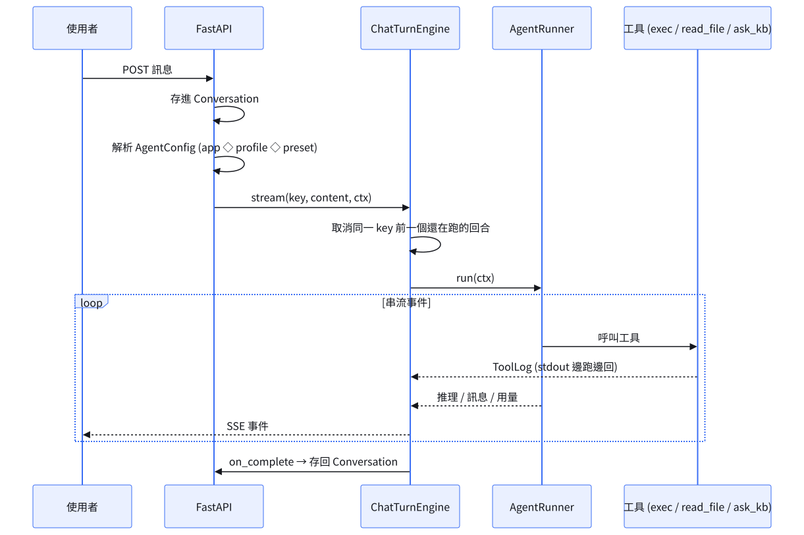

<!-- _class: brief -->

# 團隊使命
## AI Infra 對部門的承諾 —— 以及接下來要建的東西

> 讓部門的**每一個領域**都能安全、快速地把 AI 用進日常工作，
> 而且**用過的每一次，都變成下一次的資產**。

| 支柱 | 我們對部門的承諾 | 現在到哪 | 接下來要建的 |
|---|---|---|---|
| ① Harness · 地基 | 下游任務靠平台架構**快速長出新功能，不重複造輪子**。架構要涵蓋未來需求；舊系統嫁接要簡單且**框得住 AI**；要可靠可擴展並**善用下班時間跑 async** | 4 個 App 共用同一套回合引擎、權限、沙盒、檔案同步；新 App 只寫 `app.json` + `model.py` | 把舊系統的嫁接變成一套標準做法；讓下班時段也能替我們工作 |
| ② 知識 · 沉澱 | 部門知識**保存在系統裡**。不只給 AI 用，也讓**新人與跨部門更快掌握領域知識** | 文件庫 + wiki + 詞彙卡已上線，答案帶 `[n]` 引註點得回原文 | 把知識從片段推進到關係（知識圖譜）；把簡報與截圖裡的知識也收進來；建立檢索品質的評測基準 |
| ③ 橋樑 · oneshot | 領域專家用 AI 產出**可以直接看、直接跑的東西**，取代用文字描述想像的需求文件 | 已可行：md / marp / **ppt**，可附簡單 script 與 sample output | 讓 oneshot 產出可互動的網頁；讓產出能一鍵變成需求或任務 |
| ④ 階梯 · 固化 | **做過一次的事不該做第二次**：一次性操作 → skill / workflow → tool → App → 獨立系統 | PM 是第二個 App：畫 gantt、管 issue，**AI 直接參與 PM 工作** | 讓每一階之間自動接上；把第一個「長成獨立系統」的案例走通 |

### 四條承諾都已經站上第一階；**最右邊那一欄，是這個團隊接下來要建的東西**。

---

<!-- _class: brief -->

# 系統架構 ①
## 平台由什麼組成 —— 以及哪些已經穩了、哪些還在補

| 元件 | 它負責什麼 | 現在的狀態 |
|---|---|---|
| **React SPA**（`web/`） | 工作區 UI：檔案樹、編輯區、對話、各 App 的儀表板 | **補強中** — UX 全面檢查、PM 前端、大清單虛擬化 |
| **FastAPI** `create_app` + **AgentRunner** | 路由與事件串流的唯一組裝點；驅動一次 agent 回合 | **穩定** — 回合可靠性已補完，接新模型是常態工作 |
| **Sandbox** + **FileStore** | 指令真正執行的隔離環境；workspace 檔案的永久儲存 | **大致穩定** — 隔離、配額、跨 pod 一致性都已收斂；巨量小檔的儲存效率待解 |
| **KB 子系統** | 切塊 · 嵌入 · 混合檢索 · KB agent | **主戰場** — 知識圖譜、多模態、檢索評測基線 |
| **specstar** 資料層 + **背景 worker** | 資料模型 / 自動 CRUD / 向量查詢；索引 · wiki · 卡片生成 · 健檢，各自獨立擴縮 | **穩定** — 下一步是把**下班時段的長跑排程**架在上面 |

---

<!-- _class: brief -->

# 系統架構 ②
## skill / workflow / tool / App 與 sandbox，各管哪一層

| 層 | 是什麼 | 它決定什麼 | 誰會改它 |
|---|---|---|---|
| **App** 領域層 | 一個自成一格的儀表板：`app.json` + `model.py` + `prompts/` + `profiles/` | **這個領域的資料長什麼樣**（WorkItem 的欄位與**狀態機**，各 App 資料不互通）、清單 / 看板 / 表單怎麼呈現、agent 的人格與起始內容包，以及功能開關與工具上限 —— **界線怎麼切見下一頁** | 平台團隊 + 領域負責人 |
| **skill** 做法層 | 寫給 AI 讀的作法備忘錄，可帶 script 與範例檔一起走 | 像**交代一位老手**：他會看情況調整，但也可能跳步或漏掉 —— 彈性換來的是不保證 | 領域專家（`save_skill`） |
| **workflow** 做法層 | **程式決定的流程**，不是給 AI 的指示：節點、輸入輸出、分支都寫在程式裡 | 像**一條生產線**：每一站由程式推進，AI 只是被叫上工的其中一站 —— **AI 再懶再誤判，流程也不會漏拍** | 領域專家（`save_workflow`） |
| **tool** 能力層 | 一個具體能力：`read_file` `exec` `ask_knowledge_base` `sci-plot` …，分**內建**與**外掛**兩種（見附錄 ④） | **AI 對外的唯一出入口**，所以閘門都掛在這一層：**權限、網路、限流、大小上限**。既擋住 AI 弄壞別人的東西，也擋住它**看到不該看的東西** | 平台團隊 / 工具作者 |
| **sandbox** 執行層 | 每個項目一個隔離環境 | 指令**真正跑起來的地方**：要跑才建、閒置回收、OS 使用者 + cgroup 隔離、磁碟配額 | 平台團隊 |

---

<!-- _class: brief -->

# 系統架構 ③
## App 的界線怎麼切 —— 「B 能在 A 做到」就代表切錯了

> 界線**不是**用「做得到什麼」切的 —— 工具本來就共用，
> 是用「**你在管理哪一種工作項目、它有沒有自己的狀態機**」切的。

| 判準 | 問自己 | 答案是「否」的話 |
|---|---|---|
| ① 有自己的**工作項目**嗎 | 這個 App 在管一筆一筆的什麼東西？講不出名字就是沒有 | 它不是 App |
| ② 那個項目有自己的**狀態機**嗎 | 有沒有開始 / 進行 / 結案，結案條件是什麼 | 多半只是既有 App 的一個 **profile** |
| ③ 要以它為單位做**清單、看板、報表**嗎 | 主管會不會想看「所有的 ○○」 | 不必開 App |
| ④ 紀錄要**跨人、跨時間**被查嗎 | 半年後有人要回頭追這件事嗎 | 一次性的事 → **workflow** 或 **skill** |

| 現有的 App | 它管的工作項目 | 狀態機 |
|---|---|---|
| **RCA** | 一次失效調查 | 開案 → 分析 → 結案，產出可稽核的報告 |
| **PM** | 專案 / issue / 里程碑 | 排程與進度 |
| **Topic Hub** | 一個主題的長期記憶 | 無結案概念，持續累積 |
| **Playground** | 不管理任何項目 | 所以它是沙盒，不是領域 App |

只是「做事方式不同」→ **profile**；「一套固定步驟」→ **workflow**；「一項能力」→ **tool**。這條判準會寫進 `CONTEXT.md`，成為團隊的共同語言。

---

<!-- _class: brief -->

# 系統未來
## 四條產品主線 —— 每條線底下都是一整片工作，不是一張待辦清單

| 主線 | 做到之後，使用者看到的是 | 這條線底下的工作 |
|---|---|---|
| ① **連接** 部門的系統長在同一張網上 | 問一句話就跨系統拿到答案，不必開五個網站來回複製貼上 | 連接層的骨架與模板 · 各系統逐一接入 · 身分與權限對映（AI 用的是**人**的權限）· 連線的維運與稽核 |
| ② **知識** 從找得到片段，到理解得了關係 | 問一個領域問題，得到有出處、有脈絡的答案；新人第一週就查得到老手腦裡的東西 | 知識圖譜的抽取與消歧 · 圖的產品化（搜尋 / 巡檢 / 視覺化）· 簡報與截圖的多模態 · 檢索品質的評測基準 |
| ③ **自主** 從你問它答，到交代完就下班 | 下班前交代一件事，上班時拿到成果與一份收尾摘要 | 目標拆解與長跑排程 · 失敗的自動收斂 · 進度與成本的可觀測 · 多項任務之間的協調 |
| ④ **平權** 領域專家自己造工具 | 不寫程式的人也長得出自己的工具，而且能分享給別人用 | oneshot → skill → workflow → tool 的升級動作 · 工具的分享與版本 · App 模板與生成 · 自助的除錯與觀測 |

### 四條線共用一個地基：**每個結論都查得回出處** —— 可稽核，是這個平台敢被拿去做決定的前提。

四條線可以並行，各自有明確的成果與負責人；優先序會隨部門實際需求調整。

---

<!-- _class: brief -->

# 下一步
## 上面四條線，這一季先從哪裡落地

| 方向 | 具體要做什麼 | 為什麼是現在做 | 需要什麼 |
|---|---|---|---|
| ① **接上舊系統** 用 MCP 串接 | 把部門既有系統（資料庫 / 報表 / 工單 / 量測平台…）用 **MCP** 包成 AI 可呼叫的工具接進平台。這是**全新的一層**：從連接協定、身分對映到維運，整套自己建。閘門照樣掛在 tool 層 —— 權限、網路、限流、大小上限；而且舊系統的權限要對應到**人**，不是給 AI 一把萬用鑰匙 | 兌現使命第一條「舊系統嫁接要夠簡單」：有了 MCP，每接一個系統從「改平台」變成「**加一個 server**」 | 各系統的 owner、可控權限的帳號，以及那個 server 由誰維護 |
| ② **擴展新業務** 讓領域專家真的變快 | 已有數個專案在推進 —— **內容另行說明，不在這頁**。這裡講可複製的打法：找出高頻重複的領域工作 → 先用 **profile + skill** 起步（**不動任何程式**）→ 穩定後固化成 **workflow** → 真的變成一種「工作項目」才升成 **App** | **真實業務是平台價值唯一的證明** —— 也是「不重複造輪子」這句話唯一能被驗證的地方 | 領域專家願意**一起做第一版**，而不是等我們做完再驗收 |
| ③ **擴充平台功能** | 下班窗自主長跑、知識圖譜可巡檢、簡報與截圖的多模態、檢索評測基準、權限入口一致化、oneshot 推進到**可互動網頁** | 這些是讓 ①② 跑得動的地基：評測基線讓檢索的每次調整都有依據，長跑排程讓下班時間也產出 | 主要是我們自己的工時 —— 所以優先序必須跟 ①② 對齊，不是各做各的 |

### 三個方向互相咬住：**接上舊系統才有資料** · **有真實業務才知道要補什麼** · **平台功能到位新業務才接得快**。

②的專案清單為機密，簡報時口頭補充；本頁只保留可對外說明的方法論。

---

<!-- _class: part -->

# 附錄

## 給要動手的人 —— 回合怎麼跑、東西怎麼固化、檔案怎麼搬、知識怎麼進出、我們怎麼守品質

以下不必在會議上講完，是留給接手某一塊時回來查的。

---

# 附錄 ① · 一次 agent 回合怎麼跑

**工具不是終點**：內建工具可以再叫一個 agent —— `read_image` 叫 VLM 看圖、`ask_knowledge_base` 開一個 KB 子代理。所以一個回合裡面**可能還有回合**（哪些工具做得到，見附錄 ④）。

---

# 附錄 ② · 為什麼回合裡要有一個 fan-in queue

#### 問題

Agents SDK 的工具是 **request → response**：工具執行期間，SDK **沒有回報 stdout 的管道**。
一條跑 3 分鐘的指令，在畫面上就跟卡死一模一樣。

#### 解法

`_run_once` 把**兩個來源併進同一個 queue**：

- SDK 的事件流（推理、工具呼叫、訊息）
- 執行中的 `exec` 工具**即時推進來的輸出**

取用端誰先到先出 —— 所以長指令的輸出能**邊跑邊變成畫面上的 ToolLog**，而不是整段跑完才出現。

#### 這類「為什麼」都有紀錄

決策與**被否決的替代方案**記在 `docs/decisions.md`。改設計前先去看那裡有沒有人已經試過。

---

# 附錄 ③ · 固化的階梯

#### 這條軸線是什麼

**越往右，越少靠 AI 臨場發揮，越多由程式保證。** 所以 skill 與 workflow **不是同一階**：
skill 把做法留下來、但每次仍由 AI 拿捏（漏拍是有可能的）；workflow 把步驟交給程式推進，
**AI 只是被叫上工的其中一站**，跑法每次一致。**先寫 skill 探路、穩定了再固化成 workflow**，
是常見且正確的順序 —— 不是二選一。

每一階都有現成的載體（`save_skill` / `save_workflow` / tool bundle / `app.json`），
往上爬不必打掉重練。接下來要讓**每一階之間自動接上**，並把第一個「長成獨立系統」的案例
走通 —— 這條路走順，就是支柱四真正的成果。

---

# 附錄 ④ · 兩種 tool：**內建工具** 與 **外掛工具**

| | **內建工具** built-in —— `read_image` · `read_file` · `exec` · `ask_knowledge_base` | **外掛工具** provider —— `sci-plot` · `python-stack` · `rca-tools` |
|---|---|---|
| **在哪裡執行** | 平台程序內，跟 API 同一個行程 | **sandbox 裡，當成一支指令跑** |
| **拿得到什麼** | 整個回合的 context：權限檢查、FileStore、sandbox handle、檢索器、VLM | 只有 sandbox 裡的檔案，加上呼叫時給的參數 |
| **能不能再叫模型** | **可以，而且平台已經接好**：`read_image` 叫 VLM 看圖、`ask_knowledge_base` 開一個 KB 子代理 —— 共用這回合的金鑰與預算，進度還會 relay 回同一條串流。**回合裡面可以有回合** | **可以，但要自己來**：自己寫 LiteLLM 呼叫、自己管金鑰（或由 item 的環境變數帶入）。拿不到平台的子代理、回合預算與串流 |
| **誰寫、怎麼上線** | 平台團隊改程式碼，**跟平台一起發版** | 工具作者自己的 repo，CI 產出 bundle，**新 sandbox 自動帶上**，不必動平台 |
| **適合做什麼** | 需要平台上下文、需要權限判斷、或要用**平台既有的子代理**的事 | 純運算、畫圖、資料處理 —— 能自己跑完的事（要叫模型也行，自備金鑰） |

### 怎麼選：**要用到平台的東西（權限 · 子代理 · 金鑰 · 串流）→ 內建**；**能在 sandbox 裡自己跑完 → 外掛**。

外掛的代價是**跨不出 sandbox**，好處是**不必動平台就能上線**；內建的代價是要走平台的測試與發版。
注意 `exec` 是**內建**工具 —— 它自己跑在平台裡，只是去**驅動** sandbox；別因為「指令在 sandbox 執行」就把它當成外掛。

---

# 附錄 ⑤ · 四者的取捨
## 注意：這是**兩條不同的軸**，不是四選一

> **skill / workflow** 決定「**怎麼做**」；**內建 / 外掛工具** 決定「**用什麼能力做**」。
> 一個 workflow 的節點，照樣可以呼叫內建或外掛工具。

| | **skill** | **workflow** | **內建工具** | **外掛工具** |
|---|---|---|---|---|
| **優點** | 門檻最低，領域專家自己寫、不必發版；情境變了 AI 會自己調整；可以帶範例檔與 script 一起走 | **可重現**：程式推進，AI 誤判也不漏拍；跑到哪一步、哪一步失敗都看得到；可重跑、可排程、能在下班時段跑 | 拿得到平台的一切：權限、FileStore、sandbox、檢索器、VLM；**能用平台接好的子代理**，共用金鑰與串流；不必起 sandbox，快 | **不必動平台就能上線**，作者自己迭代；任何語言與依賴都行，不污染平台；炸了只炸自己那一格 |
| **缺點** | **不保證**：可能跳步、漏步，同樣輸入兩次結果不一定一樣；內容要佔 context；出錯時只看得到「AI 沒照做」，不知道是哪一步 | **僵硬**：情境變了要改流程；要先把步驟想清楚，前期成本高；引擎目前仍缺快取與事件觸發 | **要動平台**：過測試門檻、跟平台一起發版，迭代慢；只有平台團隊能寫，容易變瓶頸；寫壞會影響所有人 | **跨不出 sandbox**：拿不到權限判斷與檢索器；要叫模型得自備金鑰；觀測性只有 stdout 與 exit code；版本散布要自己顧 |
| **什麼時候選它** | 步驟還在變、每次情境都不太一樣 —— **探索期先寫這個** | 步驟已經穩定、要重複很多次、要能事後追溯 | 需要平台上下文、需要權限判斷，或要用平台既有的子代理 | 能在 sandbox 裡自己跑完的運算、畫圖、資料處理 |

### 一句話：**先 skill 探路 → 穩了固化成 workflow**；**要平台的東西用內建 → 能自足就用外掛**。

---

# 附錄 ⑥ · Sandbox 與 FileStore 的分工

#### 三條規則

- **延遲建立** — sandbox 只在 agent 第一次要跑 shell 指令時才開。純檔案操作走 FileStore，**永不開 sandbox**（不跑指令的對話零成本）
- **閒置回收** — 沒人用就收掉，資源不長期佔用
- **回寫不刪檔** — sandbox 少了檔案**不會**反向刪掉 FileStore 的檔案。誤刪不可逆，清理交給明確的 Files API

#### 兩個共用的回合引擎

App 的 workspace chat 與 KB chat 跑**同一個** `ChatTurnEngine`：每個對話一把鎖、一個可取消的
進行中回合。不要為每個介面各刻一套 turn / cancel / 串流。

---

# 附錄 ⑦ · 知識庫：文件怎麼進來

#### 為什麼要拆成快慢兩段

慢的解析與嵌入不能壓住 event loop，否則所有人的請求一起卡住。上傳立刻回應、文件先以
`indexing` 出現，索引完才翻成 `ready`；壞檔與加密檔在**上傳邊界**就擋下並給可行動的訊息，
而不是深埋在背景索引裡才爆掉。

---

# 附錄 ⑧ · 知識庫：問題怎麼被回答

#### 三個知識來源，由 AI 自己選

**文件檢索**（要精確出處與引註） · **wiki**（要全貌與脈絡） · **詞彙卡**（只是要確認一個名詞）。

#### 一個學費換來的規則

工具分成 **leaf**（自己去搜）與 **consumer 介面**（把整題委派出去）。一般 App 的 agent 只拿
委派工具，**不拿** leaf —— 因為委派會生出一個 KB 子代理，而子代理必須用非委派的工具搜尋，
否則它會對自己無限呼叫下去。委派還有第二個好處：吵雜的檢索過程留在子代理的拋棄式 context 裡，
**消費端的 context window 保持乾淨** —— 這對本機小模型是生死問題。

---

# 附錄 ⑨ · 怎麼把 AI 框住：四道閘

安全不是靠提示詞，是靠**結構**：

| 閘 | 管什麼 | 違規會怎樣 |
|---|---|---|
| **function toggles** | 這個 App 有沒有 workspace / sandbox / terminal | 設定不一致 → **啟動就報錯**，不讓它上線 |
| **tool ceiling** | `app.json` 的工具清單是**硬上限**，profile 只能取子集 | 超出上限的覆寫直接無效 |
| **workspace quota** | 一個 workspace 能用多少磁碟 | 超過 → 拒絕寫入，但**縮小與刪除永遠放行** |
| **per-item 權限** | 誰能進入 / 讀 / 對話 / 寫入 | 無權**不靜默丟棄**，而是明講「有東西你看不到」 |

#### 一條刻意的設計

**AI 不繼承管理員權限。** admin 的 agent 在別人的項目裡一樣會碰壁 —— 這是設計，不是缺陷。

---

# 附錄 ⑩ · 可靠與可擴展

#### 多 pod 一致性（踩過最多坑的地方）

- workspace 檔案綁**固定目錄**而非綁 pod，任何 pod 都解析到同一份活檔案
- 生產環境的 sandbox 用**共享地址 + 搶佔**收斂成同一個，不會分裂成兩個
- 回寫刪除有 **readiness 保護**：重建到一半的 sandbox 不可能把永久檔案洗掉

#### 背景工作與 API 分離

索引 / wiki / 卡片生成 / 健檢各自是獨立的 worker，**依自己的負載擴縮**，不會互相拖累，
也不會把 API 卡住。這也是「下班時間跑 async 工作」要站的地基。

#### 跨 pod 串流

agent 回合的即時事件走訊息佇列廣播，所以**連到哪個 pod 都看得到同一場對話**。

---

# 附錄 ⑪ · 我們怎麼守品質

| 關卡 | 內容 |
|---|---|
| **本機全套** | 全部測試 + **100% 覆蓋率**，這是權威的門檻 |
| **CI** | 只跑單元測試（平行）；整合測試會塞爆 runner，所以留在本機 |
| **Lint / 格式** | `ruff check` + `ruff format --check` |
| **型別** | `ty check`，全專案不設範圍 |
| **流程** | 新功能與 bug 先 `/grill-me` 問到清楚，再 `/tdd` 紅 → 綠 → 重構 |

#### 兩份必讀

`CONTEXT.md` —— 領域名詞的權威定義（用字漂移會付出審查成本）
`docs/decisions.md` —— 為什麼這樣設計、**否決了什麼**

#### 從哪裡開始

`docs/index.md`（30 秒心智模型）→ `CONTEXT.md` → `docs/architecture.md` → `docs/decisions.md`。
跑起來：後端 `uv run python -m workspace_app`，前端 `pnpm run dev`。

看不懂就問 —— **看不懂通常是文件的問題，不是你的問題**，順手把它補好。
